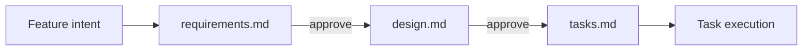

Kiro (Amazon's spec-driven IDE, [kiro.dev](https://kiro.dev)) writes each feature's
spec as three Markdown files in a per-feature folder. This page records their
exact structure so Rennet's Design lens can render them as objects rather than as
raw Markdown. It describes Kiro's artifacts, not Rennet behaviour.

## Directory layout

One folder per feature under `.kiro/specs/`, holding three files in a fixed
order of authorship:

```text
.kiro/
  specs/
    <feature-name>/
      requirements.md   # user stories + EARS acceptance criteria
      design.md         # architecture, diagrams, interfaces, data models
      tasks.md          # numbered checkbox plan, each task back-referencing requirements
  steering/
    product.md          # project-wide context (see "Steering files")
    tech.md
    structure.md
```

`<feature-name>` is a slug Kiro derives from the feature intent. A bug-fix spec
substitutes `bugfix.md` (current / expected / unchanged behaviour) for
`requirements.md`; the other two files are unchanged. Specs formalize one
feature; steering files under `.kiro/steering/` carry project-wide rules that
apply across every spec.

## requirements.md

Fixed heading tree. Each requirement is a numbered `### Requirement N` block
carrying one user story and a numbered list of EARS acceptance criteria under
`#### Acceptance Criteria`:

```markdown
# Requirements Document

## Introduction

<one or two paragraphs framing the feature>

## Requirements

### Requirement 1

**User Story:** As a [role], I want [feature], so that [benefit]

#### Acceptance Criteria

1. WHEN a user submits valid registration data THEN the system SHALL create a new user account
2. IF a user submits an email that already exists THEN the system SHALL display "Email already registered" error
3. WHEN a user submits an invalid email format THEN the system SHALL display an email validation error

### Requirement 2

**User Story:** As a [role], I want [feature], so that [benefit]

#### Acceptance Criteria

1. WHEN [event] AND [condition] THEN the system SHALL [response]
```

The numbering is load-bearing: an acceptance criterion is addressed as
`<requirement>.<criterion>` (so `1.2` is Requirement 1's second criterion), and
that dotted address is exactly what `tasks.md` back-references.

### EARS grammar

Acceptance criteria use EARS (Easy Approach to Requirements Syntax, originally
Rolls-Royce), which constrains each line to one of a few templates, always
ending in a `SHALL` response. Kiro uses these patterns:

| Pattern | Template | Example |
|---|---|---|
| Event-driven | `WHEN [event] THEN the system SHALL [response]` | WHEN a webpage loads THEN the system SHALL scan for all input, select, and textarea elements |
| Conditional | `IF [precondition] THEN the system SHALL [response]` | IF a user is not authenticated THEN the system SHALL redirect to the login page |
| Compound | `WHEN [event] AND [condition] THEN the system SHALL [response]` | WHEN a form field is detected AND it is empty THEN the system SHALL highlight it |
| Continuous | `WHILE [state] the system SHALL [response]` | WHILE a reset link is unused and unexpired the system SHALL allow exactly one password change |
| Contextual | `WHERE [context] the system SHALL [response]` | WHERE rate limiting is enabled the system SHALL block more than 5 reset requests per email per hour |

Docs also show the shorter `WHEN [condition/event] THE SYSTEM SHALL [expected
behavior]` form (no `THEN`); Kiro's own spec agent generates the
`WHEN … THEN … SHALL` form. A lens should accept both. The uppercase keywords
(`WHEN`, `IF`, `WHILE`, `WHERE`, `AND`, `THEN`, `SHALL`) are the parse anchors.

Before design, an optional **Analyze Requirements** action runs a deeper pass
for logical inconsistencies, ambiguities, conflicting constraints, and gaps.

## design.md

Free-form Markdown, but Kiro's spec agent generates a fixed section set. Expect
these `##` headings, in this order:

- **Overview** — what the feature does and the shape of the solution.
- **Architecture** — components and how they interact, often with a Mermaid
  diagram (`flowchart` or `sequenceDiagram`) when a flow is clearer seen.
- **Components and Interfaces** — the interface surface, method signatures,
  and boundaries.
- **Data Models** — types, schemas, and persisted shapes.
- **Error Handling** — failure modes and responses.
- **Testing Strategy** — how the design will be verified.

Mermaid fences are the norm for the Architecture section, so a renderer that
already themes Mermaid (as Rennet's docs build does) can display them directly.

## tasks.md

A numbered checkbox list titled `# Implementation Plan`, at most two levels
deep. Sub-tasks use decimal notation (`1.1`, `1.2`, `2.1`). Detail bullets sit
indented under a task, and the final italicized bullet back-references the
requirement criteria the task satisfies:

```markdown
# Implementation Plan

- [ ] 1. Set up project structure and core interfaces
  - Write TypeScript interfaces for all data models
  - Define the module boundaries
  - _Requirements: 1.1_

- [ ] 2. Implement the data layer
- [ ] 2.1 Create core data model interfaces and types
  - Encode validation rules on each model
  - _Requirements: 2.1, 3.3, 1.2_
- [ ] 2.2 Wire persistence
  - _Requirements: 2.4_
```

Checkbox state is standard GitHub-flavoured Markdown: `- [ ]` open, `- [x]`
done. The `_Requirements: …_` bullet lists dotted requirement addresses
(`<requirement>.<criterion>`), giving task→requirement traceability. Kiro's
agent is instructed to reference granular sub-requirements, not just whole user
stories, and to keep tasks to coding work only (no deploy, metrics, or manual
QA tasks).

## Lifecycle



Kiro drives the three files through phased, human-in-the-loop generation:

- **Requirements-First** (default): Requirements → Design → Tasks. You review
  and approve each file before the next is generated.
- **Design-First**: Design → Requirements → Tasks, for architecture- or
  constraint-led work. Same artifacts, requirements derived from the design.
- **Quick Spec**: runs all three phases automatically with no approval gates —
  you answer clarifying questions up front and land on the task list.

Refinement edits the files in place: editing `requirements.md` (directly or via
a spec session), **Refine** on `design.md` updates both design and the task
list, and **Sync Files** on `tasks.md` maps new tasks to new requirements.

**Task execution** runs against `tasks.md`. Kiro's task interface shows
real-time status (in-progress, completed) and flips the checkbox as each task
finishes. Running all tasks builds a dependency graph from the back-references
and groups independent tasks into waves that run concurrently.

## Steering files

`.kiro/steering/` holds persistent project context — typically `product.md`,
`tech.md`, and `structure.md` — that Kiro loads alongside any spec. They are
plain Markdown with no imposed schema, so a lens should treat them as prose
context rather than structured spec objects.

## Rendering affordances

What the Design lens can rely on, from most to least structured:

- **File triplet as a unit.** `requirements.md` / `design.md` / `tasks.md` in a
  `.kiro/specs/<feature>/` folder is a reliable signal to group the three into
  one spec object with three tabs or panes. `bugfix.md` marks a bug-fix spec.
- **Requirement blocks as cards.** `### Requirement N` + `**User Story:**` +
  `#### Acceptance Criteria` is a rigid, parseable shape — render each as a card
  with the role/feature/benefit split out and the criteria as a list.
- **EARS clause parsing.** The uppercase keywords delimit clauses cleanly:
  split each criterion into its `WHEN/IF/WHILE/WHERE` condition and its `SHALL`
  response, and colour or badge the two halves. This is the highest-value parse
  a Markdown viewer cannot do.
- **Task → requirement traceability.** The `_Requirements: a.b, c.d_` bullet is
  a machine-readable edge from a task to specific acceptance criteria. A lens
  can link each task to the criterion cards it satisfies, flag criteria with no
  covering task (coverage gaps), and flag tasks referencing missing criteria.
- **Progress.** Counting `- [x]` vs `- [ ]` in `tasks.md` (respecting the two
  levels) yields a completion bar for free; the decimal numbering gives the
  task hierarchy.
- **Diagrams.** `design.md` Mermaid fences render directly through a themed
  Mermaid pipeline — no need to treat them as opaque code.

Softer targets: `design.md` section headings are conventional but not
guaranteed (free-form Markdown), and steering files have no schema — parse them
defensively.

## Sources

- [Specs](https://kiro.dev/docs/specs/) and [Feature Specs](https://kiro.dev/docs/specs/feature-specs/), Kiro docs.
- [Requirements-First Workflow](https://kiro.dev/docs/specs/feature-specs/requirements-first/), Kiro docs.
- [Requirements analysis: catching requirement bugs before they become code](https://kiro.dev/blog/deep-spec-analysis/), Kiro blog.
- [Kiro spec agent system prompt](https://gist.github.com/notdp/19822831b54190bd9c6b34f6b69fadeb) (exact generated document formats).
- [Easy Approach to Requirements Syntax](https://en.wikipedia.org/wiki/Easy_Approach_to_Requirements_Syntax), Wikipedia (EARS origin and patterns).
