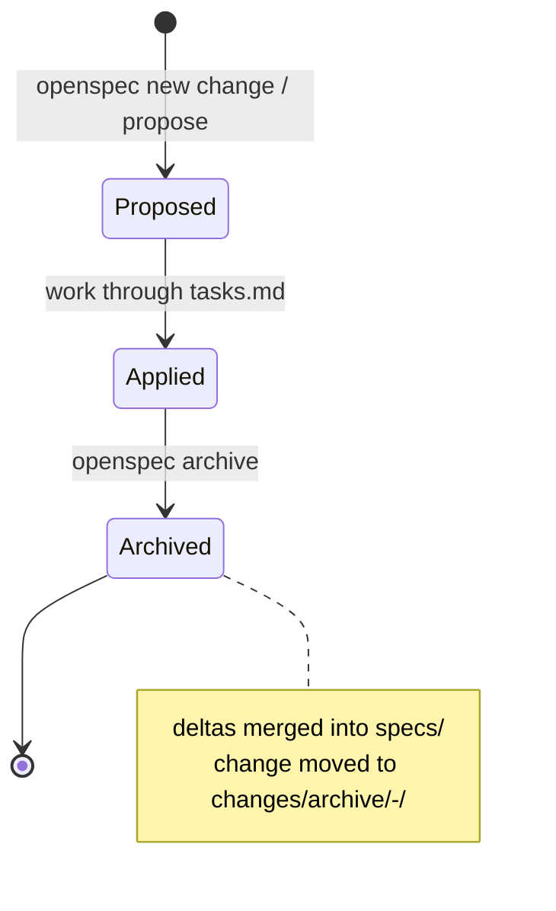

OpenSpec ([Fission-AI/OpenSpec](https://github.com/Fission-AI/OpenSpec)) is a spec-driven workflow that keeps a project's accepted behavior in Markdown under an `openspec/` directory. This page documents the precise artifact shape the Design lens can render: the directory layout, the requirement grammar, the change lifecycle, and which parts are reliably structured versus freeform prose. The corpus of record is this repo's own `openspec/` tree; upstream docs fill in the CLI and validation rules.

## Directory layout

`openspec init` creates one `openspec/` directory at the project root. Two subtrees carry the substance:

```text
openspec/
  config.yaml                 # schema: spec-driven
  specs/                      # the accepted, current truth
    <capability>/
      spec.md                 # one capability = one spec file
  changes/                    # proposed, not-yet-promoted work
    <change-name>/
      proposal.md             # why + what changes
      design.md               # technical approach (optional)
      tasks.md                # implementation checklist
      specs/
        <capability>/
          spec.md             # delta against the capability
    archive/
      <YYYY-MM-DD-change-name>/   # completed changes, dated
```

Two facts a lens must model:

- **`specs/` is the current state; `changes/` is the diff against it.** A capability under `specs/<capability>/spec.md` is a full, self-contained document. A capability under `changes/<change>/specs/<capability>/spec.md` is a *delta* — it only contains the requirements being added, modified, or removed, never the full spec.
- **Archiving promotes deltas and moves the change.** When a change is archived, its deltas are merged into `specs/` and the change directory is moved to `changes/archive/<date>-<name>/`. Archived changes retain their original proposal/design/tasks/deltas as a historical record.

Upstream (`openspec init`) also scaffolds AI-guidance files — a root `AGENTS.md`/`project.md` describing conventions — but those are guidance, not part of the spec corpus a lens renders. This repo's corpus carries only `config.yaml` (`schema: spec-driven`) plus `specs/` and `changes/`.

## Requirement grammar

A capability `spec.md` is a flat Markdown document with a fixed heading spine. From `openspec/specs/harness-discovery/spec.md`:

```markdown
# Harness discovery specification

## Purpose
Define how Rennet finds and probes model harnesses ...

## Requirements
### Requirement: Discovery resolves the harness without asking a shell to resolve a binary
Discovery SHALL harvest the login-shell PATH ... and SHALL NOT use `which` ...

#### Scenario: The GUI-inherited PATH omits the real location
- **WHEN** the login-shell PATH does not contain the directory holding `claude`
- **THEN** discovery still finds the binary via a known location and reports it
```

The load-bearing rules:

- **`# <title>`** — one H1, the capability name.
- **`## Purpose`** — a short prose statement of what the capability is for. Freeform.
- **`## Requirements`** — the container heading for all requirements.
- **`### Requirement: <name>`** — one H3 per requirement. The `Requirement:` prefix is the parse anchor. The name is a short imperative sentence.
- **Requirement body** — one or more prose paragraphs stating behavior in **normative keywords**: `SHALL`/`MUST` (hard requirement), `SHALL NOT`/`MUST NOT` (prohibition), `SHOULD` (strong recommendation), `MAY` (optional). Upstream guidance: "One statement, one `SHALL`/`MUST`", reach for `MUST`/`SHALL` by default. In practice a requirement body packs several `SHALL` clauses.
- **`#### Scenario: <name>`** — one H4 per scenario, nested under a requirement. **Every requirement must have at least one scenario that exercises it** — this is a validation rule, not a style preference.
- **Scenario body** — a bullet list of `GIVEN`/`WHEN`/`THEN`/`AND` steps. Upstream docs show bare-keyword bullets (`- WHEN 30 minutes pass ...`); this repo's corpus bolds them (`- **WHEN** ...`, `- **THEN** ...`, `- **AND** ...`). A lens should treat both `**WHEN**` and `WHEN` as the same token.

Everything at requirement-body and purpose level is freeform prose. Everything at the heading and step level is structured.

## Change deltas

A change's `specs/<capability>/spec.md` uses the same requirement/scenario grammar, but wraps requirements in **delta operation headers** that say what the change does to the base spec. From `openspec/changes/wsl-daemon-runtime/specs/wsl-daemon-runtime/spec.md`:

```markdown
## ADDED Requirements

### Requirement: The daemon bundle is delivered into the distro once per version
For a WSL-locus project, the shell SHALL ensure the daemon bundle exists ...

#### Scenario: First launch for a version delivers the bundle
- **WHEN** a WSL-locus project is opened and no ... exists in the distro
- **THEN** the shell copies the bundle to that path and spawns the daemon from it
```

The three delta headers, confirmed across this corpus (107 ADDED, 21 MODIFIED, 4 REMOVED occurrences):

| Header | Meaning | Body requirement |
|---|---|---|
| `## ADDED Requirements` | Brand-new behavior | Full requirement + scenarios |
| `## MODIFIED Requirements` | Existing behavior changes | The **full new version** of the requirement, not a patch |
| `## REMOVED Requirements` | Behavior going away | The requirement plus a line on why |

Notes for a renderer:

- A single change spec can carry more than one delta header (e.g. a `## MODIFIED Requirements` block followed by `## ADDED Requirements`). See `openspec/changes/archive/2026-08-16-add-windows-support/specs/packaged-editor-resolution/spec.md`.
- `MODIFIED` is a whole-requirement replacement, so a lens cannot show an intra-requirement diff from the change file alone — it must diff the modified requirement against the base `specs/` requirement of the same name.
- A change that creates a new capability may open its delta with `## Purpose` before the delta headers (the promoted spec inherits it).
- `RENAMED` is not part of this corpus or the current writing guide; treat `ADDED`/`MODIFIED`/`REMOVED` as the complete set.

## Proposal, design, tasks

The other three change artifacts are looser. A lens can exploit their headings but should treat the bodies as prose.

**`proposal.md`** — the why-and-what. This corpus uses `## Why`, `## What Changes` (bulleted), `## Capabilities` (with `### New Capabilities` / `### Modified Capabilities` sub-lists that name the affected capability slugs), and `## Impact`. See `openspec/changes/wsl-daemon-runtime/proposal.md`. The `## Capabilities` block is the reliable machine-readable link from a change to the capability specs it touches.

**`design.md`** — optional technical approach. Freeform, but conventionally `## Context`, `## Goals / Non-Goals`, `## Decisions`, `## Risks / Trade-offs`, `## Migration Plan`, `## Open Questions`.

**`tasks.md`** — a GitHub-flavored Markdown checklist, grouped under numbered `##` sections, with `x.y` task numbers:

```markdown
## 1. Distro paths and bundle delivery
- [x] 1.1 In `core`, add pure helpers: `wslServerBundlePath(version)` ...
- [ ] 5.1 Full `pnpm check` green ...
```

`- [x]` is done, `- [ ]` is open. This is the single richest structured signal in the whole format for progress rendering: parse the checkboxes for a completion ratio, and the `##` groups for phase structure.

## Change lifecycle



1. **Propose** — scaffold `changes/<name>/` with `proposal.md`, `specs/` deltas, `design.md`, `tasks.md`.
2. **Apply** — implement, checking off `tasks.md` as you go, keeping the deltas aligned with the code.
3. **Archive** — `openspec archive <change>` validates the change, merges its accepted deltas into `openspec/specs/`, and moves the directory into `changes/archive/` under a dated name. A retired partial change is archived with `--skip-specs` so its unimplemented scope is not promoted as accepted contract.

Newer OpenSpec versions expose this through slash commands (`/opsx:propose`, `/opsx:apply`, `/opsx:archive`) rather than typed CLI verbs, but the on-disk artifacts are identical.

## CLI and validation

The commands that produce or check the artifact shape (see the [OpenSpec CLI reference](https://github.com/Fission-AI/OpenSpec/blob/main/docs/cli.md)):

| Command | Purpose |
|---|---|
| `openspec init [path]` | Scaffold `openspec/` and AI-tool configs |
| `openspec list [--specs\|--changes] [--json]` | List specs or changes |
| `openspec show [item] [--json] [--requirements] [--deltas-only]` | Render one spec or change, optionally as JSON |
| `openspec validate [item] [--strict] [--json] [--all]` | Check structural conformance |
| `openspec archive <change> [--skip-specs] [--yes] [--no-validate]` | Promote deltas and move the change to archive |
| `openspec update` | Regenerate AI-guidance files after a CLI upgrade |

`openspec validate` is what makes the format trustworthy for a lens. It checks the structural grammar — a requirement has the `### Requirement:` shape, every requirement has at least one `#### Scenario:`, scenarios have step bullets, delta headers are recognized — and `--strict` tightens the checks. Crucially, `openspec show --json` and `openspec validate --json` mean a lens does **not** have to reimplement the Markdown parser: it can shell out to the CLI and consume structured output for CI or a renderer.

## Rendering affordances

What the Design lens can reliably exploit, ranked by how machine-parseable it is:

- **Requirement cards** (reliable). Every `### Requirement:` is a titled, addressable unit with a normative body. Render each as a card; the `SHALL`/`SHOULD`/`MAY` keyword gives a strength badge (hard / recommended / optional) for free.
- **Scenario blocks** (reliable). Each `#### Scenario:` under a requirement is a titled GIVEN/WHEN/THEN block. Render as a labeled step list; the WHEN/THEN split is a natural two-column or trigger-outcome layout. Bold-vs-bare keyword variance is the only normalization needed.
- **Delta badges** (reliable). `## ADDED / MODIFIED / REMOVED Requirements` maps directly to added/changed/removed badges on each requirement card in a change view. Counts per header give a change-size summary.
- **Task progress** (reliable). `tasks.md` checkboxes give an exact completion ratio and per-phase grouping — a progress bar with no heuristics.
- **Coverage mapping** (semi-reliable). `proposal.md` `## Capabilities` names the affected capability slugs, and each change delta lives under `specs/<capability>/`, so a lens can draw change to capability edges. A requirement-without-a-scenario is a validate failure, so scenario coverage per requirement is a renderable health signal.
- **Modified-requirement diffs** (requires two files). Because `MODIFIED` carries the full new requirement, an intra-requirement diff needs the base `specs/<capability>/spec.md` requirement of the same name diffed against the change's copy. Match on the requirement name after `Requirement:`.
- **Purpose / proposal / design prose** (freeform). `## Purpose`, `## Why`, `## Decisions` and requirement bodies are prose — render as readable Markdown, not as structured fields.

The single highest-leverage move for a lens: consume `openspec show --json` / `openspec validate --json` rather than re-parsing Markdown, and reserve custom parsing for the parts the CLI does not surface.

## Sources

- Corpus: this repo's `openspec/` tree (`specs/`, `changes/`, `changes/archive/`, `config.yaml`).
- [Fission-AI/OpenSpec README](https://github.com/Fission-AI/OpenSpec/blob/main/README.md) — workflow, slash commands, directory demo.
- [OpenSpec CLI reference](https://github.com/Fission-AI/OpenSpec/blob/main/docs/cli.md) — command and flag list.
- [Writing good specs](https://github.com/Fission-AI/OpenSpec/blob/main/docs/writing-specs.md) — requirement/scenario grammar and delta headers.
</content>
</invoke>
