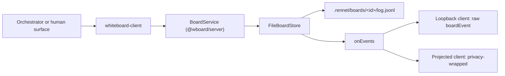

Boards are built on the whiteboard protocol, which lives in its own repository and
ships as published npm packages. This page covers the consuming side: what Rennet
pins, which parts of the design are Rennet's rather than the protocol's, and how
board writes reach disk.

## What Rennet pins

The whiteboard protocol is a separate MIT repository
([`rbutera/whiteboard`](https://github.com/rbutera/whiteboard)) with its own Nx
monorepo, its own release train, and no dependency on Rennet. It is host-agnostic
by design — a minimal shared-canvas protocol that stores and validates elements
without interpreting them. Rennet is one host among possible others, and the
import runs one way.

Two packages are consumed, both published under the `@wboard` scope on the `alpha`
dist-tag:

| Package | What it provides | Pinned in |
|---|---|---|
| `@wboard/core` | element and op shapes, the host-schema authoring kit, `compileToWire`, wire validation | `packages/protocol`, `packages/adapters`, `packages/server` |
| `@wboard/server` | the embeddable reference board service: append-only event log, `project` fold, pluggable store | `packages/adapters`, `packages/server` |

Both are pinned to an exact version (`0.1.0-alpha.2` at time of writing), as the
[dependency standard](./dependency-standard.md) requires of every direct
dependency. They are also named in `minimumReleaseAgeExclude` in
`pnpm-workspace.yaml`, on the same first-party rationale as the Claude Agent SDK:
the seven-day age floor guards third-party supply-chain risk and does not apply to
Rai's own scope, and the alpha is published expressly for this build. The
exclusions are name-scoped, so a version bump does not silently re-arm the gate.

The packages are MIT. Rennet's own source stays FSL-1.1-MIT; inbound and outbound
licences are independent.

Rennet embeds the board service in-process. It does not run or consume the
protocol repo's MCP facade.

## Where the boundary sits

The wire contract, the closed error-code enum, and the conformance fixture corpus
are normative in the whiteboard repo's `spec/SPEC.md`. Rennet's documentation does
not restate them. If you need to know what an op means on the wire, what a
rejection code signifies, or how a projection folds, read `SPEC.md` — these pages
cover consumption only.

Two version axes travel separately. Each package carries its own npm semver, while
the protocol has its own version owned by `SPEC.md` (`PROTOCOL_VERSION`, currently
`"0.1"`). Two implementations interoperate when their protocol versions match,
whatever their package versions are. `WhiteboardClient.describe()` surfaces the
implemented protocol version alongside board metadata.

The whiteboard repo ships no schema package. Hosts own their schema; its `docs/`
carry neutral worked examples (a kanban board, a diagramming app) and nothing
Rennet-shaped.

## Rennet's host schema is Rennet-side

Rennet declares **one host schema**, at board creation, covering every board. It
lives at `packages/protocol/src/board/schema.ts` — not in `@wboard/*` — and it is
the reason the protocol needs no review vocabulary of its own.

The schema declares a closed palette of thirteen kinds: the typed lens outputs
(`finding`, `decision`, `requirement`, `noise_verdict`, `order_step`,
`round_outcome`) and the authoring palette (`section`, `prose`, `callout`,
`annotation`, `message`, `code_ref`, `review_comment`). There is no `custom` kind;
a genuinely new structured shape becomes a new typed kind.

The board document is a Rennet-owned envelope above those elements. It carries
an authored title, a Markdown introduction, the `reading` or `structured`
measure, and optional source links and labelled string stats. Sections can
carry their own sources and an artifact `spec_delta`; requirements can carry
their name, capability, canonical scenario refs, related files, exact source,
artifact delta, and host-grounded coverage. `HostBoardSchema` and
`DraftBoardSchema` validate this data, but the document is not a fourteenth
whiteboard element and does not enter the board event log as an op.

A source ref carries a repo-relative path and may add its stable discovery
candidate id, label, and line. Candidate identity disambiguates two selected
artifact sets that share a file; it does not replace the path the editor opens.
Design decisions stated by an artifact carry `inferred: false` and that exact
source. Sparse decisions may honestly leave evidence or alternatives empty.

The file keeps two honest layers, matching the kit's own doctrine that authoring
is convenience and the wire is truth:

- `AUTHORED_BOARD_SCHEMA` declares the thirteen kinds on `@wboard/core`'s typed
  authoring surface, using only the wire attribute types
  (`string | number | boolean | element | json`, each optionally `many`).
  `compileToWire` lowers it to `BOARD_WIRE_SCHEMA`, which is what
  `createRennetBoard()` hands to the service.
- `HostBoardSchema` is the Rennet-side Zod that layers the real vocabulary — the
  severity, status, and coverage enums, the nested `concurrence`, `quote`, and
  `ask` shapes — on top of that topology. This is what parses a board.

A drift test compiles the authored schema through the kit and re-validates every
fixture element against the kit's per-kind validator, so changing an attribute's
wire type breaks the gate. `DraftBoardSchema` is derived from `HostBoardSchema`
by omitting the curation-only kinds (`message`, `review_comment`), never
hand-written; both schemas retain the same document envelope.

Three model rules ride in the schema rather than in the protocol: every reference
is an `element`-typed attribute (there is no protocol-level relation table),
`code_ref` cites the immutable patchset so code is never copied into a block, and
read-state and attention stay UI-only.

## Who calls the five tools

`packages/adapters/src/whiteboard-client.ts` exposes the five protocol tools —
`create`, `schema`, `apply`, `describe`, `events` — as a typed client over an
injected `BoardService`. **It is the only writer of board ops in Rennet.** Reads
may go anywhere; writes come through here, and a test asserts that no other file
calls `BoardService.apply` or constructs board ops.

The tools serve the orchestrator and the human surfaces. Lens drafters do not call
them: a drafter returns schema-validated structured output and the host writes it
to the draft board as ops on the drafter's behalf, because agentic tool-calling
per element is slow and expensive. See [the lens pipeline](../concepts/lens-pipeline.md).

`apply` takes a flat ordered ops list, all-or-nothing, attributed to an actor.
Ops arriving without an `op_id` get one minted in the client — once, before the
retry boundary — and the result carries the enriched batch back. Retrying a
possibly-applied batch means re-sending `result.ops` verbatim, which the service
dedups by `op_id`; re-sending the original id-less drafts would mint fresh ids and
append twice.

## Element state and board metadata

The board service's element state is a projection of an append-only attributed
event log. Rennet persists that log through a `FileBoardStore` rooted at
`.rennet/boards/` under the review project, local and ignored by default. Each
board is a `schema.json` written once at creation plus an append-only `log.jsonl`
with contiguous sequence numbers. Restart is replay: a fresh process over the
same directory serves the identical element state. See
[architecture contracts](../concepts/architecture-contracts.md#review-state-and-command-persistence).

The readable board has a second durable half in the daemon's board-meta store.
It holds the document envelope, skipped-hunk coverage, and validation results
that the thirteen element kinds cannot carry. The pipeline persists this record
before announcing the board. `board.read` combines it with the event-log
projection, so a restart preserves the authored title and introduction rather
than reconstructing them from section elements.

A successful no-material result has no board or board-meta row. Its durable home
is the generation's `absentLenses` map. `board.read` pairs `board: null` with the
`no-material` code for that case, keeping it distinct from a board that has not
arrived yet.

### Write and broadcast path

`createBoardsRuntime` builds one embedded service per project root and observes
the store's `append` rather than wrapping `apply` — `append` returns events with
their assigned sequence numbers and is the one path every write takes. A listener
that throws cannot poison a persisted apply: the events are already on disk, and
live listeners re-sync through `events`.

Appended events reach connected clients as the `boardEvent` session frame, whose
payload is `@wboard/core`'s published `EventSchema` rather than a re-model.
Loopback connections receive it raw; projected connections receive the
privacy-wrapped variant — same string shapes, scrubbed content. See
[protocol compatibility](./protocol-compatibility.md).

Freeze and generation policy is not part of this seam. The boards runtime stores
and serves; lifecycle belongs to the pipeline and session layers.
