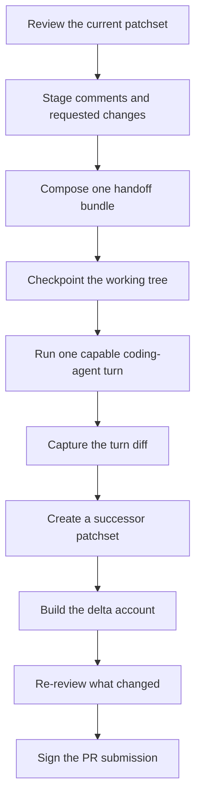
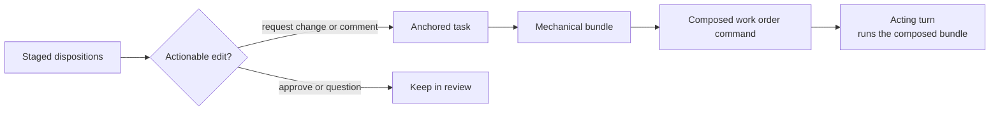
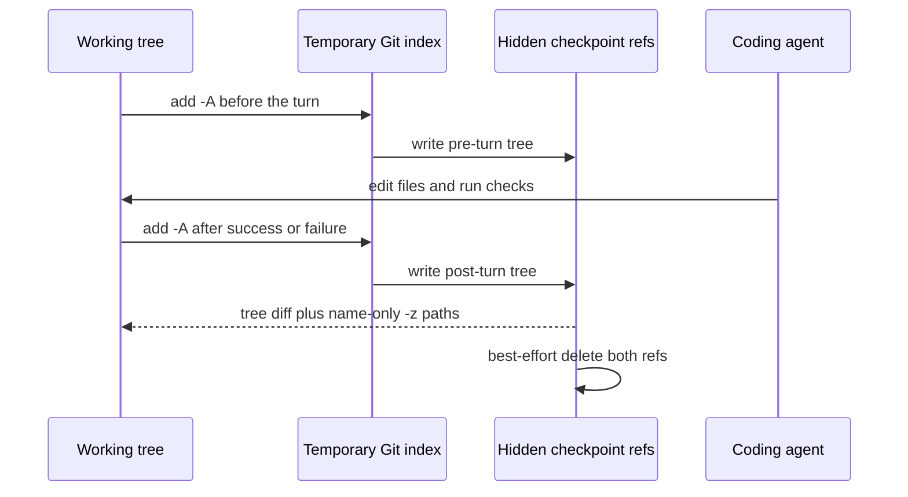
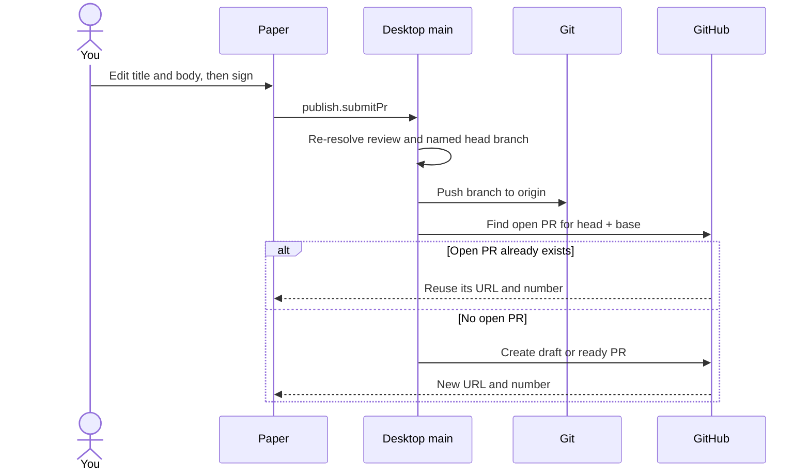

Agent handoff is the intended author-side loop: collect the changes you want,
hand them to the coding harness, capture what it edits, then review only the
resulting delta. The backend pieces exist, but the current renderer does not yet
invoke this loop. Today, signing your own-branch paper pushes the branch and
opens the pull request instead.

## The loop

Most of the machinery is live behind typed main-process commands: the mechanical
bundle, write-enabled runner, workspace checkpoints, successor capture, exact
carry, delta account, optional digest, and PR submission. As of
[#72](https://github.com/rbutera/rennet/issues/72), `review.handoff.run` now
accepts and executes the exact composed bundle `review.handoff.compose` produced,
bound by its digest — it no longer rebuilds a mechanical bundle from the raw
dispositions. A pure stage-6 preview view-model (`handoffPreview`) and paper
component render that composed bundle before it runs. One join is still missing
from the shipped product path: the live renderer journey does not yet invoke
`review.handoff.run` or mount the stage-6 paper (no button wires the loop end to
end). The composed-bundle→run integrity binding and the preview are in place; the
in-app trigger is the remaining wiring.

## From dispositions to a work order

The source material is the draft the reviewer already shaped. `request-change`
and actionable `comment` dispositions become tasks. Approvals mean “leave this
alone,” while questions stay in the review conversation, so neither becomes an
edit instruction.

The mechanical bundle contains:

- the active review and patchset identities;
- one task per addressed disposition;
- the file and line range, when there is one;
- bounded diff context around that anchor;
- the exact instruction body;
- a stable digest of the ordered tasks.

`buildHandoffBundle()` in `packages/core/src/handoff-loop.ts` owns this plain,
deterministic shape. The separate `review.handoff.compose` command merges related
asks, chooses a useful order, and adds a short narrative without changing which
asks are in the bundle. Its output IS the input to the acting turn: `review.handoff.run`
now runs the composed bundle's ordered, verbatim prompt.

The mechanical partition remains the authority. Composition may make the work
order easier to follow, but it may not invent a task or lose one.

## The acting turn

When invoked, `review.handoff.run` receives the composed bundle, verifies its
integrity (its digest and prompt recompute from its tasks, and it was composed
against the currently-active patchset — otherwise the run is refused rather than
executing an order nobody composed), checkpoints the working tree, and starts one
Claude Code session in the repository root running the composed prompt. The session has the harness's full default tool
surface, including shell access. That lets the agent edit, inspect, format, and
test the work it just changed.

Rennet's prompt asks the agent to stay on the listed work and leave commit and
push to the later PR-submission step. This is instruction, not a reduced
capability profile. The product does not add its own tool denylist.

A failed turn stays a failed turn. If it changed files before failing, those
files are reported instead of being hidden behind the error.

Repositories containing submodules are currently refused on this path. An edit
inside a child repository can leave the superproject gitlink unchanged, which
would make the checkpoint diff incomplete. Recursive submodule checkpoints are
the missing implementation; the refusal is an honest visibility limit, not a
reduced coding-agent capability.

## How checkpoints isolate one turn

`GitCheckpointStore` snapshots tracked, deleted, and non-ignored untracked files
with a temporary Git index. It writes each snapshot to a hidden
`refs/rennet/checkpoints/*` ref without moving `HEAD`, changing a branch, touching
the user's real index, or creating a reflog entry. The two trees bracket the
agent turn.

The display diff and the authoritative path list are deliberately separate.
`git diff --name-only -z` supplies `filesTouched`, so spaces, quotes, and tabs in
a path are not lost by parsing human-oriented patch headers. An unrelated edit
and a partial edit made before a failed turn are both included.

## Capturing the result

The handoff never edits the old patchset. It captures the working tree again and
activates a new immutable patchset. The previous one remains available as the
baseline for the delta.

The successor gets a deterministic account of:

- which asks were addressed, partially addressed, or untouched;
- which files the turn touched beyond the asks;
- which dispositions carried cleanly;
- which anchors became orphaned;
- any rename information from Git.

A light model turn may turn that account into a one-line digest, but the facts
remain model-free. If the digest cannot run, the account still renders.

## Signing opens the pull request

After the delta is reviewed, the own-branch paper previews a pull request rather
than review comments. Its title and body start from the drafted values and remain
editable. Signing sends those exact edited values through `publish.submitPr`.

Desktop main resolves the named branch from the captured patchset, verifies that
it is the branch shown on the paper, and pushes `refs/heads/<branch>` to the
resolved github.com remote. It prefers `origin` and otherwise uses the first
matching GitHub remote. `GitHubPrSubmissionAdapter` then opens the pull request.
A detached HEAD cannot be submitted because there is no branch to name.

The adapter checks for an open PR from the same head and base before creating
one. It also resolves GitHub's duplicate-PR response back to the existing PR, so
a retry or a double sign does not open a second one. The successful URL appears
on the paper.

## Carry is deliberately conservative

The live handoff carry uses deterministic file and span evidence. A byte-identical
span can carry at the same path, and it can carry through a Git-proven rename when
the bytes still match. Edited spans reopen. Whole-file dispositions reopen across
a rename because the patch headers change.

The fuzzy occurrence matcher is a separate mechanism. It exists and is measured,
but it does not currently drive disposition carry in the handoff loop. This
separation avoids turning “looks similar” into “the reviewer already approved
this.” See [delta re-review and lineage](/developing/concepts/delta-rereview-and-lineage/).

## The commands and owners

| Concern | Owner |
|---|---|
| Bundle filtering, anchored context, deterministic prompt | `packages/core/src/handoff-loop.ts` |
| Agent-friendly ordering, narration, and the compose→run integrity check | `packages/core/src/handoff-compose.ts` |
| Stage-6 composed-bundle preview view-model | `packages/ui/src/canvas/publish.ts` (`handoffPreview`) |
| Write-enabled harness turn behind the main-process command | `packages/adapters/src/handoff-run-live.ts` |
| Checkpoint and turn diff | `packages/adapters/src/checkpoint-store.ts` |
| Command routing and successor capture | `apps/desktop/src/main/dispatch.ts` |
| Delta facts | `packages/core/src/delta-account.ts` |
| Draft, paper, and sign interaction | `packages/ui/src/app.tsx` |

The renderer never gets direct process authority. The one remaining join is the
in-app trigger: the live journey does not yet call `review.handoff.run` or mount
the stage-6 paper. The desktop main process already resolves the current review,
verifies and runs the composed bundle, captures the result, and returns a
validated output.

## Current edge

The first product seam is the in-app trigger — wiring the renderer to compose,
preview on the stage-6 paper, and invoke `review.handoff.run` with that exact
composed bundle. After that, the main precision seam is sub-file lineage
across a changed patchset. The fuzzy matcher can classify it, but handoff carry
still stays on the deterministic floor. That means Rennet can reopen more work
than strictly necessary; it does not silently carry uncertain review state.
