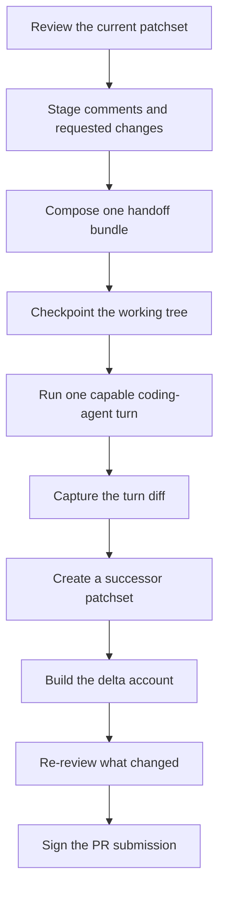
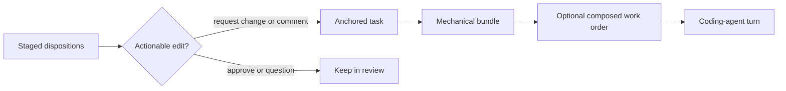
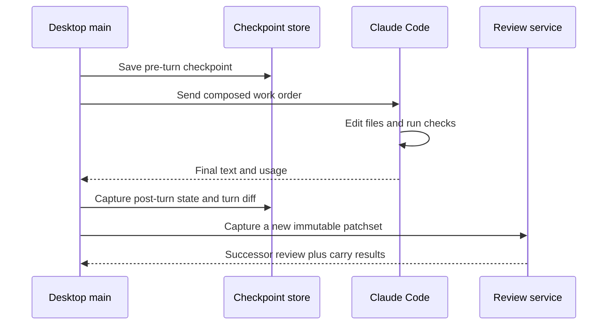
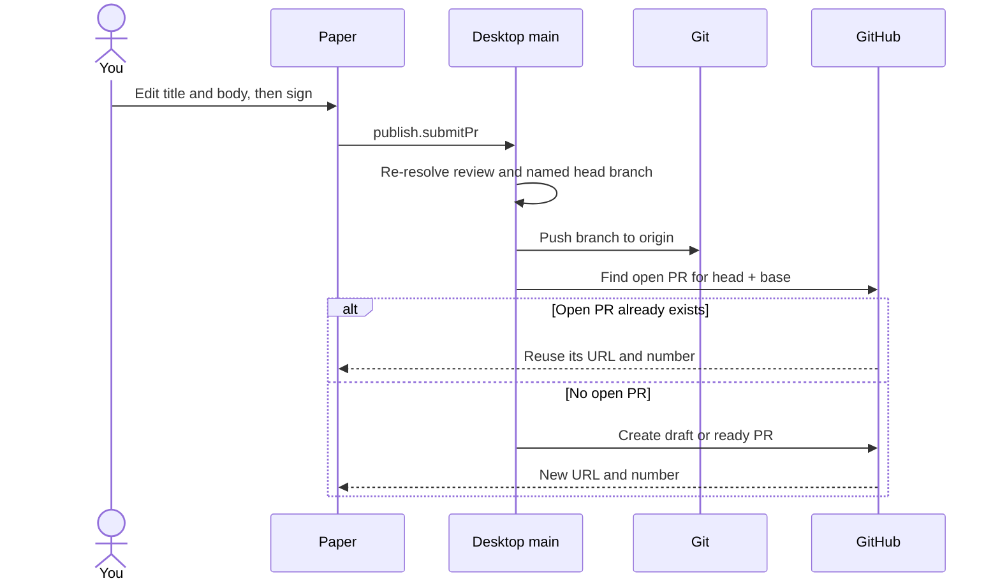

Agent handoff closes Rennet's author-side loop: collect the changes you want,
hand them to the coding harness, capture what it edits, then review only the
resulting delta. The coding agent is capable enough to edit files and run the
tests it needs.

## The loop

This loop is live. The handoff runner, bundle composer, successor capture, delta
account, short delta digest, and author-side PR submission are all wired through
the desktop main process.

## From dispositions to a work order

The source material is the draft the reviewer already shaped. `request-change`
and actionable `comment` dispositions become tasks. Approvals mean “leave this
alone,” while questions stay in the review conversation, so neither becomes an
edit instruction.

The mechanical bundle contains:

- the active review and patchset identities;
- one task per addressed disposition;
- the file and line range, when there is one;
- bounded diff context around that anchor;
- the exact instruction body;
- a stable digest of the ordered tasks.

`buildHandoffBundle()` in `packages/core/src/handoff-loop.ts` owns this plain,
deterministic shape. `review.handoff.compose` can then merge related asks, choose
a useful order, and add a short narrative without changing which asks are in the
bundle.

The mechanical partition remains the authority. Composition may make the work
order easier to follow, but it may not invent a task or lose one.

## The acting turn

`review.handoff.run` rebuilds the bundle from the current patchset, checkpoints
the working tree, and starts one Claude Code session in the repository root. The
session has the harness's full default tool surface, including shell access. That
lets the agent edit, inspect, format, and test the work it just changed.

Rennet's prompt asks the agent to stay on the listed work and leave commit and
push to the later PR-submission step. This is instruction, not a reduced
capability profile. The product does not add its own tool denylist.

A failed turn stays a failed turn. If it changed files before failing, those
files are reported instead of being hidden behind the error.

## Capturing the result

The handoff never edits the old patchset. It captures the working tree again and
activates a new immutable patchset. The previous one remains available as the
baseline for the delta.

The successor gets a deterministic account of:

- which asks were addressed, partially addressed, or untouched;
- which files the turn touched beyond the asks;
- which dispositions carried cleanly;
- which anchors became orphaned;
- any rename information from Git.

A light model turn may turn that account into a one-line digest, but the facts
remain model-free. If the digest cannot run, the account still renders.

## Signing opens the pull request

After the delta is reviewed, the own-branch paper previews a pull request rather
than review comments. Its title and body start from the drafted values and remain
editable. Signing sends those exact edited values through `publish.submitPr`.

Desktop main resolves the named branch from the captured patchset, verifies that
it is the branch shown on the paper, and pushes `refs/heads/<branch>` to the
resolved github.com remote. It prefers `origin` and otherwise uses the first
matching GitHub remote. `GitHubPrSubmissionAdapter` then opens the pull request.
A detached HEAD cannot be submitted because there is no branch to name.

The adapter checks for an open PR from the same head and base before creating
one. It also resolves GitHub's duplicate-PR response back to the existing PR, so
a retry or a double sign does not open a second one. The successful URL appears
on the paper.

## Carry is deliberately conservative

The live handoff carry uses deterministic file and span evidence. A byte-identical
span can carry at the same path, and it can carry through a Git-proven rename when
the bytes still match. Edited spans reopen. Whole-file dispositions reopen across
a rename because the patch headers change.

The fuzzy occurrence matcher is a separate mechanism. It exists and is measured,
but it does not currently drive disposition carry in the handoff loop. This
separation avoids turning “looks similar” into “the reviewer already approved
this.” See [delta re-review and lineage](/developing/concepts/delta-rereview-and-lineage/).

## The commands and owners

| Concern | Owner |
|---|---|
| Bundle filtering, anchored context, deterministic prompt | `packages/core/src/handoff-loop.ts` |
| Agent-friendly ordering and narration | `packages/core/src/handoff-compose.ts` |
| Live write-enabled harness turn | `packages/adapters/src/handoff-run-live.ts` |
| Checkpoint and turn diff | `packages/adapters/src/checkpoint-store.ts` |
| Command routing and successor capture | `apps/desktop/src/main/dispatch.ts` |
| Delta facts | `packages/core/src/delta-account.ts` |
| Draft, paper, and sign interaction | `packages/ui/src/app.tsx` |

The renderer never gets direct process authority. It invokes typed commands; the
desktop main process resolves the current review again, runs the turn, captures
the result, and returns a validated output.

## Current edge

The main remaining precision seam is sub-file lineage across a changed patchset.
The fuzzy matcher can classify it, but the handoff carry still stays on the
deterministic floor. That means Rennet can reopen more work than strictly
necessary; it does not silently carry uncertain review state.
