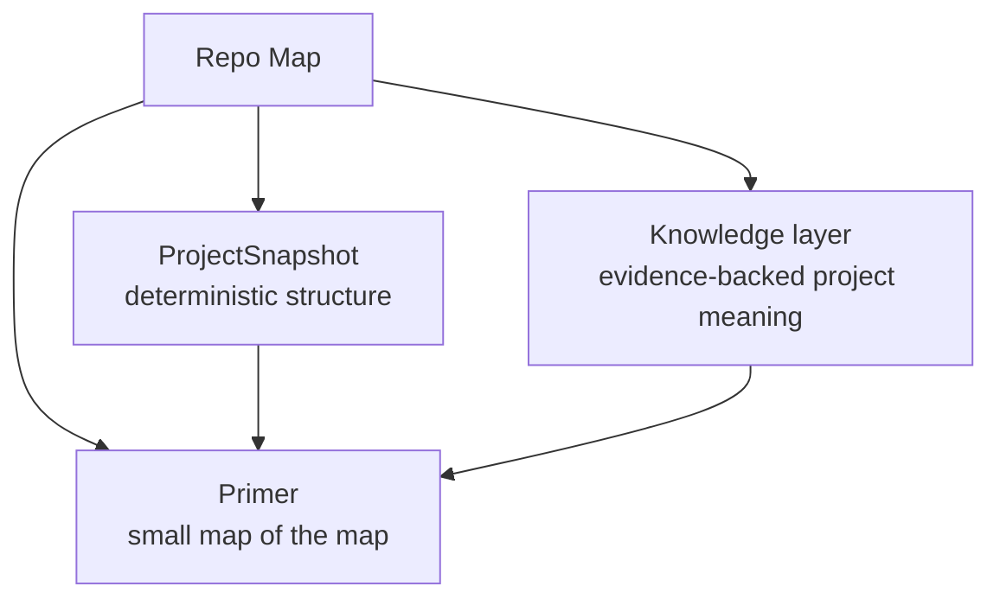
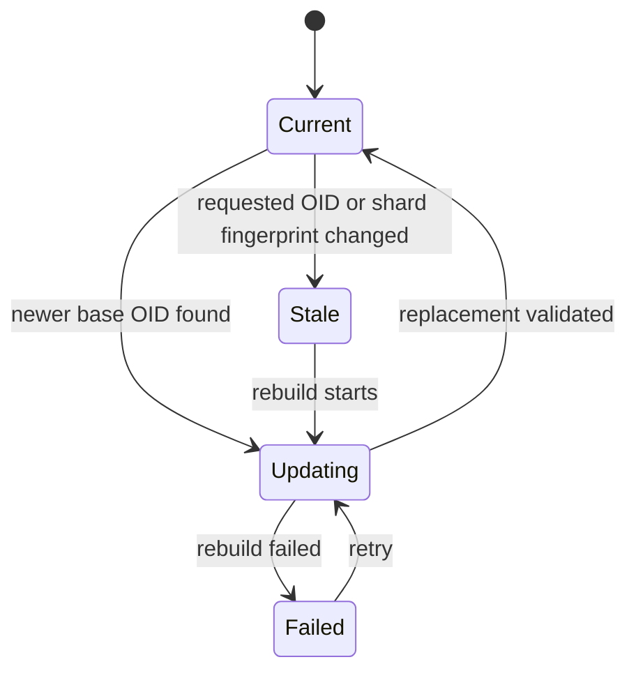
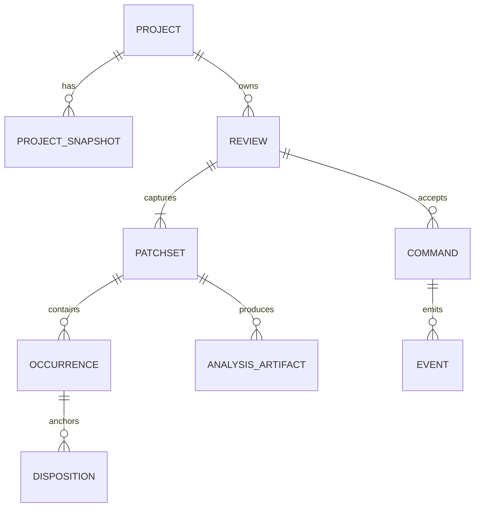
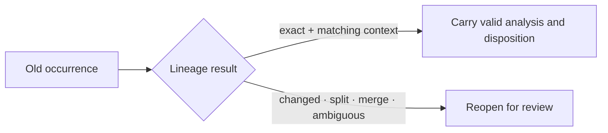
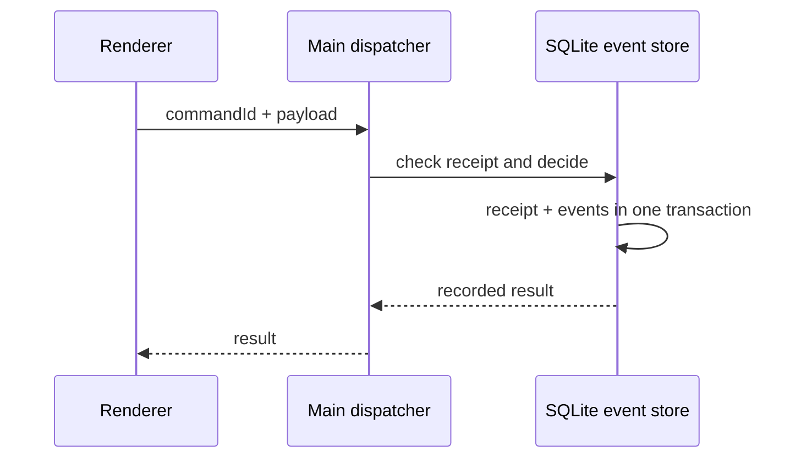
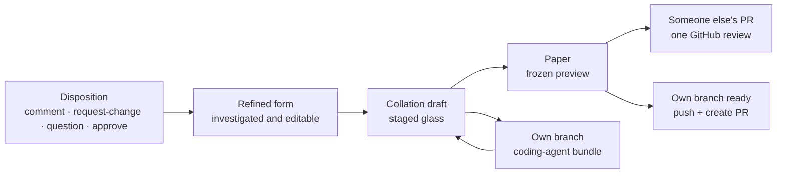

These contracts keep Rennet honest while the implementation changes quickly.
They describe the behaviour developers must preserve, and call out the places
where current `main` has not reached the full contract yet.

## How to read this page

“Contract” means a code change may not quietly weaken the rule. “Live” means the
path is wired on current `main`. “In progress” means the data shape or component
exists but the full product behaviour is not complete.

Rule Zero applies throughout: a capable agent is the product. These contracts
protect the truth of a review and the user's authorship; they do not justify
consent screens, capability denial, read-only coding sessions, or safety theatre.

| Area | Current `main` | Contract |
|---|---|---|
| Immutable local and PR capture | Live | Every review reads a fixed patchset |
| Deterministic Repo Map | Live, with proactive snapshot refresh | Never present stale context as current |
| Evidence-backed knowledge layer | Data model exists; desktop composition is deferred | Every statement carries evidence and freshness |
| Occurrence lineage | Exact carry is live; fuzzy matching is present but not connected to carry | Similarity never impersonates identity |
| Someone else's PR | Live end to end | Preview the exact outbound review, then submit once |
| Own-branch PR submission | Live | Sign pushes the named branch and opens the previewed PR |
| Coding-agent handoff | Backend commands live; renderer and composed-bundle joins missing | Coding agent may write and test; capture its complete delta as a successor |
| Remote/mobile client | Protocol seam only; client deferred | Host paths and raw events never cross the portable boundary |

## The ten invariants

1. **A review targets an immutable patchset.** The working tree and PR head may
   move; the patchset being read does not.
2. **Every derived artifact carries provenance.** It names the review, patchset,
   project context, inputs, instructions, generator, and model or deterministic
   tool that produced it.
3. **Stale context is never called current.** Refresh it, or continue with the
   exact degradation visible.
4. **Invalidation is automatic.** Rennet classifies what changed and may regenerate
   affected analysis without asking permission for each model turn.
5. **Agents remain capable.** Review agents can inspect and verify; coding agents
   can write, run tests, commit, and push when the product flow calls for it.
6. **Rennet's own repo data stays separate.** It never stages or commits local
   `.rennet/` context as a side effect of reviewing code.
7. **One command means one mutation.** Retrying a command cannot duplicate a local
   event or an external GitHub action.
8. **Unknown history is never hand-waved away.** Preserve unknown events byte for
   byte, name the unsupported state, and carry the warning with later actions.
9. **Deletion covers every Rennet-controlled copy.** The boundary outside Rennet
   is stated plainly.
10. **Outbound work is the user's authored result.** Model work may run freely;
    another human sees a GitHub review or PR only when the reviewer signs it.

## Repo Map and project context

The user-facing **Repo Map** is three related things, not one model-written blob:



- `ProjectSnapshot` records files, symbols, references, package boundaries,
  entry points, and other model-free structure at one base OID.
- The knowledge layer records conventions and architectural meaning. A model-made
  statement remains a labelled hypothesis unless evidence or a human confirms it.
- The primer is a compact orientation document. It tells an orchestrator what it
  can retrieve; it is not a dump of the repository.

### Where it lives

Current `main` uses the local-first, path-keyed lifecycle adopted after the first
architecture draft:

```text
~/.rennet/projects/<escaped-absolute-repository-path>/
├── config.json
├── map/
│   ├── manifest.json
│   ├── manifests/<base-oid>.json
│   └── shards/<digest>.json
├── overlays/
└── knowledge/
```

Each checkout or worktree gets its own local entry. This supersedes the older
design where every worktree shared an entry keyed by `git-common-dir`. The local
entry wins because it is the freshest view of that checkout.

The repository's own `.rennet/` holds human-authored configuration and, only
after an explicit promotion, a committed mirror of the derived map and knowledge.
Promotion is off by default. A discovered committed map is validated before use;
it is a fallback, never blindly trusted over a fresher local map.

### Snapshot identity and freshness

The live manifest is deliberately smaller than the eventual contract:

```ts
interface ProjectSnapshotManifest {
  schemaVersion: number
  repoKey: string
  baseRef: string
  baseRefResolution: BaseRefResolution
  baseOid: string
  fingerprint: string
  shards: Record<StructuralShardSlot, ShardRef>
  symbols: readonly [blobOid: string, digest: string][]
  references: readonly [blobOid: string, digest: string][]
}
```

The fingerprint covers the repository and base pins plus the structural,
symbol, and reference shard digests. The same inputs produce byte-identical
shards and the same manifest. On a base-branch advance, Rennet rebuilds affected
snapshot shards and advances the manifest only after the replacement is durable.
Generator, configuration, and toolchain digests are contract work, not fields in
the live fingerprint yet. The model-derived knowledge refresh is likewise not
composed into desktop main.



A consumer may use only a snapshot that matches the requested inputs. Otherwise
Rennet rebuilds it or runs without it and says exactly what context is missing.

## Reviews and patchsets

A `Review` is a continuing piece of work. A `Patchset` is one immutable edition
of its input.



Every patchset freezes:

- its base and Git head, or immutable working-tree snapshot;
- committed, staged, unstaged, and non-ignored untracked changes;
- file modes, renames, deletions, binaries, submodules, and decomposition blocking states;
- review intent: PR title and body or local branch/commit intent, plus relevant
  spec snapshots and digests;
- the project-context identity used for analysis.

A local edit, rebase, force-push, changed PR base, or remote head update creates a
successor patchset. It never edits the old patchset in place.

### Occurrences and lineage

An occurrence is a reviewable unit scoped to one patchset. A successor may have
an `exact`, `one-to-one`, `move`, `split`, `merge`, `ambiguous`, or `terminated`
relationship to an older occurrence.

Only exact byte-identical content with matching context carries read state and
analysis automatically. Similarity can suggest a continuation; it cannot declare
one. Changed, split, merged, or ambiguous content reopens.



## Analysis provenance and invalidation

Every RSP analysis document carries the provenance the live validator can check:

```ts
interface RspProvenance {
  harness: string
  harnessVersion: string
  adapterVersion: string
  model: string
  modelReportedBy: "harness" | "config" | "unknown"
  tier: "light" | "heavy"
  route: "agentic" | "structured"
  runId: string
  inputDigest: string
  capability: RspCapabilitySnapshot
  tokens: RspTokenUsage
  reportedUsd: number | null
  derivedUsd: number | null
}
```

Today `inputDigest` covers the patchset ID and sorted offered occurrence and
lineage manifest. It does not yet bind Repo Map shards, the assembled context,
instructions, settings, schemas, validators, or tool versions.

The wider invalidation lifecycle remains a contract for the affected-only
regeneration work in [#38](https://github.com/rbutera/rennet/issues/38):

| State | Meaning |
|---|---|
| `current` | Every input still matches |
| `invalid` | A directly referenced occurrence, source, instruction, or dependency changed |
| `potentially-invalid` | Related context, dependency, or ambiguous lineage changed |
| `regenerating` | A replacement is running against the successor patchset |
| `superseded` | A validated replacement took over |
| `failed` | Replacement failed; the old, visibly stale artifact remains inspectable |

Those states are not a live artifact state machine yet. When implemented,
regeneration may run for the whole affected set, one lens, or one item, and a
failure must not destroy the older artifact or label it current.

## Commands, events, and projections

The live SQLite store has two tables: append-only review events and idempotent
command receipts. One transaction appends the command's events and records its
result.



- Repeating the same command ID and payload returns the recorded result.
- Reusing an ID with different bytes is an error.
- External mutations use a deterministic marker and read-back reconciliation.
  A timeout after GitHub may have accepted the request becomes
  `outcome-unknown`; it is not blindly retried.

Expected-sequence concurrency, transactional stored projections, a post-commit
invalidation feed, and warned partial projections for unknown events are future
contracts. The current replay path throws on an unknown event rather than
pretending it produced a complete projection.

## Harness authority and egress

Rennet reviews with the user's installed harnesses. The live runners currently
work in the mutable checkout and receive explicitly assembled review context;
the separate immutable patchset materialisation layer has not been built yet.

Review and coding sessions are capable sessions. They may read, write, execute
tools, load harness configuration, and run tests. The exact authority depends on
the harness and the job, so the run ledger records:

- executable, version, harness, provider, and model-selection source;
- working directory and read roots;
- whether user config, hooks, MCP servers, or other ambient context may load;
- the assembled prompt and context manifest;
- reported token use and the applicable product budget.

The honest product claim is **no Rennet backend**. Selected code and context may
leave the machine through the chosen harness provider. If ambient inputs cannot
be enumerated, the manifest says `exhaustive: false`; it never invents completeness.

## Storage and deletion

| Storage | Contents | Lifetime |
|---|---|---|
| Repository `.rennet/` | Human config; optional promoted Repo Map | User-controlled Git data |
| `~/.rennet/projects/` | Local derived Repo Maps and knowledge | Rebuildable, retained project context |
| Electron Application Support | Review events, command receipts, settings, and other app-owned state | Durable app data |
| Harness/provider storage | Foreign transcripts and provider retention | Outside Rennet's control |

Review deletion is a contract, not a live command today. When it lands, deleting
a review must remove every Rennet-controlled copy and state plainly what it
cannot erase: material already sent to GitHub or a provider, a harness-owned
transcript, a user export, or a system backup outside Rennet's control.

## Publication

The same staged dispositions have two destinations:



Dispose means staged; withdraw means unstaged. Editing happens in the collation
draft. Signing freezes the exact outbound bytes into the paper.

For someone else's PR, signing submits one idempotent GitHub review pinned to the
reviewed head. For the user's branch, a handoff gives a capable coding agent the
batched requests and recaptures its changes; once the branch is ready, signing
pushes the named reviewed branch and opens the exact PR shown on the paper.

## Proof obligations

A contract test must be able to fail. Some of these are live regression checks;
others are acceptance proofs required when the corresponding future contract
lands:

- mutate the live tree after capture and prove the old patchset stays byte-identical;
- once tool fingerprints join snapshot identity, change one and prove dependent
  context is not served as current;
- seed ambiguous lineage and prove read state does not carry;
- retry a publication after a simulated accepted-but-timed-out response and prove
  GitHub receives one side effect;
- compare the displayed prompt with the exact bytes sent to the harness;
- once partial replay lands, seed an unknown event and prove it survives while
  the projection reports it;
- once deletion lands, delete a review containing a unique marker and search every Rennet-controlled
  database, WAL, backup, blob, and cache location for that marker.

## Related

- [Architecture overview](/developing/concepts/architecture-overview/)
- [Contracts and rulings](/developing/reference/contracts-and-rulings/)
- [Dependency standard](/developing/reference/dependency-standard/)
