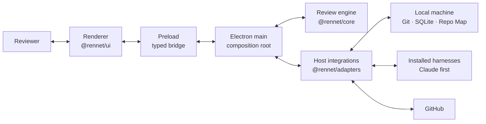
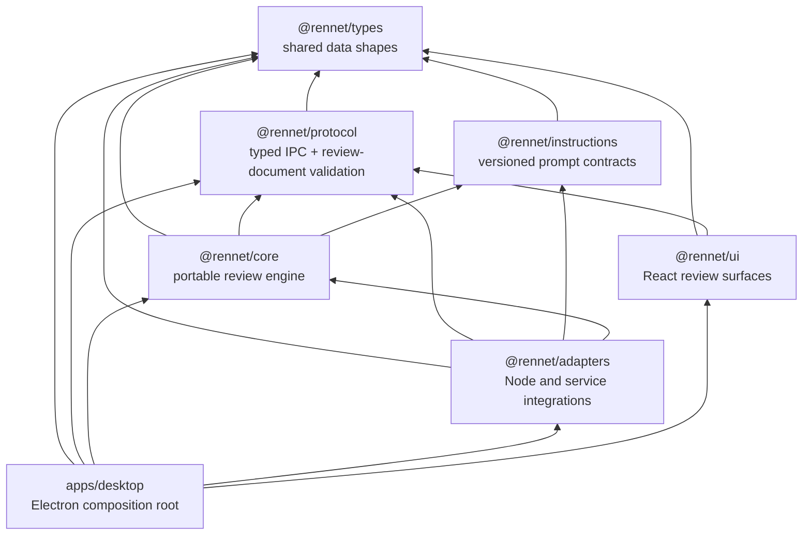
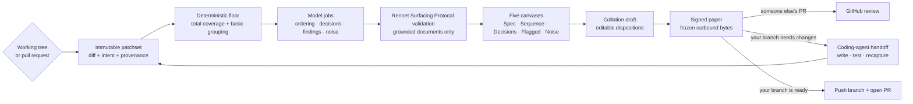
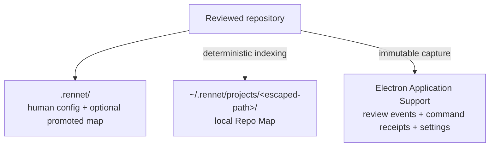
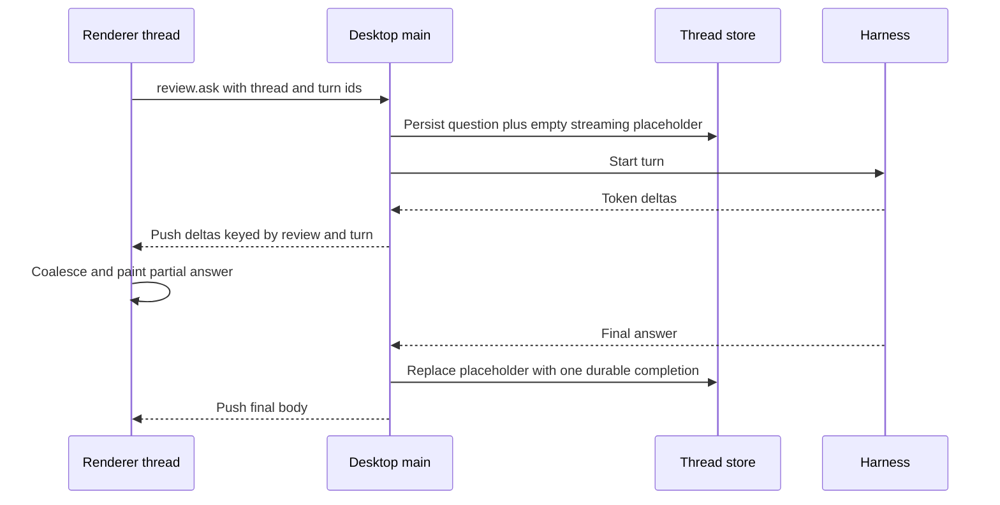

This page is the quickest way to get your bearings in the Rennet codebase. It
shows the boundaries that exist on `main`, then follows one review from Git to a
signed GitHub result and shows where the coding-agent handoff is meant to join.

## The short version

Rennet is an Electron app in a pnpm + Nx monorepo. The renderer is deliberately
thin: it asks the desktop main process to do work through a typed inter-process
communication (IPC) bridge, while
`@rennet/core` owns review behaviour and `@rennet/adapters` talks to Git, GitHub,
SQLite, the filesystem, and installed coding harnesses.

The main process is the authority boundary. The renderer cannot import core or
reach Node APIs directly, and adapters never leak host-specific behaviour back
into the portable protocol.

## Package graph

The arrows below mean “may depend on.” They are enforced by
`scripts/check-boundaries.mjs` and the Nx module-boundary rule; the architecture
target includes a deliberately forbidden import so the check proves it can fail.

| Project | Owns | Must not own |
|---|---|---|
| `@rennet/types` | Shared, transport-safe TypeScript shapes | Runtime behaviour or in-repo dependencies |
| `@rennet/protocol` | IPC commands, Rennet Surfacing Protocol (RSP) schemas, wire validation | Electron, filesystem, or product orchestration |
| `@rennet/instructions` | Versioned base instructions and prompt assembly | Public protocol or host access |
| `@rennet/core` | Capture-independent review logic, event folds, canvases, routing, lineage, publication decisions | Electron, GitHub clients, filesystem calls, or renderer state |
| `@rennet/adapters` | Git, GitHub, SQLite, local files, harness SDKs, and other host integrations | UI or product policy |
| `@rennet/ui` | React surfaces and ephemeral view state | Core imports, Node APIs, or durable review truth |
| `apps/desktop` | Electron main/preload/renderer assembly and live dependency wiring | Reusable domain logic that belongs in a package |

## A review from input to outcome

Both local branches and pull requests become immutable patchsets. Everything
after capture refers to that fixed input, even if the working tree changes or a
pull request is force-pushed while the reviewer is reading.

The deterministic pass is the floor, not the final reading order. It guarantees
that every changed byte has somewhere to go. Model jobs then propose the
human-friendly cohorts, decisions, findings, and noise groups. Rennet validates
their output and places it on a canvas; the reviewer owns the dispositions. The
[surfacing and routing page](/developing/concepts/surfacing-and-routing/)
explains the RSP document shapes and how model jobs reach them.

## The local data model

Rennet keeps three kinds of local state separate because they have different
lifetimes:

- The **Repo Map** is derived project context. Current `main` stores it by escaped
  repository path under `~/.rennet/projects/`; each checkout or worktree gets its
  own local entry. A deliberate promotion can mirror it into `.rennet/` for a team.
- The **review event store** is durable app data. Events and idempotent command
  receipts are persisted; canvas projections are rebuilt in product code.
- Review harnesses currently run against the live checkout. The separate
  immutable materialisation and prompt-staging cache described by the long-term
  contract is not implemented yet.

## What is live and what is a contract

The package boundary, typed Electron bridge, immutable local and remote capture,
review pipeline, five lenses, dual-model findings, comment refinement,
deterministic Repo Map refresh, GitHub review publication, and own-branch
push-plus-PR submission are wired on current `main`.

The handoff bundle, capable harness turn, checkpoints, successor capture,
exact-evidence carry, and optional composition command also exist. They are not a
renderer-to-renderer loop yet: no renderer call invokes the acting command, and
the acting command still rebuilds the mechanical bundle instead of consuming the
composer's exact output.

The architecture still contains deliberate future seams: additional harnesses,
remote/mobile clients, and public release machinery are not all live merely
because their ports or contracts exist. The
[architecture contracts](/developing/concepts/architecture-contracts/) page
keeps those requirements separate from observed implementation.

## Conversation transport and durability

Inline review questions stream from desktop main to the renderer on a channel
keyed by review and turn. The renderer coalesces token deltas before painting;
those partial bodies are live display state, not durable conversation history.

If the process dies first, the empty `streaming` placeholder reloads as
`interrupted`; no partial token buffer is promoted to a finished answer. A
malformed thread file degrades to no restored threads and is left untouched for
manual recovery. On app quit, desktop main aborts every registered turn. Codex's
child is killed through its executor; the Claude SDK exposes no child PID, so
Rennet can request cancellation but cannot claim it observed the process exit.

Persisted threads do reattach after reload. Main-alive in-flight enumeration is
not wired yet—`review.reattach` returns an empty `inFlight` list—so a freshly
loaded renderer cannot reconstruct deltas it missed before subscribing. The
durable completion or honest interrupted placeholder remains the source of
truth.

## Where to go next

- [Architecture contracts](/developing/concepts/architecture-contracts/) explains
  patchsets, freshness, persistence, harness authority, and publication in depth.
- [Contracts and rulings](/developing/reference/contracts-and-rulings/) explains
  which decision wins when old plans disagree.
- [Dependency standard](/developing/reference/dependency-standard/) records which
  package owns each piece of plumbing and which alternatives stay out.
- [Delivery order](/developing/reference/delivery-order/) is the current build
  sequence. Re-check its “true right now” claims against `main` before acting.
