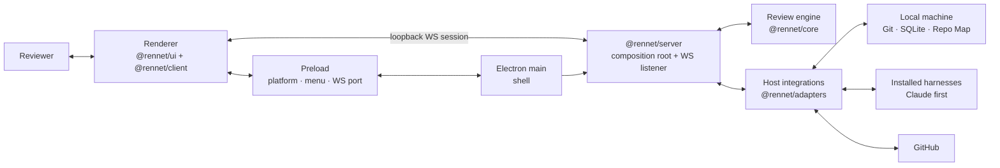
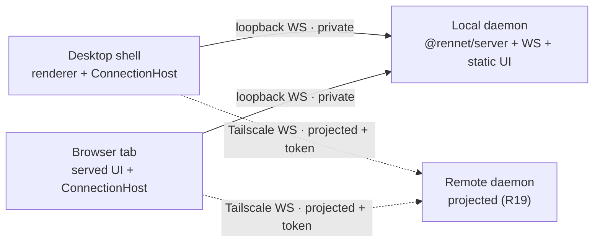
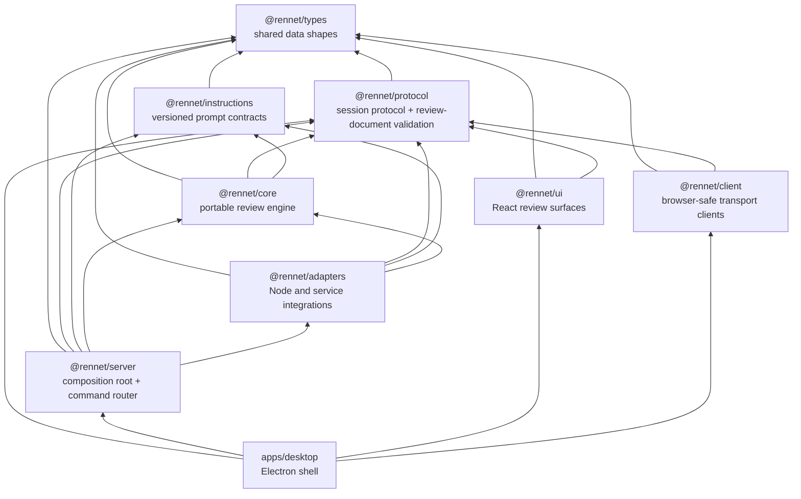
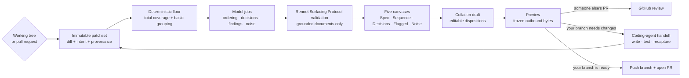
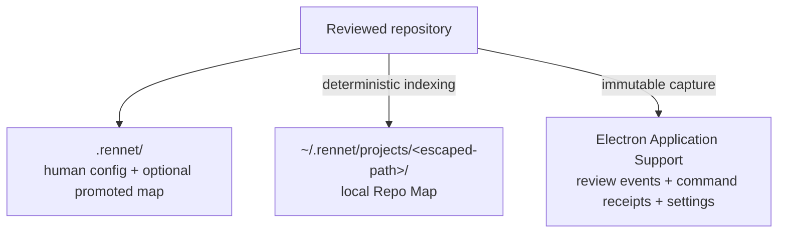
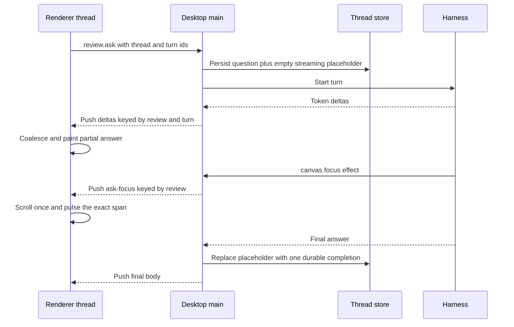

This page is the quickest way to get your bearings in the Rennet codebase. It
shows the boundaries that exist on `main`, then follows one review from Git to a
posted GitHub result and shows where the coding-agent handoff is meant to join.

## The short version

Rennet is an Electron app in a pnpm + Nx monorepo. The renderer is deliberately
thin: it asks the server to do work by speaking a typed session protocol over a
loopback WebSocket. As of the app-server wave the composition root — every store,
adapter, and the 49-command dispatch router — lives in `@rennet/server`, built by
`createRennetServer(options)`, which also starts a WebSocket listener on an
ephemeral `127.0.0.1` port. The Electron main process is a shell that instantiates
the server in-process; the renderer connects to that listener as client #1 through
`@rennet/client`'s `WsRennetBridge`. `@rennet/core` owns review behaviour and
`@rennet/adapters` talks to Git, GitHub, SQLite, the filesystem, and installed
coding harnesses.



The main process owns windows, menu, the `app://` protocol, and auto-update, and
hands the Electron-owned effects (data directory, repository-chooser dialog,
`shell.openPath`, and `net.fetch`) to the server as options. Command invocation
and the progress / ask-stream push streams travel the server's loopback
WebSocket, which the renderer reaches through `WsRennetBridge` — the same wire
the served browser tab and the `rennet` CLI already use, and future mobile clients
will use, so a transport bug shows up as a bug in every shell. The renderer cannot import core or reach Node APIs directly, and
adapters never leak host-specific behaviour back into the portable protocol.

## Two shells, one UI

The desktop app is no longer the only way to run Rennet. The daemon serves the
**same** `@rennet/ui` as a browser client over its HTTP port, so a browser tab is a
full peer of the Electron window — same surfaces, same capabilities, no read-only
mode and no feature that exists in only one shell. Both shells mount one shared
`ConnectionHost` (in `@rennet/ui`) that owns *which daemon this window is attached
to*: the local daemon by default, plus any saved remote daemons (added with a
phase-4 pairing code). Switching daemons remounts the app against the chosen one.

The browser shell is a composition file (`apps/desktop/src/browser/`), not a second
UI — it injects a bridge factory into `ConnectionHost` exactly as the renderer does,
so `@rennet/ui` never imports a transport. A loopback tab is `private` (the full
contract); a remote tab is `projected` (the R19 public projection, per the
[remote access guide](/using/guide/remote-access/)). Reaching a remote daemon is a
Tailscale hop — there is no relay and no hosted backend.



Machine-bound actions key on the daemon's machine, never the shell: open-in-editor
opens where the daemon runs, and an absent capability reports itself honestly rather
than breaking. No command is gated on which shell invoked it.

## Package graph

The arrows below mean “may depend on.” They are enforced by
`scripts/check-boundaries.mjs` and the Nx module-boundary rule; the architecture
target includes a deliberately forbidden import so the check proves it can fail.



| Project | Owns | Must not own |
|---|---|---|
| `@rennet/types` | Shared, transport-safe TypeScript shapes | Runtime behaviour or in-repo dependencies |
| `@rennet/protocol` | Session envelope, command definitions, Rennet Surfacing Protocol (RSP) schemas, wire validation | Electron, filesystem, or product orchestration |
| `@rennet/instructions` | Versioned base instructions and prompt assembly | Public protocol or host access |
| `@rennet/core` | Capture-independent review logic, event folds, canvases, routing, lineage, publication decisions | Electron, GitHub clients, filesystem calls, or renderer state |
| `@rennet/adapters` | Git, GitHub, SQLite, local files, harness SDKs, and other host integrations | UI or product policy |
| `@rennet/server` | The `createRennetServer` composition root: stores, adapter wiring, harness memoisers, and the 49-command dispatch router | Electron imports (its effects are injected as options) or renderer state |
| `@rennet/ui` | React surfaces, ephemeral view state, and the shared `ConnectionHost` daemon-attachment shell | Core imports, Node APIs, a transport client, or durable review truth |
| `@rennet/client` | Browser-safe transport clients — the `WsRennetBridge` the renderer, the served browser tab, and the `rennet` CLI use to speak the session protocol (mobile clients will use it too) | Electron, Node APIs, filesystem, or review logic |
| `apps/desktop` | Electron shell (windows, menu, `app://` protocol, auto-update, the WS port) **and** the served browser shell (`src/browser/` → `dist/browser`, which the daemon serves); both compose a `WsRennetBridge` into `ConnectionHost` | Reusable domain logic that belongs in a package, or a second copy of the UI |

## A review from input to outcome

Both local branches and pull requests become immutable patchsets. Everything
after capture refers to that fixed input, even if the working tree changes or a
pull request is force-pushed while the reviewer is reading.



The deterministic pass is the floor, not the final reading order. It guarantees
that every changed byte has somewhere to go. Model jobs then propose the
human-friendly cohorts, decisions, findings, and noise groups. Rennet validates
their output and places it on a canvas; the reviewer owns the dispositions. The
[surfacing and routing page](/developing/concepts/surfacing-and-routing/)
explains the RSP document shapes and how model jobs reach them.

## The local data model

Rennet keeps three kinds of local state separate because they have different
lifetimes:



- The **Repo Map** is derived project context. Current `main` stores it by escaped
  repository path under `~/.rennet/projects/`; each checkout or worktree gets its
  own local entry. A deliberate promotion can mirror it into `.rennet/` for a team.
- The **review event store** is durable app data that outlives any single session:
  events and idempotent command receipts are persisted, and canvas projections are
  rebuilt in product code.
  - Any persisted review is **loadable by id** — `review.load` folds it back from its
    events as a pure read (no event appended), independent of which review is most
    recent.
  - A load reports whether its recorded repository root still exists, so the renderer
    can show honest missing-context status; bootstrap reports the same presence fact
    for the latest review.
  - Every id-addressed command resolves the review it names rather than assuming the
    globally latest one, so an older reopened review is fully addressable, and
    repository-dependent commands bind their caller path to the addressed review's
    stored root.
- **Navigation state** (the back/forward surface stack plus recents) is
  renderer-local UI state, persisted to a versioned `localStorage` blob and restored
  on the next launch so the app reopens where the user left off. It is deliberately
  separate from the durable event store:
  - A landing rehydrator reloads each surface's content as the user arrives on it.
  - An unreadable or older blob degrades to recents-only with no migration step, and
    an entry that can no longer load is discarded from both Back and Forward in favour
    of the nearest surface that still opens.
  - The parser rejects unrooted or cross-review breadcrumb routes, and each stack half
    is capped at 100 entries so the local blob stays bounded.
- Review harnesses currently run against the live checkout. The separate
  immutable materialisation and prompt-staging cache described by the long-term
  contract is not implemented yet.

## What is live and what is a contract

The package boundary, typed Electron bridge, immutable local and remote capture,
review pipeline, five lenses, dual-model findings, comment refinement,
deterministic Repo Map refresh, GitHub review publication, and own-branch
push-plus-PR submission are wired on current `main`.

The handoff bundle, capable harness turn, checkpoints, successor capture,
exact-evidence carry, and model composer are wired end to end, as is the
deterministic delta account over the successor patchset; the remaining seam is fuzzy
lineage carry.

The acting command runs the composer's exact output bound by its digest, refusing a
tampered or stale bundle, and the renderer composes, previews, and invokes it from
the own-branch destination, surfacing the run outcome truthfully.

The architecture still contains deliberate future seams: additional harnesses, a
dedicated mobile client, and public release machinery are not all live merely
because their ports or contracts exist. (The browser shell and remote projected
access over Tailscale ARE live.) The
[architecture contracts](/developing/concepts/architecture-contracts/) page
keeps those requirements separate from observed implementation.

## The daemon lifecycle

The server runs as a **detached daemon**, not inside the desktop app. The app is a
supervisor and a client: on launch it looks for a healthy daemon and connects to it,
or spawns one and waits for it to come up. Quitting the app stops nothing — the daemon,
and any review turn running inside it, outlive the window. A running review survives
app quit and relaunch; the reopened app reattaches to the same process.

Discovery and supervision are a pidfile plus a health probe, nothing fancier. The
daemon writes `daemon.json` (pid, WS port, protocol version, version, start time) under
its data dir once its listener is up, and removes it on clean shutdown. A launcher — the
desktop shell or the `rennet` CLI — treats that file as a *claim* to verify, never as
truth: it probes `GET /healthz` on the claimed port before trusting it. A missing, stale
(dead pid), or unhealthy claim leads to spawning a fresh daemon that overwrites it. There
is no socket-handover protocol and no leader election; two cooperating launchers
converging on one healthy daemon is enough.

The daemon runs the Electron binary as plain Node (`ELECTRON_RUN_AS_NODE`), so the
packaged app carries and spawns its own daemon with no system Node dependency. On
incompatible protocol skew the shell restarts the daemon with no dialog (a personal
product updates the daemon with the app); the CLI only reports skew, never restarts.

```mermaid
sequenceDiagram
  participant App as Desktop shell
  participant File as daemon.json
  participant Daemon
  participant CLI as rennet CLI

  App->>File: Read the claim
  App->>Daemon: Probe GET /healthz
  alt healthy and compatible
    Daemon-->>App: identity (pid, port, protocol)
    App->>Daemon: Connect over WS (client)
  else missing, stale, or incompatible
    App->>Daemon: Spawn detached (ELECTRON_RUN_AS_NODE)
    Daemon->>File: Write claim once listening
    App->>Daemon: Probe until healthy, then connect
  end
  Note over App,Daemon: App quit closes the window; the daemon keeps running
  CLI->>File: rennet stop reads the claim
  CLI->>Daemon: SIGTERM
  Daemon->>File: Remove claim, shut down cleanly
```

Per-data-dir isolation keeps dev checkouts, agent worktrees, and e2e runs from ever
attaching to the production daemon: the pidfile lives under the data dir, so the
`RENNET_USER_DATA` override that already isolates the stores isolates the daemon too.

## Conversation transport and durability

Inline review questions stream from the daemon to the renderer over the WebSocket wire
on a channel keyed by review and turn. The renderer coalesces token deltas before painting;
those partial bodies are live display state, not durable conversation history.



If the process dies first, the empty `streaming` placeholder reloads as
`interrupted`; no partial token buffer is promoted to a finished answer. A
malformed thread file degrades to no restored threads and is left untouched for
manual recovery. **App quit no longer aborts turns** — the daemon outlives the
window, so a turn keeps running and the relaunched app reattaches to it. A turn is
aborted only by an explicit daemon shutdown (`rennet stop`, a signal, or a
skew-restart): then Codex's child is killed through its executor, while the Claude SDK
exposes no child PID, so Rennet can request cancellation but cannot claim it observed
the process exit.

Persisted threads reattach after reload; live in-flight deltas do not. Main-alive
in-flight enumeration is not wired yet — `review.reattach` returns an empty
`inFlight` list — so a freshly loaded renderer cannot reconstruct deltas it missed
before subscribing. The durable completion or honest interrupted placeholder remains
the source of truth.

## Where to go next

- [Architecture contracts](/developing/concepts/architecture-contracts/) explains
  patchsets, freshness, persistence, harness authority, and publication in depth.
- [Contracts and rulings](/developing/reference/contracts-and-rulings/) explains
  which decision wins when old plans disagree.
- [Dependency standard](/developing/reference/dependency-standard/) records which
  package owns each piece of plumbing and which alternatives stay out.
- [Delivery order](/developing/reference/delivery-order/) is the current build
  sequence. Re-check its “true right now” claims against `main` before acting.
