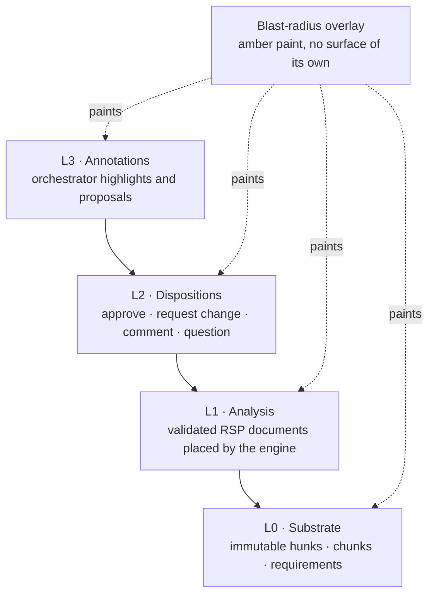
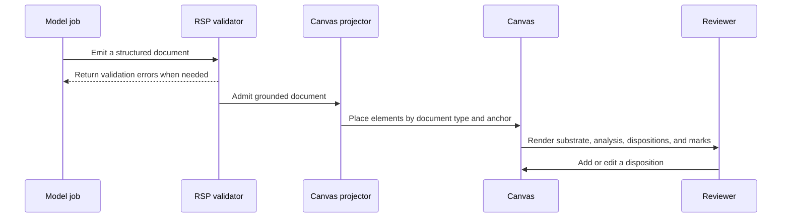

Rennet does not treat a review as one long model answer. It rebuilds a small set
of named canvases from durable review state, then lets the reviewer and the
orchestrator work over those same surfaces.

## The idea in one sentence

An **angle** is a way of looking at a change; a **canvas** is the stateful surface
for that angle in one review and one patchset.

The intended product has five review canvases:

| Canvas | What it helps you answer |
|---|---|
| Spec | What was this change meant to do? |
| Sequence | In what order will the change make sense? |
| Decisions | Which implementation choices deserve human judgment? |
| Flagged | What did the automated review find, and where? |
| Noise | What changed but probably needs little attention? |

Blast radius is different. It is amber paint laid over the other canvases, not
another queue to work through.

Those surfaces are intentionally different species: Sequence is a reading path;
Spec is a structured document; Decisions is a judgment queue; Flagged is an
index; Noise is the visible remainder. [Review lenses](/developing/concepts/review-lenses/)
explains their behavior, provenance, and shared read-coverage floor.

> **Retired surface (#221):** the `claims` canvas is gone. `CanvasAngle`,
> `ChunkAngle`, `CANVAS_ANGLES`, and the `claim` doc type no longer include it —
> the Decisions lens owns that ground. A decomposition persisted before the
> retirement may still carry a `claims` chunk angle; the canvas read path strips
> retired angles (`stripRetiredChunkAngles`) so an old review still opens, while the
> validator rejects a newly declared `claims` angle with V104. Claim and requirement
> links remain useful infrastructure for Spec coverage, test links, and
> unclaimed-change detection.

## Four layers, one surface

Every review canvas is a projection over four layers. The layers keep raw code,
model analysis, reviewer judgment, and conversational marks understandable even
when they occupy the same screen.

**L0, substrate** is the material being reviewed. In code canvases that means
hunks and decomposition chunks; in Spec it also includes requirements.

**L1, analysis** comes from model jobs, but models do not place pixels or mutate
a canvas. They emit [RSP documents](/developing/concepts/surfacing-and-routing/),
the protocol validates them, and a pure projector decides where each admitted
item belongs.

**L2, dispositions** is the forming review. A disposition records an anchor, a
type, and a body. It also feeds read progress, the editable collation draft, a
GitHub review, or the coding-agent handoff.

**L3, annotations** is conversational working state: highlights, callouts,
links, and proposals. It stays visually distinct from the analysis and the
reviewer’s own decisions. Unpinned annotations disappear with the session;
pinned ones survive.

Marks render at their anchors. The mark index only navigates back to them. If an
anchor cannot resolve, the mark stays visible in the orphan tray instead of being
dropped or attached to convenient nearby code.

## How analysis reaches a canvas

The placement path is deliberately boring. That is a strength: model output is
portable across harnesses, while layout and ordering remain repeatable.

Canvas identity is deterministic: a hash of `(reviewId, patchsetId, angle)`.
Element identity is derived from the source document and anchor. Replaying the
same event history therefore rebuilds the same canvas instead of slowly growing
a second source of truth in the UI.

## Who does what

The actors have different jobs, not different levels of importance:

| Actor | Job on a canvas |
|---|---|
| Deterministic engine | Build projections, carry current state, order elements, and recompute affected slices |
| Model fleet | Emit structured analysis documents |
| Orchestrator | Describe, focus, annotate, propose, retrieve, and ask about the review |
| Reviewer | Read, dispose, edit the draft, and sign the outbound result |

The orchestrator reaches the review through `canvasOps@2`. Its useful core is a
zoom ladder: `canvas.describe` gives counts, cohorts, or element summaries;
`canvas.read` opens one item; `diff.read` opens the code beneath it. The protocol
also has `canvas.view`, but its live backend currently returns a static empty
selection rather than renderer view state. The pushed-context design for phrases
like “this decision” is described honestly in [context
assembly](/developing/concepts/context-assembly/).

See [context assembly](/developing/concepts/context-assembly/) for the full tool
surface and primer.

## Patchsets and the collation draft

A canvas belongs to an immutable patchset. A new push creates a successor
patchset and a fresh set of projections. Review state that still refers to the
same code can carry forward through lineage; changed or ambiguous material
reopens for reading.

The [collation draft](/developing/concepts/collation-and-signing/) is a related
canvas with a different substrate. Instead of projecting one angle over code, it
projects the complete ordered disposition set across every angle. That is where
the reviewer rewords, retypes, reorders, merges, splits, and withdraws items
before signing.

## What is live

The current tree has the four-layer `Canvas` model, deterministic projection,
blast-radius paint, event-folded L3 state, user and orchestrator command
vocabularies, the `canvasOps@2` surface, and renderer canvases. Spec, Sequence,
Decisions, Flagged, and Noise all have live product paths.

One piece is still settling: some flat projections still expose less detail than
their final surface calls for. That is a migration edge, not a second product
model. (The `claims` canvas that used to sit here is gone — retired in #221, with
normalize-on-read handling any decomposition persisted before the removal.)

## Code map

| Concern | Source |
|---|---|
| Canvas layers, projection, events, and actor operations | `packages/core/src/canvas.ts` |
| Shared canvas and analysis shapes | `packages/types/src/index.ts` |
| Orchestrator tools | `packages/core/src/canvas-ops.ts` |
| Orchestrator session and future pushed view context | `packages/core/src/orchestrator-session.ts` |
| Canvas renderer logic | `packages/ui/src/canvas/` |
