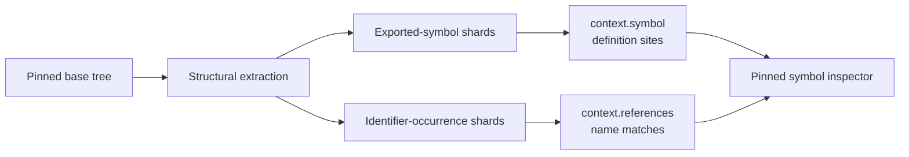
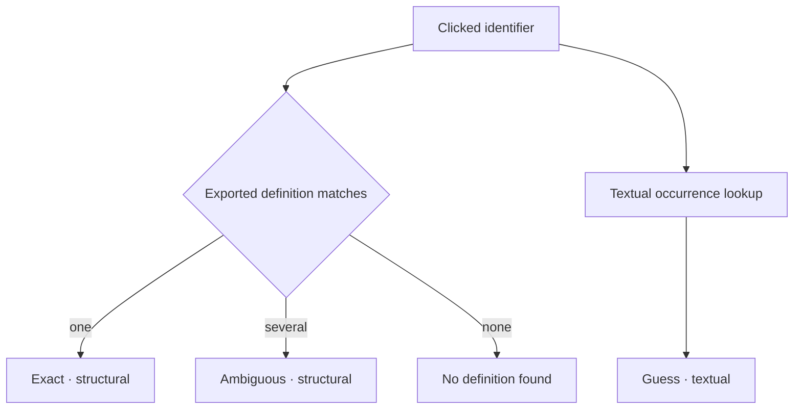
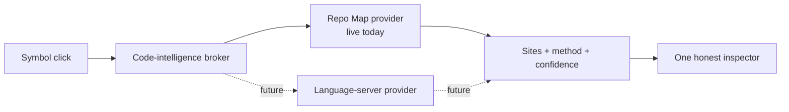

Rennet needs enough code intelligence to answer two practical review questions:
“where is this defined?” and “where else is this name used?” The current answer
comes from Rennet's deterministic Repo Map, not from a language server.

## The live path

Project processing extracts top-level exported declarations and textual
identifier occurrences into content-addressed shards. A review reads those
shards at its pinned base OID through the same freshness checks as the rest of
the Repo Map.

The desktop symbol inspector combines three answers:

- definition sites for one exported name;
- capped reference sites for that identifier; and
- neighbouring top-level symbols from the primary definition's file.

The result is useful for navigation without claiming more semantic knowledge
than the extractor has.

## Confidence is part of the answer

| Section | Label | What it really means |
|---|---|---|
| One unambiguous exported declaration | Exact, structural | Rennet found one matching declaration in its structural index |
| Several matching declarations | Ambiguous, structural | The name alone does not identify one definition |
| Identifier occurrences | Guess, textual | A name-based search found these sites; it is not type-aware |
| Missing or unreadable shard | Unavailable | The index could not answer honestly |

“Exact” does not mean TypeScript language-service resolution. It means exact
within the narrower structural index. References can include unrelated names in
another scope and can miss uses that do not preserve the identifier text.

## Why there is no language server yet

A language server can add type-aware definitions, references, implementations,
call hierarchy, and rename semantics. It also adds project startup, version
negotiation, workspace configuration, cancellation, and cache ownership. Rennet
does not currently run one, and the UI must never badge a textual answer as
language-server truth.

The clean extension is another provider behind the same inspector result:

That keeps the renderer independent of the provider and lets Rennet fall back
to its local structural index when a language server is missing, starting, or
unable to load the project. A future provider must pin its answer to the
reviewed patchset rather than quietly resolving a newer working tree.

## Code map

| Concern | Source |
|---|---|
| Symbol and reference shard generation | `packages/adapters/src/project-snapshot-generator.ts` |
| Pinned snapshot reads | `packages/adapters/src/project-context-reader.ts` |
| Portable inspector result and confidence tiers | `packages/types/src/index.ts` |
| Live definition/reference projection | `apps/desktop/src/main/symbol-lookup-live.ts` |
| Command routing | `apps/desktop/src/main/dispatch.ts` |

See [context assembly](/developing/concepts/context-assembly/) for the
`context.symbol` and `context.references` tool surface, and [architecture
contracts](/developing/concepts/architecture-contracts/) for snapshot freshness.
