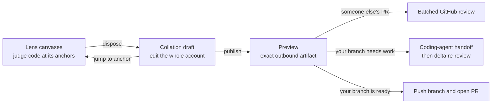
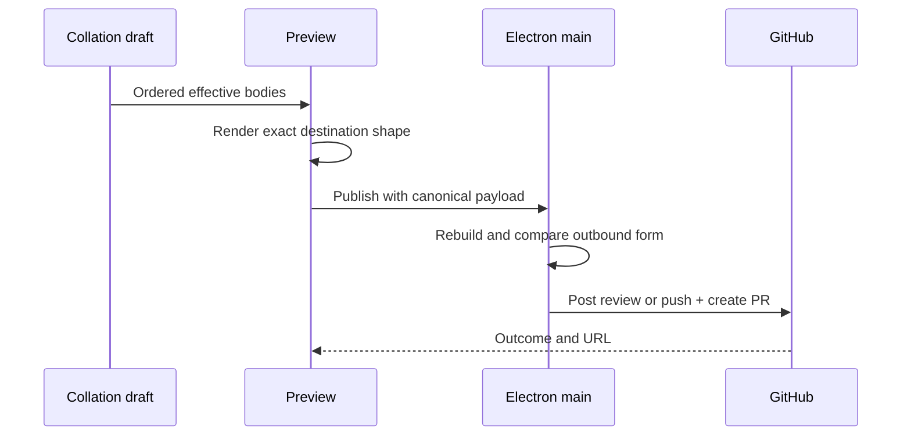

The collation draft is the missing middle between reviewing code and sending a
result. It gathers every disposition (a lens's per-anchor judgment) into one
editable account; publishing turns that account into the outbound artifact that
is pushed or posted.

## The three-part spine

The lens canvases are where judgments begin. The collation draft is where those
judgments become a coherent document. The preview shows the exact result, with
editing kept on the draft.

## Why the draft is its own canvas

A review lens projects one angle over code. The collation draft projects the
complete L2 disposition set (the disposition layer — see [the canvas
model](/developing/concepts/canvas-model/)) across all angles. Here the dispositions themselves
are the main object and code is one click away as supporting context.

The draft is an ordered list, not a map keyed only by file path. That choice makes
three important actions representable:

- **Reorder:** output order is part of how the review reads.
- **Merge:** two related notes can become one instruction or comment.
- **Split:** one note can become two items at the same anchor.

Each item has a stable ID, anchor, disposition type, raw body, optional refined
body, and staging lane. `collationItems()` turns the current ordered list into the
outbound disposition sequence, and `collationPayload()` serialises it in that
same order.

## Editing belongs on the draft

The current draft supports:

| Action | Effect |
|---|---|
| Reword | Changes the original body and clears any now-stale refinement |
| Retype | Switches approve, request-change, comment, or question |
| Move | Changes output order |
| Merge | Joins two raw notes and removes the second item |
| Split | Adds a new empty sibling at the same path |
| Withdraw | Removes the item from the draft |
| Refine | Adds a model-cleaned candidate body |

The renderer ingests a disposition into the draft in the same act that records it
on a lens. There is no separate staging ritual between “I made this judgment” and
“it appeared in my draft.”

## One draft, two destinations

The machinery stays the same in both review modes; only the outbound shape
changes.

| | Your branch | Someone else's pull request |
|---|---|---|
| Draft emphasis | Compose change requests and the PR account | Refine and order review comments |
| Preview shows | PR title, body, base, head, and draft state | Review verdict and anchored comments |
| Publish does | Push the branch and create or reuse the PR | Post one batched GitHub review |
| Needs another coding pass | Intended: hand the same asks to a coding harness, then recapture | Not applicable |

On your branch, the title and body can be drafted by a [Model
Council](/developing/concepts/model-council/) seat and then edited directly. On another person's PR, the preview derives one GitHub review
event from the collated comments.

## The payload follows the preview

All outbound paths derive from the same draft projection the preview renders:

Publishing is the product's external act: the reviewer sees the whole artifact, then
sends that artifact. Internal review state, orchestrator chatter, and refinement
history are not part of the outbound shape unless the reviewer has turned them
into a disposition on the draft.

There is no hosted Rennet backend on either side of that act. The outbound artifact
goes to GitHub; a review's context reaches the harness's model provider. A remote
reviewer reaches the daemon on the host machine directly over the user's own
private network — never through a Rennet server, because none exists. The honest
claim is "no hosted backend", not "nothing leaves the machine".

When the review ran over partially-ingested content — a truncated tail, a binary
blob, or a submodule pointer (R18) — the preview discloses those blockers before
the publish control, so a reviewer knows the review was not a full read before
posting it. This disclosure is non-gating honest copy. It never blocks the
publish path. The reviewer publishes anyway if they choose.

## What is live

The destination frame, editable collation canvas, comment refinement, preview,
batched review post, and own-branch push-plus-PR submission are wired through the
renderer. The preview has a back action; edits happen on the draft.

The write-enabled handoff and delta-recapture machinery is wired behind typed
main-process commands, and the renderer now invokes it: an own-branch review
composes, previews, and runs the handoff bundle. The composer's exact output is
what the acting run executes, bound by its digest. Consuming the successor
patchset into a delta re-review is live: the deterministic delta account renders
from the handoff ask trace. The remaining seam is the fuzzy lineage matcher;
exact-identity carry only, for now.

The deeper orchestrator-on-draft experience is still incomplete. The UI explains
the proposal model, and `canvasOps@2` can raise proposals, but free-form
orchestrator editing of the whole collation draft is not yet the main live path.

## Code map

| Concern | Source |
|---|---|
| Ordered draft model and transforms | `packages/app-ui/src/canvas/collation.ts` |
| Destination staging lanes | `packages/app-ui/src/canvas/staging.ts` |
| Destination-specific payloads | `packages/app-ui/src/canvas/publish.ts` |
| Draft canvas | `packages/app-ui/src/components/collation-draft-canvas.tsx` |
| Preview | `packages/app-ui/src/components/publish-sheet.tsx` |
| Live publish wiring | `packages/app-ui/src/app.tsx` and `apps/desktop/src/main/dispatch.ts` |

See [comment refinement](/developing/concepts/comment-refinement/) for how rough
notes become effective bodies and [the canvas model](/developing/concepts/canvas-model/)
for the wider L0–L3 architecture.
</content>
