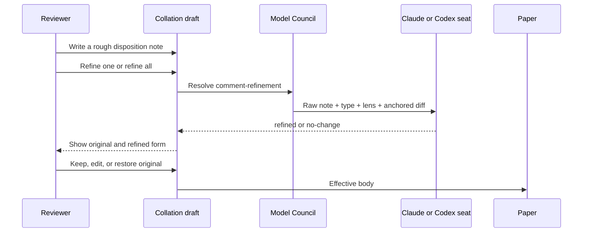
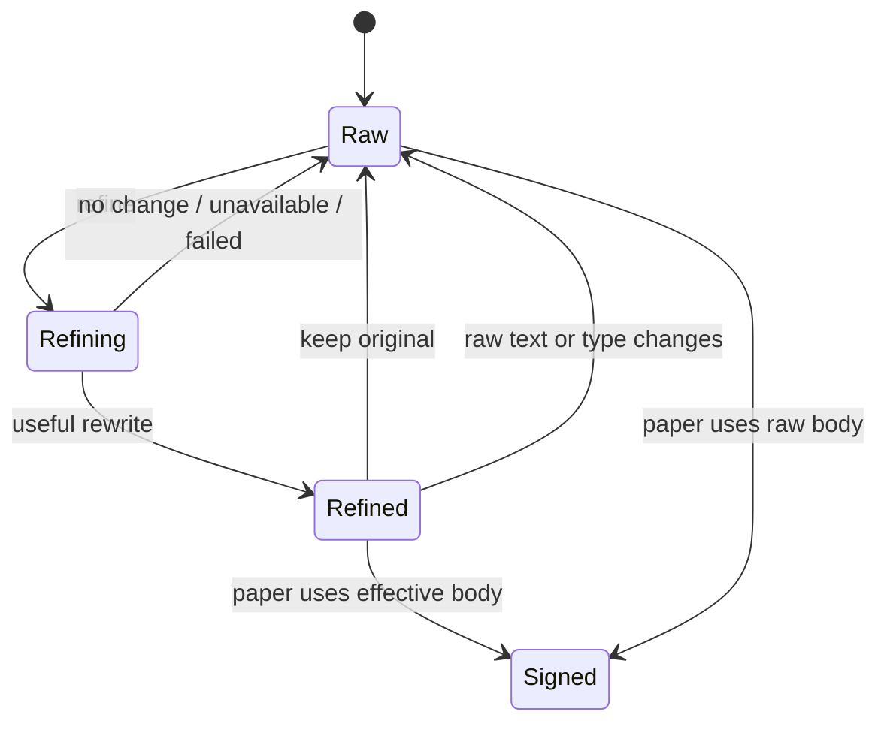

Rennet lets the reviewer write the quick, messy version first. A model can then
turn that note into clearer review prose using the anchored diff as context, while
the original remains easy to restore.

## What ships today

Refinement lives on the [collation draft](/developing/concepts/collation-and-signing/),
not in the paper and not in the main orchestrator chat. The reviewer can refine
one item or run **Refine to post** over every eligible item.



The live model output is intentionally small (illustrative shape; in source it
is the `emitted` arm of `RefinePortResult` in `packages/core/src/refine-comment.ts`):

```ts
type RefineOutput =
  | { verdict: 'refined'; refinedBody: string }
  | { verdict: 'no-change' }
```

There is no separate `refinement@1` RSP document on the live path. The desktop
uses the same structured-output mechanism as review jobs, then maps the result
through the core refinement function.

## The draft item owns both forms

A collation item stores `raw` and, once a useful result lands, `refined`.
`effectiveBody(item)` chooses the refined form when present and otherwise uses
the original.



Every request is bound to a signature of the raw body, disposition type, and
full anchor. If the reviewer edits, retypes, re-anchors, or withdraws the item
while the model is working, the late result is discarded. Rewording or retyping
an already refined item also clears the old refinement, because it describes a
different input.

## What the model sees

The request includes:

- The original note and its disposition type.
- The active lens, which helps disambiguate terse comments.
- The file path and optional line-span anchor.
- The matching unified-diff hunk where possible, otherwise a bounded file diff.

Diff context is capped at 8,000 bytes and visibly marked when cut. A span anchor
selects its own hunk before truncation, so a note near the end of a large file does
not accidentally receive unrelated code from the start.

The [Model Council](/developing/concepts/model-council/) resolves the
`comment-refinement` job. Codex uses one constrained `codex app-server` turn;
Claude uses one structured-output harness session. If neither seat exists or the
turn fails, the draft continues to use the original note.

## Refinement is content work

The useful goal is not to make every comment sound the same. A good refinement:

- preserves the reviewer's point and tone;
- makes the requested change or question concrete;
- uses the nearby code to resolve vague references;
- stays in the reviewer's first person; and
- does not add concerns the reviewer did not express.

The resulting text remains editable on the draft. The paper simply renders the
effective body that the draft currently holds.

## What remains designed, not live

The older design goes further: automatic background refinement on every
body-bearing disposition, a `needs-clarification` result, and a per-disposition
inline thread that can re-run refinement after each answer. `canvas.thread`
already provides a retrieval shape for that conversation, but the live refiner
only returns `refined` or `no-change` and runs when the reviewer asks it to.

That distinction matters when reading the old plan: the current product delivers
“rough note in, clean editable comment out,” but not yet the full anchored
clarification loop.

The completed [#19 refinement issue](https://github.com/rbutera/rennet/issues/19)
deliberately landed the narrower live scope. A future clarification loop should
get its own tracking issue before these docs describe it as scheduled work.

## Code map

| Concern | Source |
|---|---|
| Core prompt and result mapping | `packages/core/src/refine-comment.ts` |
| Live Claude/Codex seat | `apps/desktop/src/main/refine-comment-live.ts` |
| Raw/refined draft model | `packages/ui/src/canvas/collation.ts` |
| Request lifecycle and stale-result check | `packages/ui/src/app.tsx` |
| Refinement controls | `packages/ui/src/components/collation-draft-canvas.tsx` |
