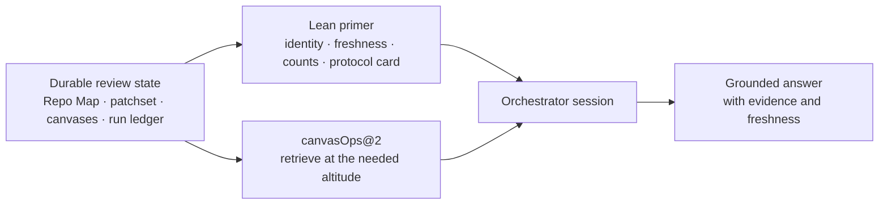
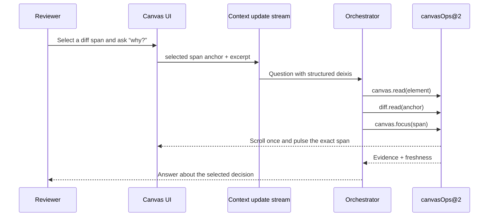

The orchestrator starts with orientation, not a dump of the repository. Rennet
keeps the durable context queryable and gives the orchestrator a compact map plus
tools for zooming into exactly what the conversation needs.

## Map, then retrieve

Dumping the diff, Repo Map, every finding, and every disposition into the opening
prompt wastes the conversation window and goes stale. Picking an arbitrary slice
up front merely hides a different set of useful facts.

Rennet instead treats its stores as the context:



This is Rennet's roll-up and zoom idea pointed inward. The orchestrator can start
with canvas counts, expand to cohorts, inspect one element, then read the hunk or
base-branch symbol beneath it.

## The Repo Map

The user-facing **Repo Map** has two deliberately different layers:

- The deterministic snapshot records files, packages, symbols, dependencies,
  entry points, references, and ownership against a pinned base OID.
- The knowledge layer records model-derived explanations and evidence. It keeps
  provenance and confidence because “why this module exists” is not the same kind
  of fact as “this symbol is exported here.”

Multi-repo workspaces compose repo maps by reference. A workspace context names
member identities, pinned OIDs, fingerprints, cross-repo edges, and freshness;
it does not inline every child map into one enormous document.

## What the primer carries

The primer is deterministic, versioned, byte-bounded, and recorded by digest in
the session provenance. It contains six small sections:

| Section | Contents |
|---|---|
| Identity | Workspace or repo, review, patchset, lineage position, and mode |
| Freshness | One verdict per repo snapshot, up to a fixed cap, then a rollup tail (`… +N more repos — X current / Y not current`) so updating and failed snapshots are never mislabeled stale and large multi-repo reviews stay under the 4,096-byte ceiling |
| Canvas summary | Counts, cohorts, disposition coverage, and residue — no bodies — one line per canvas up to a fixed cap, then a rollup tail with the aggregate counts of the rest |
| Protocol card | How the session works and when to retrieve |
| Tool index | Names and one-line “use this when” descriptions from the live registry |
| Run headline | Tasks run, documents admitted/rejected, and budget summary |

The tool index is derived from `CANVAS_OPS_TOOLS`, so adding a registered tool
updates the menu the orchestrator sees. The full schemas stay on the MCP surface;
they do not all have to live in the opening prompt.

## The live `canvasOps@2` surface

The current registry groups naturally by what it reads or changes:

| Area | Tools |
|---|---|
| Canvas interaction | `canvas.describe`, `canvas.view`, `canvas.focus`, `canvas.annotate`, `canvas.propose`, `canvas.recompute` |
| Canvas retrieval | `canvas.read`, `canvas.thread` |
| Changed code | `diff.read`, `diff.search`, `diff.structure` |
| Run evidence | `run.ledger`, `run.provenance` |
| Repo Map | `context.map`, `context.file`, `context.overview`, `context.symbol`, `context.references` |
| Derived context | `context.novelty`, `context.knowledge` |

Each reply uses one envelope:

```ts
{
  data: unknown,
  evidence?: string[],
  freshness: 'current' | 'updating' | 'stale' | 'failed',
  total?: number,
  cursor?: string | null,
  truncated?: { droppedBytes: number }
}
```

Lists report totals and cursors, and a query with no matches reports an empty
result explicitly. Freshness travels on the answer itself, which matters when a
base branch advances halfway through a long review.

## View context: the live pointing slice

The session model accepts structured selection, disposition, proposal, and view
events. The live ask path now carries the reviewer's selected diff span into the
next turn: the renderer sends an occurrence-relative RSP anchor plus the selected
text, desktop main turns it into a `selected` event, and the orchestrator appends
the exact event JSON to its inspectable turn context. An ask with no selected span
adds no `selected` event.



`canvas.focus` is presentational: it moves the viewport and pulses the resolved
rows without selecting the element, writing a disposition, or changing read
state. Malformed and orphaned anchors are honest no-ops. Continuous renderer view
sync and the `{ viewing }` batcher remain deferred; `canvas.view` therefore still
reports the backend's static view rather than a live stream of every navigation.

## The `context.ask` seam

The design includes a synthesis tool named `context.ask`: one stable request and
answer shape, with any retrieval sub-agent hidden behind it. That keeps the
orchestrator contract independent of how Rennet later implements deeper answers.

It is **not registered on the current live `canvasOps@2` surface**. The primer's
protocol-card text still mentions it, while the live tool index does not. Treat
that as an implementation seam, not a callable capability. Today the
orchestrator uses deterministic retrieval. The `context.knowledge` tool shape
exists, but the persistent model-derived knowledge layer is not composed into
desktop main; a background answer agent and its `answer` document are deferred.

The live tracking item is [#15 — context.ask](https://github.com/rbutera/rennet/issues/15).

## Empirical validation still open

The hybrid design is adopted, but several sizing and behavior choices are still
hypotheses. [Issue #24](https://github.com/rbutera/rennet/issues/24) preserves five
experiments against small, medium, and large reviews with known-answer questions:

| Experiment | What it settles |
|---|---|
| Primer ablation | Fat dump versus capped primer versus lean map and tools; correctness, resident tokens, tool calls, and time to useful output |
| `context.ask` quality | Deterministic composition versus an actual sub-agent, light versus heavy; evidence validity and honest refusal |
| Retrieval latency | Per-tool p50/p95 and quick versus thorough asks; when a synchronous answer needs an asynchronous ticket |
| Retrieval triggers | Whether the protocol card and tool descriptions actually make the model retrieve when the answer is absent, without over-asking or fabricating |
| Session economics | Warm per-review versus fresh per-question sessions and provider-cache effects |

Run these through the existing provenance and run-ledger machinery. The purpose
is to amend the primer and tool contract when evidence disagrees, not to prove a
favored architecture right.

## Code map

| Concern | Source |
|---|---|
| Primer and protocol card | `packages/core/src/orchestrator-primer.ts` |
| Tool registry and envelopes | `packages/core/src/canvas-ops.ts` |
| Session assembly | `packages/core/src/orchestrator-session.ts` |
| View and interaction event stream | `packages/core/src/context-update-stream.ts` |
| Repo snapshot reads | `packages/core/src/project-context.ts` |
| Workspace composition | `packages/core/src/repo-composition.ts` |

See [the canvas model](/developing/concepts/canvas-model/) for the surfaces being
retrieved and [the Model Council](/developing/concepts/model-council/) for how
model-backed context work gets a seat.
