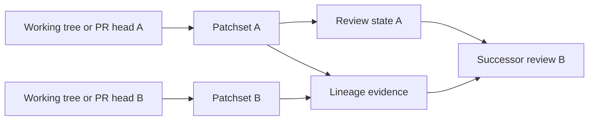
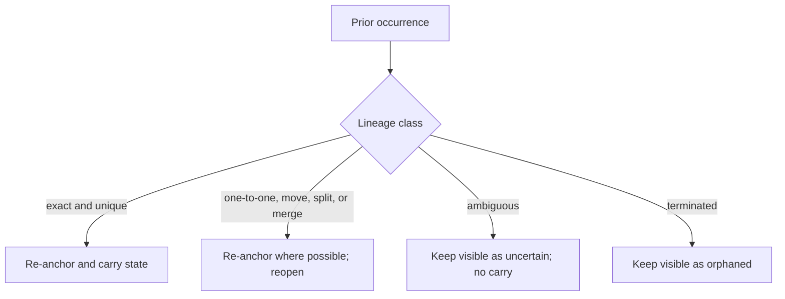
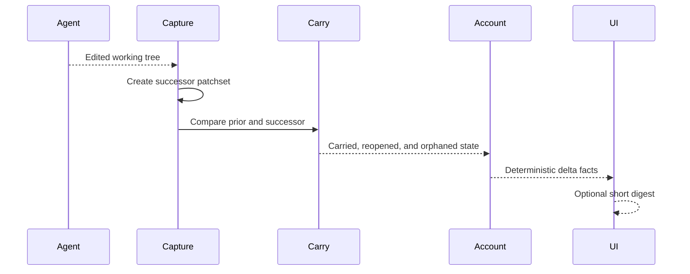

Delta re-review answers the question after an agent edit, push, rebase, or
force-push: “what genuinely changed since the version I reviewed?” Rennet keeps
the old patchset intact, creates a successor, and carries state only where the
continuity is proven.

## Patchsets do not move

The working tree and a pull request head can change. A Rennet patchset cannot.
Every capture records an immutable version of the review material, so re-review
is a comparison between two named things rather than a refresh that rewrites the
past.



The successor may reuse proven unaffected work, but it never mutates patchset A
or its original analysis.

## Occurrence and lineage

An occurrence is one reviewable piece of code inside one patchset. Its ID belongs
to that patchset. A path, symbol name, content hash, or nearby text can help map
it to a later patchset, but none of those facts is durable identity by itself.

The lineage graph can describe:

- `exact` — byte-identical and uniquely matched at the same path;
- `one-to-one` — one edited occurrence continues as one successor;
- `move` — the same bytes appear elsewhere;
- `split` — one occurrence becomes several;
- `merge` — several occurrences become one;
- `ambiguous` — more than one continuation is plausible;
- `terminated` — there is no successor.

These labels explain the relationship. They do not all grant permission to
carry review state.



## Exact is the only fuzzy-graph auto-carry

`AUTO_CARRY_LINEAGES` contains only `exact`. The structural reason is stronger
than a confidence score: byte-identical content at one unique `(body, path)` has
a forced match. Duplicate bodies at the same path are marked ambiguous rather
than assigned by nearby-text similarity.

`move` is intentionally excluded. From content and context alone, “the same
function moved” is indistinguishable from “the old function was deleted and an
unrelated copy already existed elsewhere.” The synthetic adversarial corpus
found two wrong move carries that would have occurred if move were allowed.

The committed synthetic corpus keeps the trade visible and executable:

| Class | Obs | Fixture pairs | TP | FP | FN | Fixture pass rate | Recall |
|---|---|---|---|---|---|---|---|
| `exact` | 21 | 7 | 21 | 0 | 0 | 100.0% | 100.0% |
| `move` | 5 | 4 | 4 | 2 | 1 | 66.7% | 80.0% |
| `one-to-one` | 6 | 5 | 6 | 0 | 0 | 100.0% | 100.0% |
| `split` | 1 | 1 | 1 | 0 | 0 | 100.0% | 100.0% |
| `merge` | 2 | 1 | 2 | 0 | 0 | 100.0% | 100.0% |
| `ambiguous` | 7 | 2 | 7 | 0 | 0 | 100.0% | 100.0% |
| `terminated` | 3 | 3 | 2 | 0 | 1 | 100.0% | 66.7% |

**Auto-carry (exact only):** fixture pass rate 100.0% over 21 observations from 7 independent fixture pairs (95% Wilson lower bound 84.5%). **Wrong carries under the live policy: 0** (must be 0).

**Why not `move`:** enabling `move` auto-carry would produce **2 wrong carries** on this corpus (delete-plus-copy read as relocation; a decoy that kept the old context stealing the lineage) against 4 correct moves — so it is excluded. `exact` carry safety does NOT rest on the pass rate above (a synthetic-corpus statistic): it rests on the STRUCTURAL argument that a byte-identical body at a UNIQUE (body, path) can only be mismatched by a SHA-256 collision, and a duplicated (body, path) fails closed to `ambiguous`.

The corpus contains 19 synthetic patchset pairs and no client code. It measures
the classifier and catches regressions; the uniqueness rule is what makes exact
carry structurally defensible.

## Two mechanisms, on purpose

The fuzzy occurrence graph and disposition carry are separate today.

```mermaid
flowchart LR
  subgraph Fuzzy["Occurrence matcher"]
    oldOcc["Prior occurrences"] --> match["Weighted global matching"]
    newOcc["Successor occurrences"] --> match
    match --> graph["LineageEntry graph"]
    graph --> analysis["Future analysis re-anchoring"]
  end

  subgraph Deterministic["Live disposition carry"]
    oldPatch["Prior file and span bytes"] --> compare["Digest + byte checks"]
    newPatch["Successor file and span bytes"] --> compare
    rename["Git rename provenance"] --> compare
    compare --> dispositions["Carry, reopen, or orphan dispositions"]
  end
```

### Fuzzy occurrence matcher

`packages/core/src/lineage-matcher.ts` weighs exact content, normalized content,
path, symbol, and surrounding context, then finds a global maximum-weight match.
It emits the graph shape that `resolveAnchor()` can consume, but production does
not call the classifier or supply its graph to analysis generation today. The
matcher is measured code awaiting live composition, not a claim that similar
analysis is already re-anchored.

### Deterministic disposition carry

The live review and handoff path uses `carryDispositionsByLineage()` instead of
the fuzzy matcher. It checks same-path patch identity and span bytes. Through a
Git-proven rename, a byte-identical span can carry and re-anchor. A whole-file
disposition reopens because rename patch headers change. A vanished target
becomes orphaned.

This distinction matters: keeping a safe Git-proven rename capability does not
accidentally let every fuzzy `move` edge carry approval state.

## The delta account

After the handoff captures a successor patchset,
`packages/core/src/delta-account.ts` builds a deterministic account before any
model writes a summary. It records:

- whether each prior ask was addressed, partially addressed, or untouched;
- paths touched outside the asks;
- carried and orphaned dispositions;
- rename links from the successor capture.

A light model may turn those facts into a short headline. The UI still renders
the facts when that turn is unavailable, and the model cannot add a state the
account did not contain.



## Current boundary

The matcher and its measurement suite are implemented. Exact-only authority is
shared from `@rennet/types`, so consumers cannot each invent their own carry
allowlist. The live handoff path still uses the deterministic file/span seam;
the fuzzy sub-file matcher is not wired into disposition carry.

That can reopen more work than a perfect matcher would. It is honest about the
remaining review rather than declaring similar code already approved.

See [agent handoff](/developing/concepts/agent-handoff/) for the loop that creates
the successor patchset, and
[architecture contracts](/developing/concepts/architecture-contracts/) for the
immutable patchset contract.
