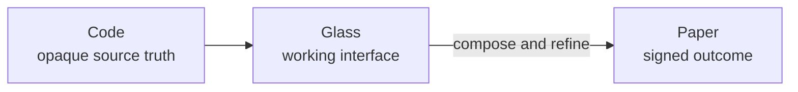
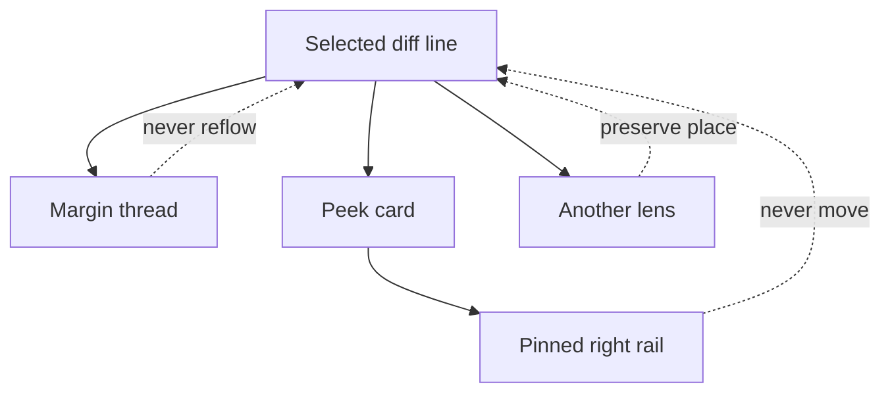
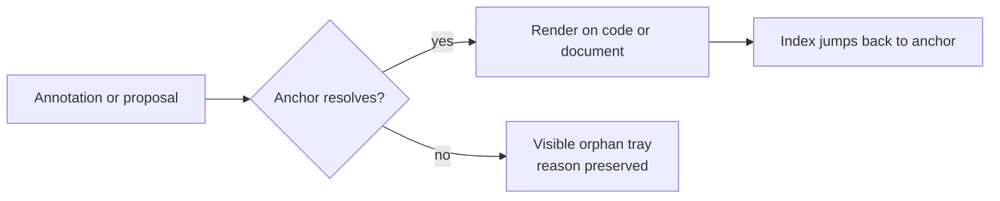

Rennet's interface should make private thinking, source code, and a signed
outcome feel like different kinds of object. These rules are the floor for UI
work, not a mood board to consult at the end.

## Three materials

- **Glass is the working interface.** Navigation, lenses, controls, drafts, and
  private annotations can be translucent. Glass says “still being formed.”
- **Code is opaque.** Diff and source surfaces need stable contrast. Decorative
  glass must never make code harder to read.
- **Paper is signed.** The final preview is the one solid object. Editing happens
  back on the glass draft; signing freezes the result that leaves Rennet.

The collation draft is intentionally glass. Signing is the phase change that
makes it paper.

## Two registers

Rennet uses material and colour to answer a practical question: where will this
thing go?

| Register | Meaning | Typical use |
|---|---|---|
| Ink | Public or publish-bound | PR content, the signed review, material already visible to the team |
| Backlight blue | Private to the local review | Notes, local worktrees, orchestrator annotations, working context |

Amber has one narrow job: blast radius, disagreement, and other review signals
that deserve attention. It is not a general accent. Do not add a fourth
semantic hue to make a screen lively.

## The fixed-point rule

The diff is the user's place in the review. Controls may appear around it, but
the line under the cursor must not jump because a thread opened, a lens changed,
or a symbol was inspected.

Use margin threads, overlays, and a peek-then-pin inspector. Do not insert a
large conversation block into the diff column and shove the code around.

## Anchors are home

A mark lives at the line, range, chunk, requirement, or conversation fragment it
refers to. An index can jump to that anchor; it must not become a detached list
that makes the reviewer guess where a finding belongs. If placement fails, show
the mark in a visible orphan tray with the reason. Never guess a nearby anchor.

## Progressive disclosure without hiding truth

The first view should be calm, but every decision and every unread part of the
change must remain reachable.

- Roll related changes into understandable cohorts.
- Collapse detail; do not truncate or silently cap it.
- Keep Noise as a visible totality floor, not a bin that makes content vanish.
- Explain degraded or incomplete data where the user encounters it.
- Let the user zoom from a review-wide view to the exact hunk and back again.

## Make machine work legible

The mature experience narrates useful progress: what Rennet is reading, what it
has produced, and what is still running. A spinner is acceptable only as a
short-lived placeholder for the processing screen while the real narration feed
is being built. It is not the default answer for a new loading state.

## Keep the chrome terse

Controls should usually fit in four words. The content being reviewed can
breathe; the interface around it should get out of the way.

- Use proportional type for interface chrome. Monospace is for code.
- Keep serif type for paper—the signed destination—not ordinary working chrome.
- Prefer one familiar glyph over a row of labelled utilities.
- Give unfamiliar glyphs a tooltip and include them in the product legend.
- Use the shared design tokens. New one-off colours and radii usually signal a
  missing system decision.

The four-word rule applies to chrome, not to the material being understood.
Model evidence, review prose, reconstructed reasoning, and processing narration
may breathe when brevity would make them cryptic.

## Accessibility is ordinary craft

- Every pointer action needs a keyboard route and a visible focus state.
- Respect reduced-motion preferences; removing animation must not remove status.
- Secondary text still needs readable contrast on glass and paper.
- Use the shared icon components for real controls. Do not use emoji or arbitrary
  text glyphs as the only meaning-bearing icon.
- Keep labels or accessible names when a compact glyph replaces visible text.

## Show mode without asking permission

Every in-project screen should surface the current execution mode rather than bury it; the execution locus is a visible setting on the settings screen.
Auto is the normal mode. A read-only mode can describe a retrospective review,
but there is no “ask before each model turn” mode: running review models is the
job of the product.

Publishing is a different moment. The paper tells the user exactly what will be
posted, and the user's sign is what makes it public.

## Review checklist

Before a UI change is done, check:

1. Can a reader tell private backlight from publish-bound ink?
2. Does code remain opaque and stable?
3. Can any interaction move or reflow the current diff anchor?
4. Is important detail collapsed rather than lost?
5. Does loading say what the machine is doing?
6. Is the chrome short, proportional, and built from shared tokens?
7. Does the signed paper match the outbound artifact exactly?
8. Can the same work be done by keyboard, with reduced motion and readable contrast?
9. Does every mark live at an anchor or in an explicit orphan tray?

## Where to go next

- [Canvas model](/developing/concepts/canvas-model/) explains the layers that these materials render.
- [Collation and signing](/developing/concepts/collation-and-signing/) follows glass becoming paper.
- [Architecture overview](/developing/concepts/architecture-overview/) places the renderer in the wider system.
