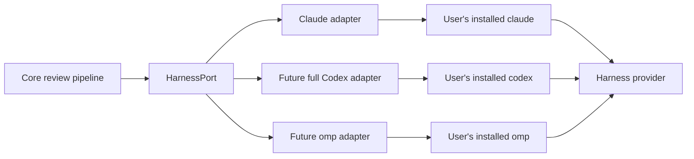
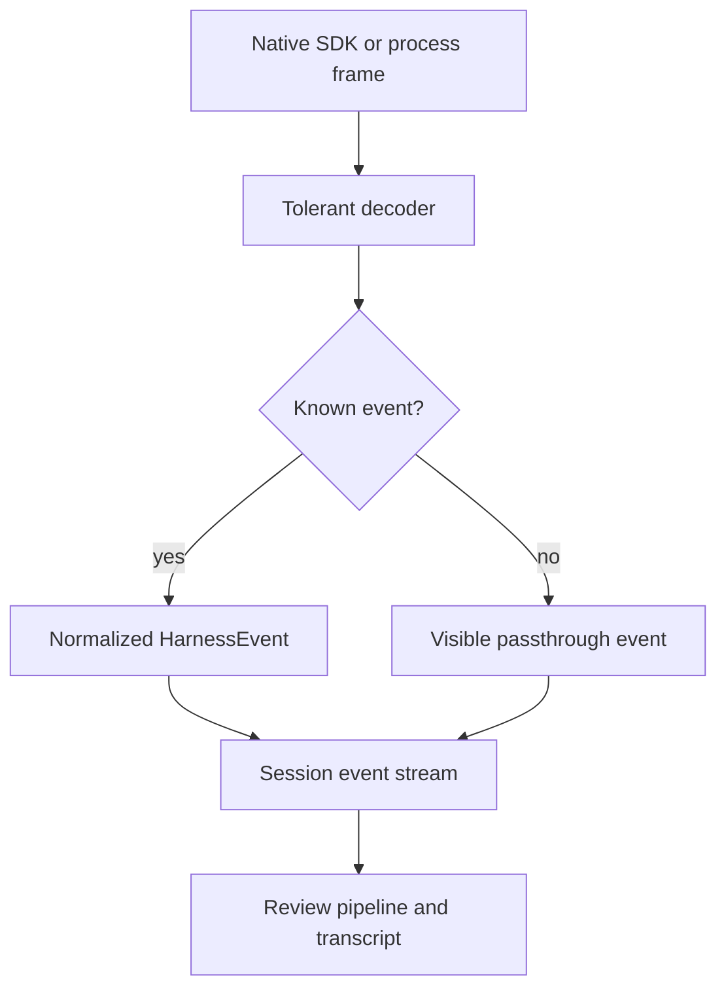
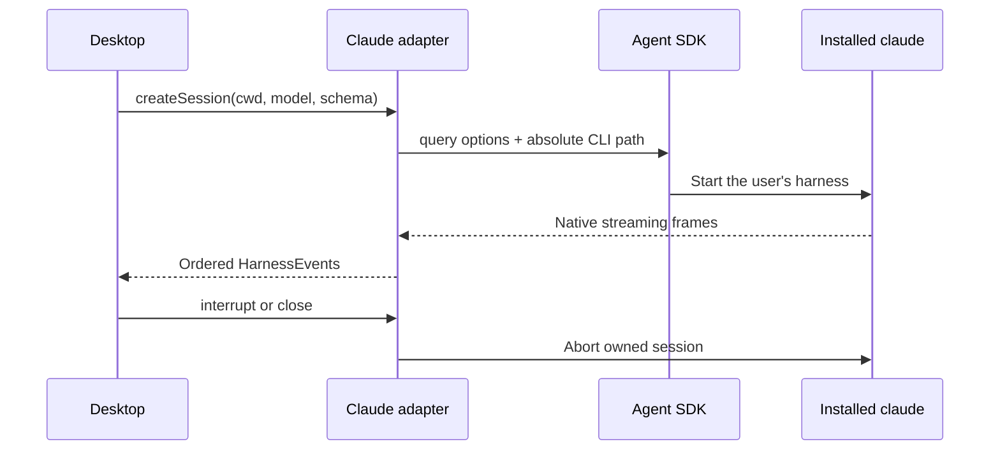

Harness adapters let the rest of Rennet speak one language even though Claude
Code, Codex, and other coding harnesses have different processes and event
formats. Rennet uses the tools already installed on the machine; it does not
bundle its own harness binary or read a harness credential.

## The boundary



`HarnessPort` lives in `packages/core/src/harness.ts`. It is free of Node and
Electron APIs. The real process integration lives in `packages/adapters`, and
the desktop app composes the two.

The port currently covers descriptor and health data, session creation, one
event stream per session, turn start, interrupt, and close. Resume, fork, a full
cross-adapter conformance runner, and the complete Codex/omp adapters remain
later slices.

## One normalized event stream

Every native harness frame becomes a `HarnessEvent` with a common envelope:

```ts
interface HarnessEventBase {
  seq: number
  harness: "claude-code" | "codex" | "omp"
  sessionId: string
  turnId: string | null
  receivedAt: number
  native: unknown
}
```

The adapter assigns `seq`; it does not trust provider timestamps for ordering.
The untouched native frame travels with the normalized view, so a newer harness
event is visible even before Rennet knows how to model every field.



The useful event kinds today are session start/end, text deltas and messages,
tool start/output/denial, normalized errors, and the metered-key warning. Tool
outputs keep both the structured value and readable text; callers do not have to
scrape prose when the harness supplied real data.

## Claude Code is the live adapter

The Claude adapter uses `@anthropic-ai/claude-agent-sdk`, but points it at the
user's installed `claude` through `pathToClaudeCodeExecutable`. The SDK's bundled
platform executables are removed during packaging, so the packaged app does not
quietly substitute another CLI.

The adapter also preserves the child environment. This matters because the SDK's
`env` option replaces the whole environment rather than merging it. Losing
`PATH`, `HOME`, or harness configuration here would look like a broken install.



Sessions are capable by default. A caller may select tools for a particular
workload, but the adapter does not impose a read-only posture or deny shell
access on the acting path.

## Discovery without shell tricks

A desktop app launched from Finder does not inherit the same environment as an
interactive terminal. On top of that, `claude` or `codex` may be shell functions,
so asking `which` for a path can return something that is not executable.

Rennet therefore:

1. asks the login shell for `PATH` only;
2. combines it with the app's `PATH` and known install directories;
3. finds executable candidates itself;
4. runs each candidate with `--version`;
5. ranks usable absolute paths and records health as ready, degraded, or
   unavailable.

Codex discovery also skips broken shims by probing with closed stdin and a hard
timeout. Discovery proves that a binary runs; the adapter never opens Claude or
Codex credential files.

## Capabilities are evidence, not a promise

A capability has three layers:

| Layer | Question |
|---|---|
| `implementedByAdapter` | Does Rennet contain the mapping code? |
| `advertisedByHarness` | Does this installed harness version claim support? |
| `availableInSession` | Did the capability work in this live session? |

All three start false. Passing checks add evidence; documentation alone does not
turn a flag on. This stops a newer or older local CLI from inheriting a capability
the current session cannot actually service.

## Authentication and cost honesty

The harness authenticates itself. Rennet never copies an OAuth token or API key
into the adapter.

Claude reports `apiKeySource` on the session start frame. Subscription OAuth
(`oauth`, and the observed subscription value `none`) is free at the point of use.
`user`, `project`, `org`, or `temporary` means a metered key is paying. The adapter
emits a visible warning when that happens; it reports the fact without blocking
the turn.

Usage is equally literal. When a harness reports token or cost data, Rennet
records it. Missing usage remains missing rather than being replaced with zero,
and a derived estimate is never presented as a provider-reported charge.

## Error shape

Native failures map into a small taxonomy—authentication, rate limit, quota,
context overflow, overload, upstream failure, invalid request, policy, sandbox,
cancellation, max turns, harness unavailable, protocol, or unknown. The event
also records whether the error came from the adapter, harness, provider, or
transport, and whether retryability was reported or inferred.

That gives the UI something better than substring matching, while the native
frame remains available for diagnostics.

## Current and deferred

| Area | Status |
|---|---|
| Claude discovery, health, sessions, streaming, tools, errors, usage | Live |
| Fully capable Claude handoff turn | Live |
| Codex binary discovery and utility execution | Live |
| Full Codex `HarnessPort` session adapter | Deferred |
| omp/Pi adapter | Deferred |
| Resume and fork in the normalized port | Deferred |
| Cross-adapter conformance suite | Deferred |
| Multi-harness self-consistency and disagreement sampling | Deferred |

The main follow-ups are [#25 for a full Codex adapter and shared conformance](https://github.com/rbutera/rennet/issues/25)
and [#41 for multi-harness disagreement work](https://github.com/rbutera/rennet/issues/41).

See [agent handoff](/developing/concepts/agent-handoff/) for the main acting
consumer of this boundary.
