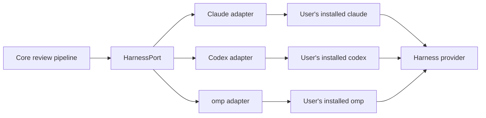
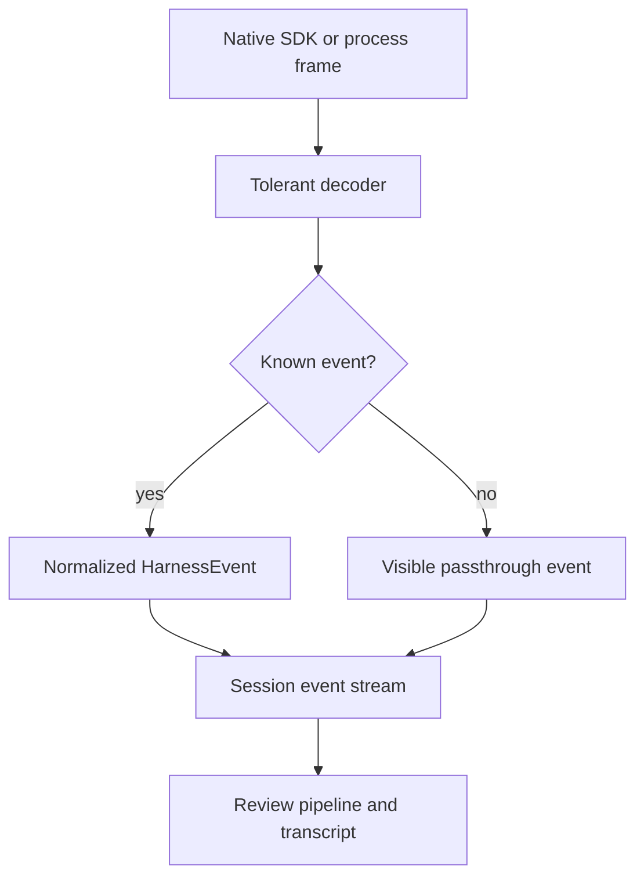
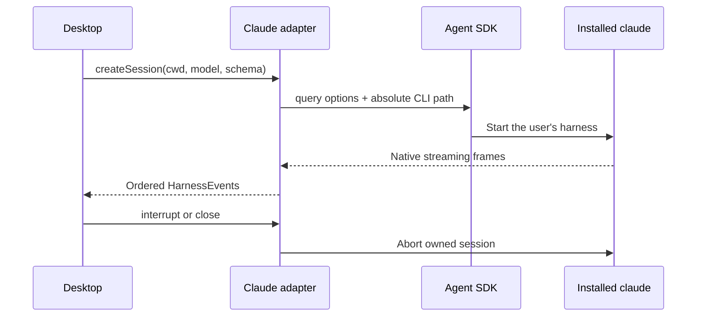

Harness adapters let the rest of Rennet speak one language even though Claude
Code, Codex, and other coding harnesses have different processes and event
formats. Rennet uses the tools already installed on the machine; it does not
bundle its own harness binary or read a harness credential.

## The boundary



`HarnessPort` lives in `packages/core/src/harness.ts`. It is free of Node and
Electron APIs. The real process integration lives in `packages/adapters`, and
the desktop app composes the two.

The port currently covers descriptor and health data, session creation, one
event stream per session, turn start, interrupt, and close. Three real adapters
implement it — Claude Code, Codex, and omp — and one cross-adapter conformance
suite runs against all three. Resume and fork remain later slices. The omp
adapter's hermetic suite proves only its interrupt and text-delta mappings, at
`implementedByAdapter`; every outer layer stays false until a gated real run.

## One normalized event stream

Every native harness frame becomes a `HarnessEvent` with a common envelope:

```ts
interface HarnessEventBase {
  seq: number
  harness: "claude-code" | "codex" | "omp"
  sessionId: string
  turnId: string | null
  receivedAt: number
  native: unknown
}
```

The adapter assigns `seq`; it does not trust provider timestamps for ordering.
The untouched native frame travels with the normalized view, so a newer harness
event is visible even before Rennet knows how to model every field.



The useful event kinds today are session start/end, text deltas and messages,
tool start/output/denial, normalized errors, and the metered-key warning. Tool
outputs keep both the structured value and readable text; callers do not have to
scrape prose when the harness supplied real data.

## Claude Code adapter

The Claude adapter uses `@anthropic-ai/claude-agent-sdk`, but points it at the
user's installed `claude` through `pathToClaudeCodeExecutable`. The SDK's bundled
platform executables are removed during packaging, so the packaged app does not
quietly substitute another CLI.

The adapter also preserves the child environment. This matters because the SDK's
`env` option replaces the whole environment rather than merging it. Losing
`PATH`, `HOME`, or harness configuration here would look like a broken install.



Sessions are capable by default. A caller may select tools for a particular
workload, but the adapter does not impose a read-only posture or deny shell
access on the acting path.

## Codex is the second adapter

The Codex adapter is the peer of the Claude adapter and the proof the boundary is
harness-agnostic. It speaks the `codex app-server` JSON-RPC protocol behind an
injected `CodexTurnTransport` — the mirror of the Claude adapter's injected query
function. The adapter is pure over that seam (fully testable without a process);
the composition root spawns the user's discovered `codex` binary as
`codex app-server` and speaks newline-delimited JSON-RPC 2.0 over its stdio.

One turn-scoped child runs one turn: `initialize` → `initialized` →
`thread/start` → `turn/start`, consuming streamed `item/*` notifications until
`turn/completed`, then the child is terminated. `turn/start` carries the prompt
input, `cwd`, the model, the full-access sandbox policy, never-ask approvals, and
— when the session spec carries one — the protocol's first-class `outputSchema`
parameter, so structured output round-trips in-protocol with **no scratch files
on the turn path**. (Reasoning `effort` is forwarded only by the utility one-shot
executor; the agentic `HarnessSession` turn spec carries no `effort` field.) The line protocol (readline over stdout,
`JSON.parse` per line, an id-correlation map) is a few lines, not a dependency.

```
codex app-server
  -c mcp_servers=<inline TOML>   # full-table replace: ONLY Rennet's canvasOps MCP
# then over stdio, per turn:
#   initialize → initialized → thread/start → turn/start → … → turn/completed
#   thread/start + turn/start compose dangerFullAccess sandbox + never-ask approvals
```

`codex app-server` **rejects `--ignore-user-config`** (verified against the real
binary), so determinism is pinned differently: the `-c mcp_servers=…` override
replaces the entire `mcp_servers` table, leaving the child with only Rennet's
canvasOps MCP regardless of the user's `~/.codex`; other config loads as it does
for any app-server client.

The adapter normalizes the app-server notifications into the same `HarnessEvent`
kinds, passing anything unmodelled straight through: `item/agentMessage/delta`
becomes streamed assistant text, `item/*` starts and completions become tool
events, `thread/tokenUsage/updated` becomes in-protocol usage, and the
`agentMessage` item on `item/completed` carries the final message text (the
structured output when `outputSchema` was set). `turn/completed` is the terminal
event: status `completed`, `failed` (with `TurnError.message` preserved verbatim,
so auth expiry reaches the outcome), or `interrupted` (the interrupt ack).
An abort during a live turn sends `turn/interrupt` and waits (bounded) for the
interrupted completion; a pre-turn abort kills directly, and a close after
completion sends no interrupt. Every path then terminates the whole process tree
and awaits transport completion. Codex reports no per-turn cost, so
`costUsd` stays honestly false. `ThreadTokenUsage` does expose a
`modelContextWindow` field (nullable in the schema), but Rennet does not map or
surface it, so `reportsContextWindow` stays false too — the wiring, not the
protocol, is what is missing.

The full method surface, frame-mapping table, discovery candidates, and schema
provenance live in the [Codex app-server integration
reference](/developing/reference/codex-app-server/).

Both Codex spawn sites — the agentic `CodexTurnTransport` and the utility
`CodexExecutor` — share this one app-server turn runner and are locus-aware. They
take the project's `Locus` and route every spawn through `locusCommand` (verbatim
argv, no shell). JSON-RPC over stdio crosses the locus boundary unchanged, so a
WSL locus needs no scratch translation: codex is spawned inside the distro and
`turn/start` receives a distro-native `cwd`. A host locus is byte-identical to
the shipped path apart from the transport swap. The desktop resolves and memoizes
a Codex seat per locus, exactly as it does the Claude harness, so a WSL project
runs the distro's own `codex`.

The desktop composition resolves the `orchestrator-chat` council assignment across
both real adapters. A Claude-selected turn receives canvasOps in process; a
Codex-selected turn reaches an injected `CodexTurnTransport` with the same backend
served at its loopback MCP URL. For a WSL Codex turn that URL must be reachable from
inside the distro: the composition probes shared-localhost first, else binds the
loopback to the WSL-facing host address the distro routes to (never `0.0.0.0`), and
settles the turn as an honest failed turn when no route exists rather than running
host-side. The session event stream is subscribe-once.

## omp is the third adapter

The omp adapter drives the user's own installed `omp`
(`@oh-my-pi/pi-coding-agent`, bin `omp` — never the abandoned npm namesake
`oh-my-pi`), the harness R23 ratified as the third slot. It is the same shape as
Codex: pure over an injected `OmpTurnTransport`, with the composition root
spawning the discovered binary. The transport is `omp --mode rpc` — line-delimited
JSON over stdin/stdout — not `omp acp`. ACP's distinguishing feature is a
`session/request_permission` write-gating protocol, which is approval apparatus
Rennet does not build (Rule Zero); RPC is also the surface `pi` shares, so the wire
mapping stays inside that compatible subset and a future `pi` binary could ride the
same normalization.

```
<proven bun> <resolved omp> --mode rpc   # exact runtime + pi-compatible transport
    --auto-approve                       # full capability, no prompts
    --no-session                         # ephemeral, fresh per turn
    --cwd <review worktree>
    [--model <model>] [--extension <turn scratch dir>]
# <turn scratch dir>/mcp.json contains:
# {"mcpServers":{"canvasops":{"type":"http","url":"<loopback>"}}}
# the prompt is a { "type": "prompt" } command on stdin, never a positional arg
```

`--config` is not used for MCP: omp treats it as a settings overlay. Rennet writes
the supported `mcp.json` shape into a scratch extension root, tells omp to load that
root, and removes it after the turn. The exact placement, filename, schema, URL, and
invocation are covered hermetically. Because no live omp turn has run, actual MCP
discovery and connection remain unearned outer-layer claims.

The RPC decoder bounds each stdout frame at 1 MiB and captured stderr at 64 KiB.
Malformed, oversized, and unterminated frames become native protocol evidence and
force a failed terminal outcome even when the process exits zero. Rejected RPC
responses likewise fail the turn. Construction and iteration failures settle the
same single terminal outcome, and a captured event stream is single-use.

One honesty constraint shapes the whole adapter: **no turn has ever been executed
against `omp`.** Every wire shape comes from the installed `.d.ts` files, not an
observed byte stream. So the decoders are tolerant and passthrough-by-default (a
wrong guess surfaces as `passthrough`, never a dropped or misclaimed frame), the
hermetic fakes model only documented shapes, and the descriptor is evidence-derived:
every capability flag starts false and is set only from a passing conformance check.
The hermetic run proves `interrupt` and `textDeltas` only, caps them at
`implementedByAdapter`, and spends nothing; the outer layers
(`advertisedByHarness`, `availableInSession`) and the recorded tested range are
earned only by the gated real run (`RENNET_LIVE_OMP=1`), which runs the suite against
the installed binary and, on a full expected-matrix match, records the version into
`harness-tested-range.json`. Until then there is **no omp entry** in that artifact,
the descriptor omits `testedRange`, health says `untested`, and no capability claims
above `implementedByAdapter`. `structuredOutput` remains expected-fail because omp's
RPC prompt accepts no output schema; JSON text alone is not schema enforcement.
Usage and cost are also absent because the real transport does not yet request stats.

The desktop composition serves the `orchestrator-chat` seat with omp through the same
external loopback MCP transport the Codex path uses — identical canvasOps@2 descriptors,
same contract, no harness conditional in the canvasOps layer. The selection policy is
deliberately minimal: omp serves the seat **only when neither Claude nor Codex is
installed** (where the seat was previously unavailable entirely); whenever either is
present, the Model Council's Claude/Codex assignment is unchanged.

## Discovery without shell tricks

A desktop app launched from Finder does not inherit the same environment as an
interactive terminal. On top of that, `claude` or `codex` may be shell functions,
so asking `which` for a path can return something that is not executable.

Rennet therefore:

1. asks the login shell for `PATH` only;
2. combines it with the app's `PATH` and known install directories;
3. finds executable candidates itself;
4. runs each candidate with `--version`;
5. ranks usable absolute paths and records health as ready, degraded, or
   unavailable.

Codex discovery also skips broken shims by probing with closed stdin and a hard
timeout, then probes the chosen candidate for app-server capability (the
`app-server` subcommand answering an `initialize` handshake); a binary that
cannot complete the handshake is `unavailable` with the probe detail, never
driven through another invocation mode. On macOS the candidates include the codex
binary **bundled inside ChatGPT desktop**
(`/Applications/ChatGPT.app/Contents/Resources/codex`), ranked after any
user-installed CLI and sharing `~/.codex` auth — so a Mac with ChatGPT desktop
runs the Codex seat with no extra install. On Windows the Store package's bundled
`codex.exe` is ACL-locked against out-of-package execution, so it is not offered
as a candidate; Windows rides an installed codex CLI. Discovery proves that a
binary runs; the adapter never opens Claude or Codex credential files. The full
candidate list and probe live in the [Codex app-server integration
reference](/developing/reference/codex-app-server/).

omp is a **runtime-dependent** harness: its bin is a TypeScript entry point executed
by Bun (`engines.bun >= 1.3.14`). So omp discovery proves both the `omp` binary and a
runnable `bun >= 1.3.14`, checking `~/.bun/bin` first. Bun is resolved before omp is
executed; Rennet probes and launches the omp script through that exact proven runtime.
The omp ranking demotes an asdf shim when a real install is available, and native
Windows discovery consumes the candidate locus's actual `PATHEXT`. When `omp` is present but Bun is not,
health degrades honestly — the reason **names the missing Bun runtime** and the
resolved omp path is still reported, so the app can say "found omp but not Bun" rather
than crashing at first spawn or claiming no omp is installed. This is a general
discovery property for any future runtime-hosted harness, not omp-private logic.

## Capabilities are evidence, not a promise

A capability has three layers:

| Layer | Question |
|---|---|
| `implementedByAdapter` | Does Rennet contain the mapping code? |
| `advertisedByHarness` | Does this installed harness version claim support? |
| `availableInSession` | Did the capability work in this live session? |

All three start false. Passing checks add evidence; documentation alone does not
turn a flag on. This stops a newer or older local CLI from inheriting a capability
the current session cannot actually service.

The evidence comes from the **conformance suite** (`packages/core/src/harness-conformance.ts`),
one catalogue of named checks that runs identically against any `HarnessPort`.
Each check maps to exactly one capability and drives a session, watching the
normalized stream for the evidence that capability would leave — a structured
output completing, an in-flight interrupt cancelling and terminating its transport,
a text delta arriving, an actual context-window capacity, or a cost number. Token
usage alone never certifies a context window. A run's output is exactly the passing set, fed to
`buildCapabilities`; a skipped or failed check is indistinguishable from a missing
capability, because absence of evidence is absence of capability.

The suite is hermetic by default: `pnpm check` runs it against in-process fake
transports — zero process spawns, zero token spend — which can only earn the
`implementedByAdapter` layer. A gated `.real` test runs the same suite against the
installed binary, and only that real run produces `advertisedByHarness` and
`availableInSession`. Every check first runs its own refuting control variant. If
even one broken port passes the check it is meant to refute, the suite refuses to
certify.

Each adapter's `testedRange` (the version floor and ceiling it has actually been
exercised against) is derived, never hand-edited. A real conformance run may record
the binary version into the committed artifact only when its complete expected
pass/fail matrix matches. Claude retains the explicitly permitted migration seed;
Codex and omp have no seed until each one's first genuine full-match real run writes
one; an absent entry renders as an absent descriptor range, never `0.0.0`.

## Authentication and cost honesty

The harness authenticates itself. Rennet never copies an OAuth token or API key
into the adapter.

Claude reports `apiKeySource` on the session start frame. Subscription OAuth
(`oauth`, and the observed subscription value `none`) is free at the point of use.
`user`, `project`, `org`, or `temporary` means a metered key is paying. The adapter
emits a visible warning when that happens; it reports the fact without blocking
the turn.

Usage is equally literal. When a harness reports token or cost data, Rennet
records it. Missing usage remains missing rather than being replaced with zero,
and a derived estimate is never presented as a provider-reported charge.

The canvasOps@2 surface a codex or omp session reaches is served over an external MCP
transport, but that transport is a `127.0.0.1` listener on an ephemeral port
inside the desktop process, handed only to the local codex session. It shares the
same live in-memory backend as the in-process Claude path — one contract, two
transports — and nothing is exposed off-host. There is still no Rennet backend;
the only egress is the user's own harness talking to its own provider.

## Error shape

Native failures map into a small taxonomy—authentication, rate limit, quota,
context overflow, overload, upstream failure, invalid request, policy, sandbox,
cancellation, max turns, harness unavailable, protocol, or unknown. The event
also records whether the error came from the adapter, harness, provider, or
transport, and whether retryability was reported or inferred.

That gives the UI something better than substring matching, while the native
frame remains available for diagnostics.

## Current and deferred

| Area | Status |
|---|---|
| Claude discovery, health, sessions, streaming, tools, errors, usage | Live |
| Fully capable Claude handoff turn | Live behind a main-process command; renderer caller missing |
| Codex binary discovery and utility execution | Live |
| Full Codex `HarnessPort` session adapter (`codex app-server` JSON-RPC seam) | Live; hermetic gate plus green live matrix (mac ChatGPT-bundle turn, WSL codex on lancelot, win32 gate) |
| Council-selected Codex orchestrator composition | Live |
| Cross-adapter conformance suite (hermetic + gated real) | Live |
| Derived `testedRange` from a recorded artifact | Live |
| canvasOps@2 external loopback transport for non-Claude slots | Live |
| omp adapter (`@oh-my-pi/pi-coding-agent`) | Live; hermetic evidence only, no real-run range |
| Codex discovery of the ChatGPT-desktop bundled binary (macOS) | Live; verified by the gated live run choosing the bundle |
| Resume and fork in the normalized port | Deferred |
| Multi-harness self-consistency and disagreement sampling | Deferred |

The main follow-up is [#41 for multi-harness disagreement work](https://github.com/rbutera/rennet/issues/41),
which the second real adapter unblocks.

See [agent handoff](/developing/concepts/agent-handoff/) for the main acting
consumer of this boundary.
