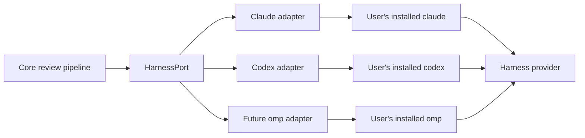
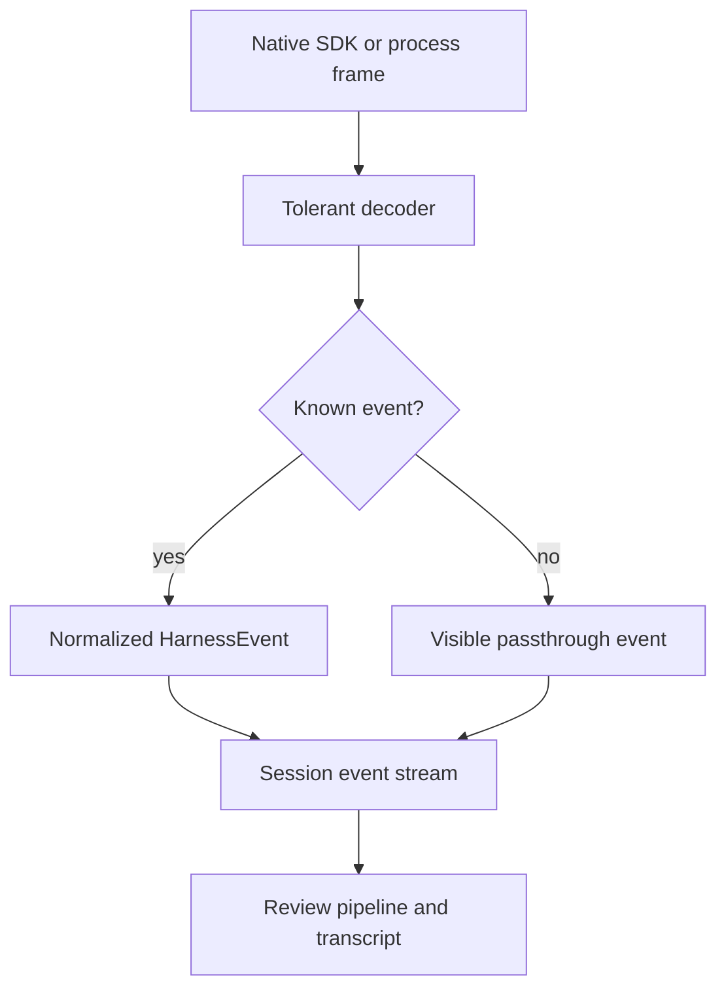
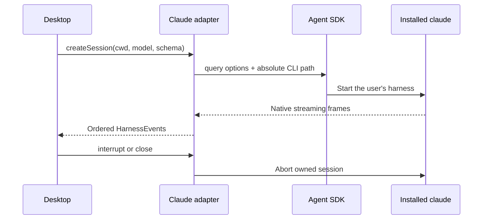

Harness adapters let the rest of Rennet speak one language even though Claude
Code, Codex, and other coding harnesses have different processes and event
formats. Rennet uses the tools already installed on the machine; it does not
bundle its own harness binary or read a harness credential.

## The boundary



`HarnessPort` lives in `packages/core/src/harness.ts`. It is free of Node and
Electron APIs. The real process integration lives in `packages/adapters`, and
the desktop app composes the two.

The port currently covers descriptor and health data, session creation, one
event stream per session, turn start, interrupt, and close. Two real adapters
implement it — Claude Code and Codex — and one cross-adapter conformance suite
runs against both. Resume, fork, and the omp adapter remain later slices.

## One normalized event stream

Every native harness frame becomes a `HarnessEvent` with a common envelope:

```ts
interface HarnessEventBase {
  seq: number
  harness: "claude-code" | "codex" | "omp"
  sessionId: string
  turnId: string | null
  receivedAt: number
  native: unknown
}
```

The adapter assigns `seq`; it does not trust provider timestamps for ordering.
The untouched native frame travels with the normalized view, so a newer harness
event is visible even before Rennet knows how to model every field.



The useful event kinds today are session start/end, text deltas and messages,
tool start/output/denial, normalized errors, and the metered-key warning. Tool
outputs keep both the structured value and readable text; callers do not have to
scrape prose when the harness supplied real data.

## Claude Code is the live adapter

The Claude adapter uses `@anthropic-ai/claude-agent-sdk`, but points it at the
user's installed `claude` through `pathToClaudeCodeExecutable`. The SDK's bundled
platform executables are removed during packaging, so the packaged app does not
quietly substitute another CLI.

The adapter also preserves the child environment. This matters because the SDK's
`env` option replaces the whole environment rather than merging it. Losing
`PATH`, `HOME`, or harness configuration here would look like a broken install.



Sessions are capable by default. A caller may select tools for a particular
workload, but the adapter does not impose a read-only posture or deny shell
access on the acting path.

## Codex is the second adapter

The Codex adapter is the peer of the Claude adapter and the proof the boundary is
harness-agnostic. It speaks `codex exec --json` behind an injected
`CodexTurnTransport` — the mirror of the Claude adapter's injected query function.
The adapter is pure over that seam (fully testable without a process); the
composition root spawns the user's discovered `codex` binary.

The transport is `codex exec`, not the `codex app-server` JSON-RPC protocol. That
is the one deliberate divergence from the issue's letter, and it is evidence-led:
every live `HarnessPort` consumer runs a single turn (create → send → drain →
close), the installed `codex` labels `app-server` experimental and its shape has
already drifted, and the approval apparatus that was app-server's main structural
requirement was struck by the Rule Zero amendment. `codex exec` is non-interactive
and already the capable-by-default posture. The app-server transport would slot in
behind the same seam the day steering or thread-resume is actually consumed.

```
codex exec --json
  --dangerously-bypass-approvals-and-sandbox   # the Rule Zero acting path
  --ignore-user-config                         # deterministic session; auth untouched
  -C <review worktree>                         # a real repo — no --skip-git-repo-check
  [--output-schema <schema>] [-o <last-message>]
  [-c mcp_servers.canvasops.url=<loopback>]    # canvasOps@2 external transport
  <prompt>
```

The transport yields codex's raw JSONL frames, then one synthetic terminal frame
carrying the exit code and the captured last message — the process facts only the
spawn can know. The adapter normalizes codex's `thread.started`, `item.*`,
`turn.completed`, and `turn.failed` frames into the same `HarnessEvent` kinds,
passing anything unmodelled straight through. Interrupt kills the subprocess and
ends the session cancelled. Codex reports no per-turn cost, so the `costUsd`
capability stays honestly false. Host locus only; WSL codex is a later seam.

## Discovery without shell tricks

A desktop app launched from Finder does not inherit the same environment as an
interactive terminal. On top of that, `claude` or `codex` may be shell functions,
so asking `which` for a path can return something that is not executable.

Rennet therefore:

1. asks the login shell for `PATH` only;
2. combines it with the app's `PATH` and known install directories;
3. finds executable candidates itself;
4. runs each candidate with `--version`;
5. ranks usable absolute paths and records health as ready, degraded, or
   unavailable.

Codex discovery also skips broken shims by probing with closed stdin and a hard
timeout. Discovery proves that a binary runs; the adapter never opens Claude or
Codex credential files.

## Capabilities are evidence, not a promise

A capability has three layers:

| Layer | Question |
|---|---|
| `implementedByAdapter` | Does Rennet contain the mapping code? |
| `advertisedByHarness` | Does this installed harness version claim support? |
| `availableInSession` | Did the capability work in this live session? |

All three start false. Passing checks add evidence; documentation alone does not
turn a flag on. This stops a newer or older local CLI from inheriting a capability
the current session cannot actually service.

The evidence comes from the **conformance suite** (`packages/core/src/harness-conformance.ts`),
one catalogue of named checks that runs identically against any `HarnessPort`.
Each check maps to exactly one capability and drives a session, watching the
normalized stream for the evidence that capability would leave — a structured
output completing, an abort cancelling, a text delta arriving, usage on the
terminal frame, a cost number. A run's output is exactly the passing set, fed to
`buildCapabilities`; a skipped or failed check is indistinguishable from a missing
capability, because absence of evidence is absence of capability.

The suite is hermetic by default: `pnpm check` runs it against in-process fake
transports — zero process spawns, zero token spend — which can only earn the
`implementedByAdapter` layer. A gated `.real` test runs the same suite against the
installed binary, and only that real run produces `advertisedByHarness` and
`availableInSession`. Every run first fires a positive control — a deliberately
broken transport that must fail its check — so a suite that cannot demonstrate a
failure refuses to certify.

Each adapter's `testedRange` (the version floor and ceiling it has actually been
exercised against) is derived, never hand-edited: a real conformance run records
the binary version it passed against into a committed per-harness artifact
(`packages/adapters/src/harness-tested-range.json`), and descriptors read the
range from there.

## Authentication and cost honesty

The harness authenticates itself. Rennet never copies an OAuth token or API key
into the adapter.

Claude reports `apiKeySource` on the session start frame. Subscription OAuth
(`oauth`, and the observed subscription value `none`) is free at the point of use.
`user`, `project`, `org`, or `temporary` means a metered key is paying. The adapter
emits a visible warning when that happens; it reports the fact without blocking
the turn.

Usage is equally literal. When a harness reports token or cost data, Rennet
records it. Missing usage remains missing rather than being replaced with zero,
and a derived estimate is never presented as a provider-reported charge.

The canvasOps@2 surface a codex session reaches is served over an external MCP
transport, but that transport is a `127.0.0.1` listener on an ephemeral port
inside the desktop process, handed only to the local codex session. It shares the
same live in-memory backend as the in-process Claude path — one contract, two
transports — and nothing is exposed off-host. There is still no Rennet backend;
the only egress is the user's own harness talking to its own provider.

## Error shape

Native failures map into a small taxonomy—authentication, rate limit, quota,
context overflow, overload, upstream failure, invalid request, policy, sandbox,
cancellation, max turns, harness unavailable, protocol, or unknown. The event
also records whether the error came from the adapter, harness, provider, or
transport, and whether retryability was reported or inferred.

That gives the UI something better than substring matching, while the native
frame remains available for diagnostics.

## Current and deferred

| Area | Status |
|---|---|
| Claude discovery, health, sessions, streaming, tools, errors, usage | Live |
| Fully capable Claude handoff turn | Live behind a main-process command; renderer caller missing |
| Codex binary discovery and utility execution | Live |
| Full Codex `HarnessPort` session adapter (`codex exec --json` seam) | Live |
| Cross-adapter conformance suite (hermetic + gated real) | Live |
| Derived `testedRange` from a recorded artifact | Live |
| canvasOps@2 external loopback transport for non-Claude slots | Live |
| omp/Pi adapter | Deferred |
| Resume and fork in the normalized port | Deferred |
| Codex `app-server` JSON-RPC transport (behind the same seam) | Deferred until steering/resume is consumed |
| Multi-harness self-consistency and disagreement sampling | Deferred |

The main follow-up is [#41 for multi-harness disagreement work](https://github.com/rbutera/rennet/issues/41),
which the second real adapter unblocks.

See [agent handoff](/developing/concepts/agent-handoff/) for the main acting
consumer of this boundary.
