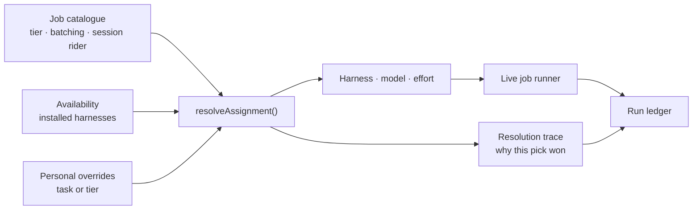
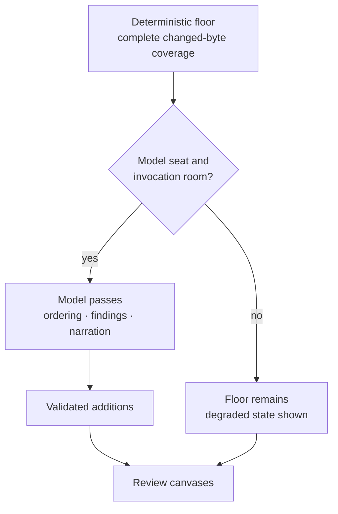

The Model Council answers one practical question: **which mind should do this
job?** It keeps model choice out of individual features and makes every
assignment inspectable.

## The tier test

The useful boundary is not “cheap model versus expensive model.” It is whether
the job needs to explore beyond the input it was handed.

| Tier | Use it when | Typical path |
|---|---|---|
| Deterministic | Code can produce the right answer directly | Git, parsers, indexes, arithmetic, validation |
| Light | The complete input fits in one bounded request | Batched structured-output call |
| Heavy | The model must inspect the repo, use tools, or sustain a session | Coding-harness session |

That rule makes assignments predictable. Naming chunks is light because the
chunks are already in the request. Reconstructing the shape of a large change is
heavy because the model has to follow the code. Building occurrence identities
is deterministic because a model would only make the result less reliable.

## Resolution happens before the call

The council keeps a versioned job catalogue and three default assignment tables:
both providers installed, Claude only, and Codex only. `resolveAssignment()` is a
pure function over that catalogue, current availability, and personal overrides.

The precedence order is:

1. A task-specific override.
2. A tier-wide override.
3. The council table for the installed-provider scenario.
4. The harness default when no table applies.

An override sets the **model** and/or **effort** only — never the harness. The
harness always derives from the resolved model's provider, on every resolving path,
so no override can produce a model/harness pair that names different providers.

Changing a default model is a catalogue/table edit. Product code asks for a job
such as `comment-refinement` or `comprehension-ordering`; it does not grow its own
provider switch.

## Cross-harness work is normal

The review does not have to stay on one provider. When both supported harnesses
are present, the shipped defaults can keep deep review work in a Claude session
while sending bounded utility work to Codex. The execution harness follows the
resolved model, and provenance records the model, effort, harness, and resolution
trace together.

This is especially useful for high-volume work such as narration, comment
refinement, requirement extraction, and drafting. It also gives a genuinely
different provider a seat in dual review when both are available.

The routing tables deliberately cover only Claude and Codex. The ratified third
adapter, omp, is not a council route: it serves orchestrator-chat only when it is
the sole installed harness.

## Jobs can share a seat

Not every catalogue row costs another session. Some jobs are **session riders**:
decision-WHY reconstruction, claim-to-requirement mapping, and derived-spec
extraction can reuse the decomposition session that already has the right code in
view. The council assigns the seat once; effort remains a per-call choice inside
that session.

Batching follows the same principle. Rennet batches light work over collections;
it does not start one process per hunk. The initial review pipeline also shares an
invocation counter across retries and stages so performance limits describe the
real run, not a collection of unrelated local counters.

## The deterministic floor still matters

Model work improves grouping, narration, ordering, and judgment. It does not own
basic coverage. Diff capture, immutable patchsets, decomposition floor, RSP
validation, canvas projection, prompt assembly, and similar jobs remain ordinary
code.

When a model seat is missing or a planned run does not fit the current invocation
envelope, the deterministic result remains available and the pipeline reports the
review as degraded. It must not dress that floor up as a completed model review.

## Traces and calibration

Every model-facing resolution produces a one-line explanation of the shape
`<job> ran on <model>-<effort> (<harness>) because: tier=<tier> · <scenario> ·
council row <n> · <source>` — for example `finding-generation ran on
sonnet-5-medium (claude) because: tier=heavy · both providers · council row 21 ·
no override`. The
trace travels with RSP provenance and gives the UI enough information to answer
why a model ran.

The intended calibration loop is deliberately human-readable: aggregate rejected
documents by model and document type, inspect the table, then edit the versioned
defaults. There is no adaptive policy silently rewriting the route table.

## What is live

The catalogue, three assignment tables, pure resolver, cross-harness execution,
resolution provenance, RoutePlan, and shared runtime invocation budget are live.
The review pipeline resolves real decomposition, ordering, narration, finding,
comment-refinement, PR-drafting, delta-summary, CI-failure-classification,
adjudication, and self-consistency seats through council-owned job IDs. CI classification is a batched light job
that sees only deterministically unclassified failures and shares the review's
invocation budget. It can promote an uncertain failure only to change-caused;
environmental attribution remains deterministic-only. Refusal, timeout, or
invalid output leaves the visible deterministic verdicts unchanged.

The full diagnostics/calibration screen is still deferred. Several catalogue
jobs also exist ahead of their final caller; the catalogue describes the system's
vocabulary, while the call sites prove what executes today.

## Code map

| Concern | Source |
|---|---|
| Job catalogue, tables, and resolver | `packages/core/src/model-council.ts` |
| Council vocabulary and trace shapes | `packages/types/src/index.ts` |
| Initial plan | `packages/core/src/route-plan.ts` |
| Shared runtime counter | `packages/core/src/invocation-budget.ts` |
| Live review composition | `packages/core/src/pipeline.ts` |

The [surfacing and routing](/developing/concepts/surfacing-and-routing/) page
explains the documents these jobs emit. [Comment refinement](/developing/concepts/comment-refinement/)
is a compact example of a council-routed feature outside the main review pass.
