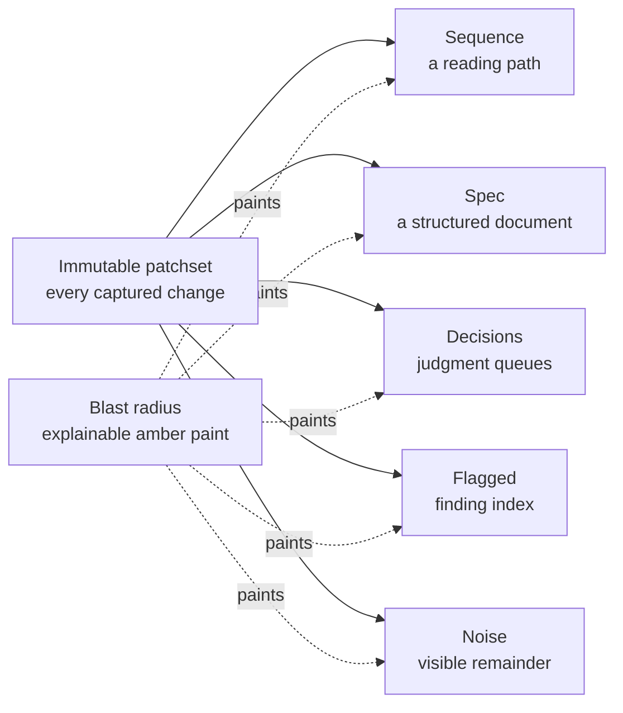
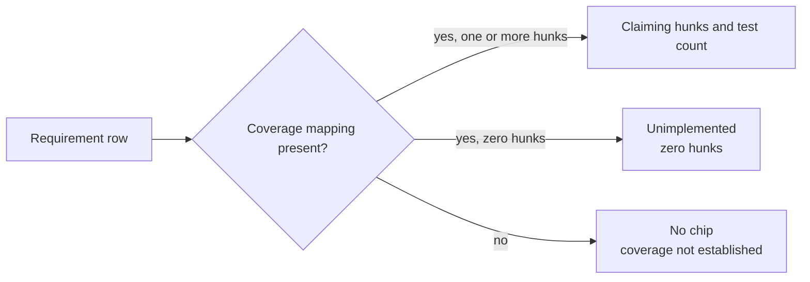
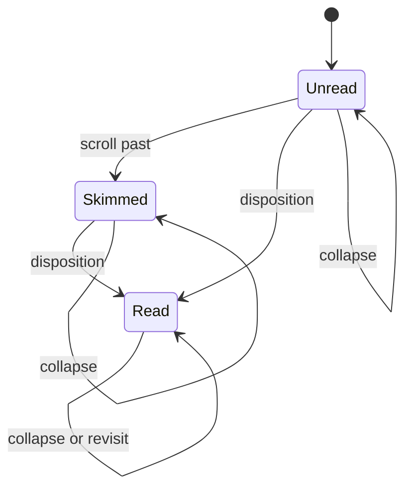

The five lenses are not five model opinions about the same diff. Each gives one
shared, immutable changeset a different useful shape: a reading path, a document
to check, a set of judgments to make, an index of findings, or the visible
remainder.

## One substrate, five jobs

The underlying occurrences and anchors do not change when the reviewer rotates a
lens. A comment made in Decisions and the code opened from Flagged still refer to
the same patchset. Blast radius is an overlay because attention is not a sixth
ordering of the change.

## Sequence is a reading path

Sequence answers “what should I read next?” It groups related hunks into cohorts
and gives them an order that helps the change make sense. That order is derived
after the code was written; it is not obliged to copy commit chronology, file
order, or a universal tests-first recipe.

The model may propose the semantic grouping and order, but a deterministic floor
keeps every captured hunk represented when that proposal is missing or invalid.
Nothing falls out of the review because it did not fit the story.

When an implementation and its test are both changed, the code header can offer
one context-labelled jump: **View test** from the implementation or **View
implementation** from the test. It is a navigation link inside this review, not
a claim that an unchanged or undiscovered test does not exist.

## Spec is a document to check

Spec presents a known OpenSpec shape as a document rather than a raw Markdown
dump. Proposal sections, capabilities, tasks, requirements, and scenarios become
addressable rows. The reviewer can comment, ask, approve, or request a change on
the piece that needs it.

Coverage chips connect a requirement to claiming hunks and tests when a mapping
was actually supplied. Zero claiming hunks is shown as **unimplemented**. An
absent mapping stays absent; Rennet does not manufacture a reassuring coverage
claim.

A test link is evidence to inspect, not proof by decoration. The useful review
question is whether the test exercises the behavior strongly enough to fail when
that behavior breaks.

## Decisions is a judgment queue

Decisions collects implementation choices discerned from the spec, pull-request
body, and diff. It groups them by theme and shows the evidence each one came
from. A suggested rationale is labelled **why · reconstructed**; it is never
presented as something the implementer definitely said. Alternatives appear
only when they can be discerned.

There is no evidenced/mechanical/contestable verdict bucket and no decision cap.
Grouping keeps the surface calm without pretending the machine has already made
the reviewer's judgment.

## Flagged is an index, not a verdict

Flagged gathers findings raised by the automated review. Each row carries
severity, an anchor, and the actual agreement state. When two providers differ,
their labelled answers stay separate; Rennet does not synthesize a confident
third answer.

Verification evidence can say **reproduced** or **couldn't verify**. A refuted
finding is removed by the deterministic review result. A failed runner is shown
as a failure, not “nothing flagged.” The row jumps to the mark at its code
anchor—the index is not a second home for the finding.

A dual review runs two provider seats over the same finding. The agreement label
is location-and-severity agreement — nearby anchors with comparable severity — not
a settled verdict; it does not recognise differently worded claims as the same claim.
When the seats **disagree** (a solo finding, or a severity conflict), Rennet asks the
code who is right ([issue #41](https://github.com/rbutera/rennet/issues/41), delivered):
one fresh adjudication turn, in its own independent session, reads both labelled answers
plus the real code window and returns **supported**, **contradicted**, or **insufficient**.
That verdict rides beside both answers, never replacing them, and no verdict value ever
hides, drops, or reorders the row; a row with no adjudication renders exactly as before.

Only divergence triggers the pass (a concurring row spends nothing), it draws from the
one shared review budget and is capped, and the desktop returns the verified rows first
and folds each adjudication result into its exact row later — it never waits for
adjudication on the initial delivery path.

Flagged only calls an empty result all-clear when the whole change was actually read.
When the decomposition floor could not ingest some content (R18: a truncated tail, a
binary blob, or a submodule pointer), Flagged carries that as its `blockingStates` and
discloses it: the empty state no longer says “ran clean, not skipped” but states that
nothing was flagged **in what could be read**, followed by one line per blocker naming
its reason and detail. The disclosure renders even beside findings, and stays visible
beside “Couldn't check” when the model review fails, because model outcome does not
change which bytes deterministic ingestion missed. It is honest copy only — it never
adds a confirmation, acknowledgement, or gate.

For GitHub pull requests, Flagged shows the commit's CI checks; the panel informs, it
never gates. It hangs a collapsible CI signal off the pinned head, and no review, sign,
or publish handler consults it. How a failure gets attributed:

- Deterministic path overlap turns attributable failures into pre-reproduced
  high-severity findings; a failure without an offered-hunk anchor stays visible in the
  panel rather than acquiring an invented location.
- Path overlap wins before the narrow, context-bearing machinery signatures labelled
  **environmental (infra)**.
- Model refinement may promote an unclassified failure to change-caused but can never
  assign the environmental label; every unresolved case says **Rennet could not
  attribute this — check it yourself**.
- Passing, no-checks, incomplete, and unavailable are distinct states, and both the
  forge read and optional refinement have independent deadlines.

## Noise is the visible remainder

Noise makes low-signal churn quieter without making it disappear. Groups start
collapsed, remain inspectable, and say how they were judged:

- **rule** means an explainable deterministic classification;
- **noise job** means a model made the call and names the model;
- **not noise?** pulls a group back into the main review;
- **re-group as noise** reverses that choice.

A line that breaks its group's pattern is ejected into normal review. A failed
noise run is not an all-clear. This is the totality floor: content can be folded
away from attention, never omitted from the account.

## Read means the reviewer acted

Rennet does not count pixels scrolled or seconds spent as review. Coverage has
three honest states:

| State | Meaning |
|---|---|
| Read | The reviewer made a disposition on the path |
| Skimmed | The path was scrolled past but not acted on |
| Unread | It was collapsed, never seen, or never acted on |

Collapse is navigation only; it can never mark work read. The coverage mosaic is
projected over every path in the changeset, so the unread residue remains visible
even when cohorts are folded.

The next-unread command walks that residue instead of rewarding passive scroll.
On a successor patchset, only exact evidence carries review state; changed or
ambiguous material reopens.

## Marks stay with the code

An annotation or proposal renders at its anchor. A separate index may jump to
it, but does not turn marks into a detached inbox. If an anchor cannot resolve,
the mark moves to a visible orphan tray with the reason instead of silently
landing on nearby code.

See [the canvas model](/developing/concepts/canvas-model/) for the four layers,
[surfacing and routing](/developing/concepts/surfacing-and-routing/) for the
documents models emit, and [delta re-review and lineage](/developing/concepts/delta-rereview-and-lineage/)
for what carries across patchsets.
