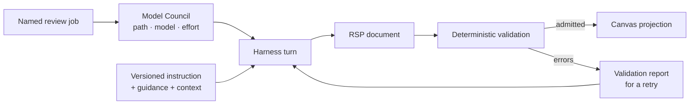
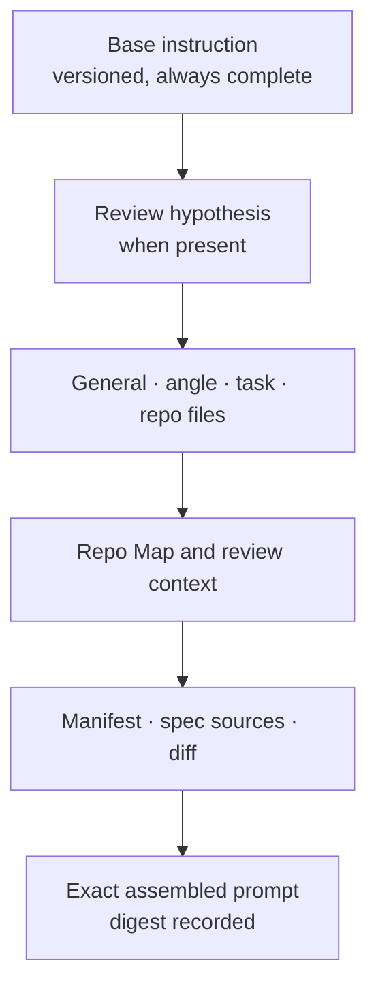

Rennet's model jobs do not write directly into the review UI. They emit Rennet
Surfacing Protocol documents, deterministic code checks those documents, and the
canvas projector turns admitted content into review surfaces.

## Three parts of one contract

The review engine separates three questions:

1. **What may a model say?** RSP document schemas and anchors.
2. **Which model should say it?** The [Model Council](/developing/concepts/model-council/).
3. **What do we tell that model?** Versioned base instructions plus layered repo guidance.



## RSP is JSON against versioned schemas

RSP uses ordinary JSON documents rather than a bespoke text language. Both
supported harness families already understand JSON-schema-shaped structured
output, and the same document can pass through any adapter.

Every document carries a universal envelope. This abridged example leaves out
some runtime accounting fields from `provenance`:

```jsonc
{
  "rsp": 1,
  "docType": "decomposition.proposal",
  "schemaVersion": 1,
  "docId": "01J9X4Q2K7ZC3M0R8T5V6WYA1B",
  "reviewId": "review-id",
  "patchsetId": "patchset-id",
  "projectSnapshotId": "snapshot-id",
  "supersedes": null,
  "provenance": {
    "harness": "claude-code",
    "model": "observed-or-configured-model",
    "tier": "heavy",
    "route": "agentic",
    "inputDigest": "sha256:..."
    // harness versions, capabilities, tokens, cost, and run identity also live here
  },
  "body": {},
  "x": {}
}
```

The adapter mints document identity. The model receives valid anchor IDs and may
refer to them; it does not invent durable identities for hunks, chunks, or
requirements.

## Anchors bind claims to review material

Anchors use a narrow `rennet:` grammar rather than free-form `file:line` prose.

```text
rennet:hunk/h_2MMD02
rennet:hunk/h_2MMD02#L14-L31@additions
rennet:chunk/c2^01J9X4Q2K7ZC3M0R8T5V6WYA1B
rennet:symbol/f_CTRL01/FlightsController.ByAirport
rennet:requirement/req_ba31c7d0
```

The resolver returns one of four useful outcomes: resolved, unresolved,
superseded through lineage, or orphaned. Quotes attached to evidence are compared
with the resolved span after a small declared normalisation. That turns a model's
“this code says X” into something the engine can check before rendering it.

## The validator checks structure and meaning

`validateDocument()` is a pure function of the document, patchset, offered
manifest, and settings. It checks the envelope, supported versions, provenance,
input digest, anchors, evidence quotes, body schema, and document-specific rules.

Two admission shapes serve different documents:

| Shape | Used for | Behaviour |
|---|---|---|
| Atomic | Graphs and other all-or-one structures | Any error rejects the document |
| Item-wise | Collections such as decisions and findings | Valid items remain; rejected items and codes stay visible |

Decomposition gets stronger semantic checks: all offered hunks are accounted for,
no hunk appears twice, edges form a DAG, and the reading order covers every chunk.
Finding, decision, noise, narration, ordering, and hypothesis documents have their
own body contracts on the live path.

Validation is an output-correctness mechanism, not the product's purpose. The
purpose is a digestible review; validation keeps fabricated anchors, missing
hunks, and mismatched quotes out of that account.

## Current document families

The protocol registry currently knows these families:

| Family | Document types |
|---|---|
| Intent and structure | `spec.model`, `decomposition.skeleton`, `decomposition.proposal`, `ordering` |
| Review narration and judgment | `rollup-narration`, `decision.record`, `finding`, `review.hypothesis` |
| Evidence links | `adjudication`, `test.mapping` |
| Low-signal change | `noise.patternProposal`, `noise`, `anomaly` |
| Feedback | `validation.report` |

Registration does not imply that every family has a complete live producer.
Rich body schemas and runners are live for decomposition, ordering, narration,
findings, decisions, noise, and review hypotheses. Spec, adjudication,
test-mapping, pattern-proposal, anomaly, and some validation-report flows remain
partial or deferred. Read call sites and `BODY_SCHEMAS`, not the registry alone,
when checking shipped behaviour.

## Instructions are versioned product

`@rennet/instructions` owns one versioned base contract per live model job. The
base text names the role, emitted document, anchor discipline, evidence rules,
and honest failure shape. The JSON schema remains the source of truth for the
wire shape, so the prose does not duplicate it.

Prompt assembly follows a fixed order:



Guidance changes emphasis and repository conventions. It does not change the RSP
schema or validator. The assembled bytes and their layer digests are inspectable,
which makes a change in review quality traceable to an instruction, guidance, or
input change.

## Routing stays outside the protocol

RSP describes documents; it deliberately does not standardise model names,
budgets, or the council's assignment tables. A third-party producer can emit the
same protocol document using different models and prompts.

Within Rennet, the council chooses deterministic, light, or heavy execution.
Light jobs are batched and schema-constrained. Heavy jobs use a harness session
with repository access. Session riders reuse context that is already open. Every
result records where it came from.

## Code map

| Concern | Source |
|---|---|
| RSP envelope, anchors, registry, and validator | `packages/protocol/src/rsp.ts` |
| Per-document body schemas and semantic rules | `packages/protocol/src/bodies.ts` |
| Shared RSP types | `packages/types/src/index.ts` |
| Base instructions and prompt assembly | `packages/instructions/src/index.ts` |
| Generic harness turn | `packages/core/src/harness-run-turn.ts` |
| Council resolution | `packages/core/src/model-council.ts` |

See [the canvas model](/developing/concepts/canvas-model/) for where admitted
documents land and [context assembly](/developing/concepts/context-assembly/) for
the orchestrator's separate retrieval interface.
