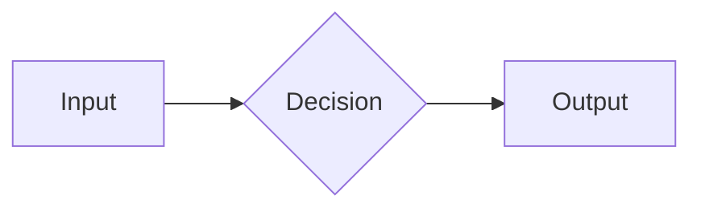

Rennet's docs stay alive because agents maintain them as a matter of course, not
because someone remembers to. This guide is how any contributor — human or agent
— writes a page that belongs here.

## The two-audience split

Every page lives in exactly one of two areas:

- **Using Rennet** — for people who *run reviews* with Rennet. Task-first. Assume
  no knowledge of the codebase. Never leak an internal package name into a using
  page unless the reader would type it.
- **Developing Rennet** — for people who *build* Rennet. Architecture, contracts,
  doctrine, delivery order. Assume the reader has the repo open.

If you cannot tell which area a page belongs in, it is probably two pages.

## Voice

- Direct and concrete. Say what the thing does and how to do it.
- Present tense, active voice. "Rennet routes the change", not "the change is
  routed".
- No marketing. No hedging. If something is deferred or not built yet, say so
  plainly and link the tracking issue or the openspec change.
- Short sentences over long ones. Short paragraphs over walls.

## Page structure

Every page opens with **one or two sentences that say what the page is for**,
before any heading. Then:

1. The shortest path to the thing (a guide) or the clearest statement of the
   idea (a concept).
2. Examples over description. Show the command, the config, the diagram.
3. A "where to go next" set of links when the page is a hub.

Use sentence case for headings. Keep the heading tree shallow — `##` and `###`
are usually enough.

## When to use a diagram

Reach for a mermaid diagram when a **flow** or an **architecture** is easier
seen than read: a pipeline with stages, a dependency graph, a state machine, a
sequence between components. Do not diagram a list.

Write diagrams as fenced `mermaid` code blocks. They render at build time to a themed
SVG that follows the site's light/dark toggle — no client-side JavaScript, no
headless browser. Supported diagram types: flowchart, sequence, state, class,
ER.

Put each diagram under a specific heading and explain its important point in
nearby prose. The build uses that heading as the diagram's accessible name; the
prose keeps the page useful when a reader cannot see the SVG.

````markdown

````

## Links

- Link across areas freely; a using page may point into developing for "how this
  works under the hood", and vice versa.
- Prefer linking a concept once, where it is defined, over re-explaining it.

## The standing obligation

The point of this whole area: **a change to the monorepo updates the affected
docs in the same change.** See the [good Rennet docs
standard](/developing/contributing/good-docs-standard/) for what "affected docs"
must carry, and the root `AGENTS.md` for where the obligation is stated.
