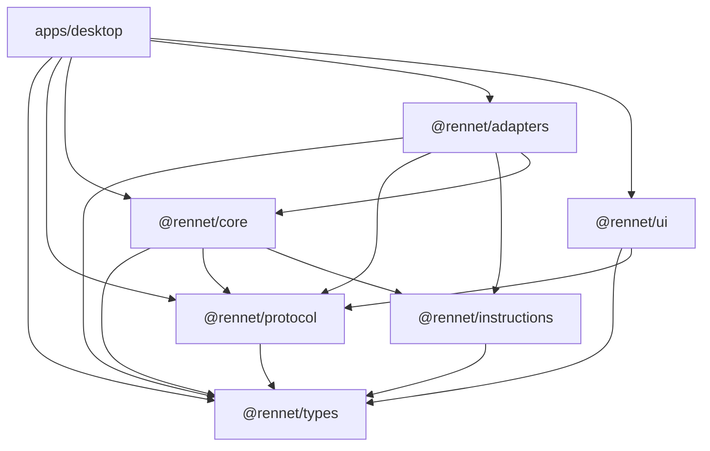
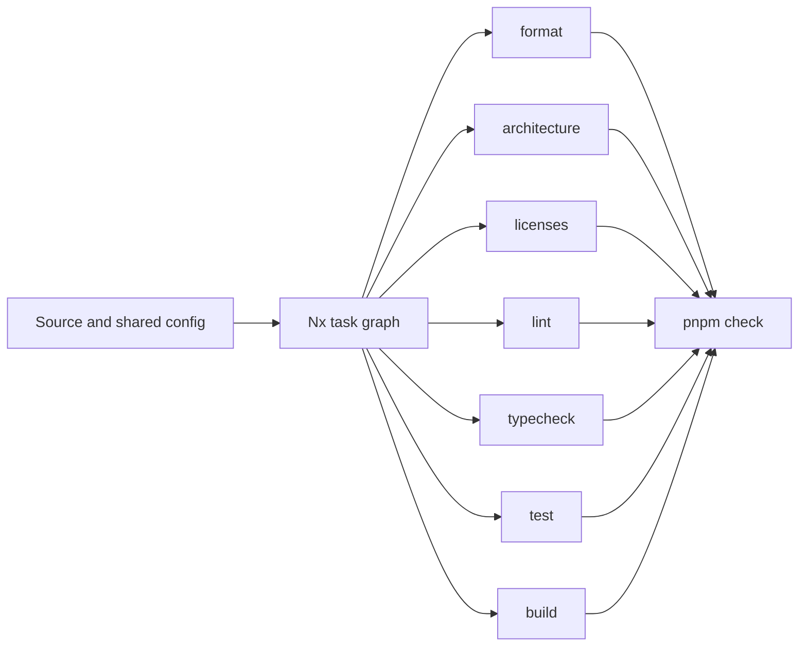
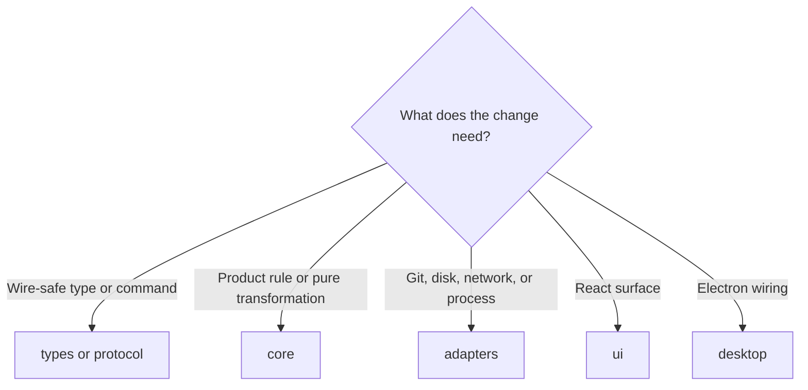

Use this guide to turn a fresh clone into a checkout that can build and test
Rennet. The repository owns the tool versions and the Nx task graph, so setup is
short and repeatable.

## Install the pinned toolchain

The root manifest is the source of truth:

- Node `24.18.0`
- pnpm `10.32.1`

The repo's `.nvmrc` pins the Node version, so a version manager can select it for
you: run `nvm use` (or `fnm use`, or `asdf install`) from the checkout root.

After selecting the pinned Node version, install exactly what the lockfile
describes:

```sh
corepack enable
pnpm install --frozen-lockfile
```

Do not install a global Nx CLI. Every workspace command goes through the pinned
copy with `pnpm nx`.

## Check the workspace shape

```sh
pnpm nx show projects
pnpm nx show project rennet-core --json
pnpm nx show project rennet-desktop --json
```

The first command shows the project names. The next two show the actual targets,
inputs, outputs, and inferred tasks before you try to run them. This is quicker
and more reliable than guessing a target name from a package directory.

The main product projects are `rennet-types`, `rennet-protocol`,
`rennet-instructions`, `rennet-core`, `rennet-adapters`, `rennet-ui`, and
`rennet-desktop`. The docs and marketing sites are separate Nx projects in the
same workspace.

## Read the package graph



Read an arrow as “depends on.” The important boundaries are:

- `types` imports no in-repo package;
- `protocol` contains browser-safe commands and schemas;
- `core` owns product logic without Node, Electron, or DOM imports;
- `adapters` owns filesystem, Git, GitHub, stores, and harness processes;
- `ui` stays browser-safe and reaches core through the typed command boundary;
- `apps/desktop` is the only Electron composition root.

`scripts/check-boundaries.mjs` checks both package dependencies and source
imports. The [architecture overview](/developing/concepts/architecture-overview/)
and [architecture contracts](/developing/concepts/architecture-contracts/) go
deeper.

## Run the gate

```sh
pnpm check
```

That is the local and CI gate. Nx runs format, architecture, licences, lint,
typecheck, test, and build across the task graph.



For a quicker branch iteration, use:

```sh
pnpm nx affected -t lint,typecheck,test,build
```

Before a push, run the full `pnpm check`. A relevant new test should have a
positive control: break the behaviour it protects, see the test fail, then
restore the implementation and see it pass.

## Trust the cache, fix the inputs

Nx caching is local and intentional. A cache hit is valid when the target's
inputs describe everything that can change its answer. Shared compiler and lint
configuration lives in `sharedGlobals`, and each cacheable target declares its
real outputs.

Do not add `--skip-nx-cache` because a result feels too quick. If a config or
source change can leave a stale pass, reproduce it and fix the target inputs.
Long-running, interactive, and end-to-end targets stay uncached.

One practical exception exists: separate Nx processes in the same worktree can
race the task-history database and fail with `FOREIGN KEY constraint failed` or
`disk I/O error` after printing a successful task result. Avoid concurrent Nx
commands in one worktree. If that exact failure appears, run `pnpm nx reset`
once and rerun the command.

## Diagnose `Operation not permitted`

Treat the path in the error as the clue. If Git cannot write
`.git/FETCH_HEAD`, Nx cannot create `.nx`, and even a small temporary-file test
fails, the repository is not broken: the shell is running under a read-only or
restricted execution profile. No package reinstall or cache reset can repair
that from inside the checkout.

Relaunch the task with write access to the workspace and temporary directory,
then verify the two external prerequisites before retrying the gate:

```sh
git status --short
gh auth status
```

If only one repository path fails, inspect that path's ownership and mount
flags. If several unrelated write locations fail together, fix the host profile
instead of adding a repository workaround. A workaround would merely hide the
same failure from the next Git or Nx write.

## Add code in the right place



When core needs a platform capability, define a port in core and implement it in
adapters. Do not import the platform into core. When UI needs product behaviour,
add or use a typed protocol command and let desktop main dispatch it.

Rennet is MIT throughout. New packages and dependencies must follow the same
licence and boundary rules; the licence target checks the installed graph.

## Keep the checkout healthy

- Keep spikes outside the pnpm workspace. A spike produces a verdict; production
  code is rewritten under the normal package boundaries.
- Preserve existing work in a dirty tree. Stage only the files that belong to
  your change.
- Update the affected docsite page in the same change when behaviour, commands,
  or architecture move.
- Never add AI attribution or co-author trailers.
- Run one Nx invocation at a time in a worktree.

For delivery priority rather than repository mechanics, read the
[delivery order](/developing/reference/delivery-order/).
