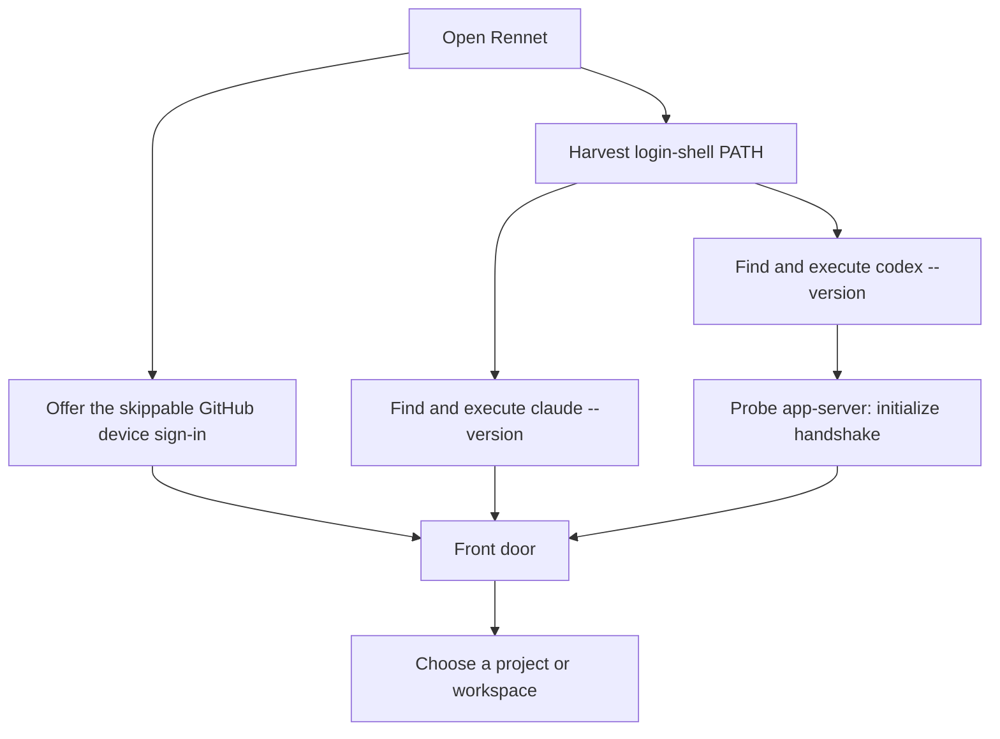
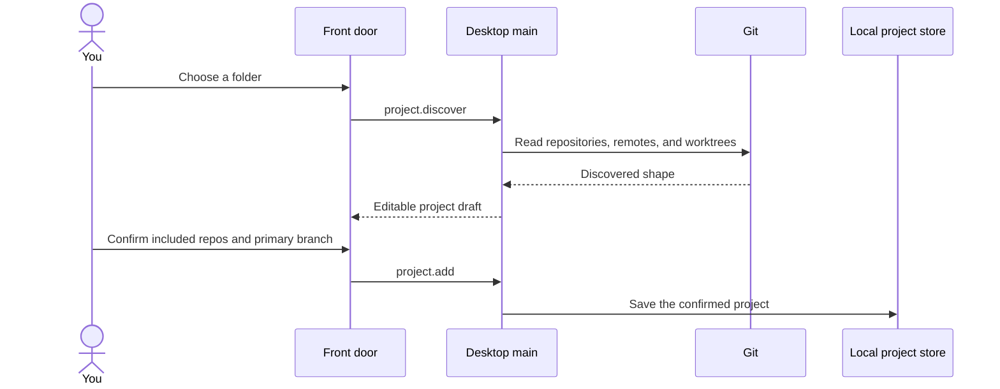
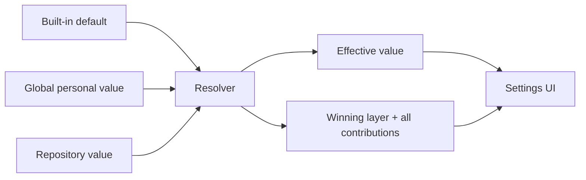

Rennet's setup rule is simple: discover facts automatically and ask only for a
preference the machine cannot know. The current settings surface is deliberately
small and backed by real consumed configuration rather than placeholder rows.

## First run

Rennet expects at least one supported coding harness to be installed as its own
native tool:

```sh
claude --version
```

GitHub needs no CLI: first run offers a skippable one-time device sign-in, and
Settings holds the account rows afterwards.

You do not paste a Claude API key into Rennet. The Claude adapter starts the
installed CLI, which owns its login. Rennet also discovers Codex and composes a
full Codex `HarnessPort` adapter from it — a co-equal review seat, not a
utility-only helper. On macOS a codex bundled inside ChatGPT desktop counts as a
candidate (a user-installed CLI outranks it); a chosen candidate is then probed
for app-server capability before it is trusted.



Discovery does not use `which`. A GUI app can have a different `PATH` from your
terminal, and a shell command may resolve to a function instead of a file. Rennet
collects candidate directories, finds executables itself, and proves each
candidate by running its version command.

GitHub is an account, not a CLI to detect. First run shows a skippable
**Connect GitHub** card (an OAuth device sign-in: a one-time code entered at
github.com/login/device, scopes `repo` and `workflow`); Settings carries the
permanent rows — connected-as, Disconnect, and the paste-a-token side door. The
stored credential lives in an owner-only file under the daemon's data directory
and is validated lazily when project detail or publication first needs GitHub —
renewing itself automatically when the app mints expiring tokens — so
opening the app does not imply the account has already been validated. A pasted
personal access token is validated before it is stored — a bad paste keeps
nothing.

## Add a project or workspace

From the front door, point Rennet at either one repository or a directory that
contains several repositories. Discovery reads the Git structure and returns an
editable draft before anything is saved.

For a workspace, choose which discovered repositories to include and confirm the
primary branch. One repository may have several worktrees; they remain checkouts
of the same project rather than appearing as unrelated projects.



Discovery itself does not fetch, check out, or create `.rennet/`. It reads only
the folder the user selected and the Git facts needed to describe it.

## Settings that exist today

The live settings page has two scopes.

| Scope | Setting | Stored where |
|---|---|---|
| Global | Appearance: system, dark, or light | `~/.rennet/config.json` |
| Repository | Derived-map visibility: local or Git-visible | `~/.rennet/projects/<project>/config.json` plus the repo's Rennet-owned `.rennet/.gitignore` |
| Repository | Whether a base map has been promoted | Read from the project config |
| Repository | Review guidance catalogue | `.rennet/conventions.json` in the repository |

The settings UI omits controls that the engine does not consume yet. Execution
mode, worktree location, harness selection, model selection, and the full review
tuning inventory are not live settings rows today.

### Appearance

Appearance is personal and machine-local. It never writes into a repository.
The global file is plain JSON and written atomically. If it is malformed, Rennet
shows built-in defaults and disables editing rather than overwriting bytes it
could not understand.

### Project map visibility

Rennet keeps the working project map in its local project store. A promoted copy
may also live under the repository's `.rennet/` directory.

- **Local** keeps the promoted map out of ordinary Git status using the
  Rennet-owned `.rennet/.gitignore`.
- **Git-visible** removes only Rennet's own exclusion, making the promoted map
  available for the user to inspect and stage.

Rennet changes visibility files but does not stage or commit them. If project
config is malformed, the UI shows the default and refuses the write so it does
not destroy the recoverable file.

### Project guidance

`.rennet/conventions.json` carries per-repository review guidance. The settings
screen shows the valid rules and reports malformed entries that were dropped.
Review runners read the same catalogue, so the UI is showing consumed input, not
a decorative settings preview.

## Provenance is part of the value

The current resolver implements the live slice of the longer settings design:



Every resolved row includes its winning layer and all contributions. The UI uses
that answer directly instead of recreating precedence in React. Today the ladder
is `builtin < global < repo`, with only the layers that have real consumers.

## Local data and repository data

The useful split from the larger design still holds:

> App-side configuration describes you. Repository configuration describes the
> project.

Personal appearance belongs under `~/.rennet/`. Project maps and conventions may
live under the repository's `.rennet/`. Review state, transcripts, caches, and
temporary material do not belong in the repository.

The broader planned ladder adds workspace-personal, workspace-shared,
repo-personal, changeset, pinning, and schema-declared merge behaviour. Those
layers are not fully implemented, so this page does not present them as current
configuration.

## Files at a glance

```text
~/.rennet/
├── config.json                    # global personal settings
└── projects/
    └── <escaped-project-path>/
        ├── config.json            # project map state and aliases
        ├── map/                   # local derived map
        └── knowledge/             # local learned project knowledge

<repo>/.rennet/
├── .gitignore                     # maintained in local visibility mode
├── conventions.json               # review guidance
├── map/                            # promoted map, when present
└── knowledge/                      # promoted knowledge, when present
```

The exact project directory key is an escaped absolute path today. Relocation
records and aliases help move local state when the checkout moves; it is not a
portable repository identity.

## The daemon and the `rennet` CLI

Rennet's server runs as a detached daemon (see the
[architecture overview](/developing/concepts/architecture-overview/#the-daemon-lifecycle)).
Opening the desktop app spawns it if it is not already running; quitting the app leaves it
running, so a review in progress keeps going and the next launch reattaches. The daemon
writes two files under its data dir (`app.getPath("userData")`, or whatever
`RENNET_USER_DATA` points at):

- `daemon.json` — the discovery claim (pid, WS port, protocol version, version, start
  time). Present while a daemon is running, removed on clean shutdown.
- `daemon.log` — the daemon's stdout/stderr when it was spawned detached.

The `rennet` CLI is the daemon's second client — the same protocol over the same wire the
desktop uses:

```text
rennet serve    # run the daemon in the foreground (dev / power tool)
rennet status   # print the daemon's pid, port, and versions (exit 0 if healthy)
rennet stop     # stop the running daemon (SIGTERM, clean shutdown)
rennet map      # build & store the Repo Map for a repository (no daemon needed)
```

Each daemon subcommand takes `--data-dir <dir>` and otherwise honors `RENNET_USER_DATA`,
then falls back to the platform user-data path. There are no confirmation prompts:
`rennet stop` just stops. The packaged app never depends on `rennet serve` — it spawns
its own bundled daemon on the Electron binary run as Node, so no system Node is required.

`rennet map [path] [--base <ref>] [--json <file>] [--projects-dir <dir>]` stands apart
from the daemon commands: it runs the exact snapshot generator `project.process` uses —
pure over git, no daemon, no model, no project registration — against the repository at
`path` (default: the current directory) and persists the result to the local project
store (`~/.rennet/projects/<escaped-path>/map/…`, overridable with `--projects-dir`).
Because the store keys on the repository's real path, a map built this way is the same
map the daemon reads later. Re-running is incremental: unchanged files reuse their
content-addressed shards. `--json <file>` additionally exports the queryable ProjectMap
(files, scopes, dependency edges, entry points, tests, ownership, conventions) plus
per-file declared symbols and the knowledge set (when one exists) for external
consumers.

`--enrich` runs the model-backed knowledge pass after the build — the same pass the
daemon runs in the background after a snapshot advance. It discovers your installed
`claude` binary (your subscription, one bounded turn) and mints the knowledge layer:
initial enrichment when no set exists, the delta pass when the prior set is pinned to
an older OID, and an honest no-op when the set is already current. Without a usable
harness the command reports why and exits non-zero; the deterministic map has already
landed by then.

**Data-dir isolation** is how dev checkouts, agent worktrees, and e2e runs stay off the
production daemon: point `RENNET_USER_DATA` (or `--data-dir`) at a per-checkout directory
and that run reads and writes only its own claim. The dev target builds the app and
launches the shell, which spawns the daemon from the built bundle exactly as production
does (minus the packaging fuses).

## When setup looks wrong

- Open Settings → Global to see which GitHub account is connected; reconnect or
  paste a token there if the row reports a problem.
- Run `claude --version` in a terminal. Rennet also checks known install
  directories when a Finder-launched app cannot see your terminal `PATH`.
- Fix a malformed `~/.rennet/config.json` by hand, or move it aside and reopen
  settings. Rennet leaves it untouched.
- Check the selected folder if workspace discovery found no repositories; Rennet
  does not crawl outside it.

For the underlying process boundary, read
[harness adapters](/developing/concepts/harness-adapters/). For the project map
contract, read
[architecture contracts](/developing/concepts/architecture-contracts/).
