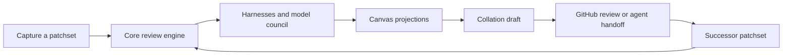

Start with the architecture tour, then follow the part of the review loop you
are changing. These pages mark clearly which parts are live code, which are
configured contracts, and which are only intended direction.

## Architecture tour

The review loop, end to end:



1. [Architecture overview](/developing/concepts/architecture-overview/) gives
   the package graph, processes, and end-to-end review flow.
2. [Architecture contracts](/developing/concepts/architecture-contracts/)
   defines immutable patchsets, project context, persistence, and publication.
3. [Canvas model](/developing/concepts/canvas-model/) explains how ingest,
   analysis, user dispositions, and orchestrator annotations share a surface.
4. [Review lenses](/developing/concepts/review-lenses/) explains why Sequence,
   Spec, Decisions, Flagged, and Noise behave differently over that surface.
5. [Context assembly](/developing/concepts/context-assembly/) and the
   [model council](/developing/concepts/model-council/) cover what models see and
   which model runs each job.
6. [Code intelligence](/developing/concepts/code-intelligence/) explains the
   live definition and textual-reference index without pretending it is an LSP.
7. [Collation and signing](/developing/concepts/collation-and-signing/) follows
   private review state into the exact outbound artifact.

## Follow a subsystem

| If you are changing… | Read… |
|---|---|
| Harness invocation or normalized frames | [Harness adapters](/developing/concepts/harness-adapters/) and [surfacing and routing](/developing/concepts/surfacing-and-routing/) |
| Definitions, references, or symbol inspection | [Code intelligence](/developing/concepts/code-intelligence/) |
| Coding-agent work after a review | [Agent handoff](/developing/concepts/agent-handoff/) and [delta re-review](/developing/concepts/delta-rereview-and-lineage/) |
| Comment or draft behavior | [Comment refinement](/developing/concepts/comment-refinement/) and [collation and signing](/developing/concepts/collation-and-signing/) |
| Project discovery or settings | [Repository bootstrap](/developing/guide/repository-bootstrap/) and [settings and setup](/developing/guide/settings-and-setup/) |
| UI behavior | [Design doctrine](/developing/concepts/design-doctrine/), [canvas model](/developing/concepts/canvas-model/), and [review lenses](/developing/concepts/review-lenses/) |
| Dependencies or build tools | [Dependency standard](/developing/reference/dependency-standard/) |

## Authority and delivery

- [Contracts and rulings](/developing/reference/contracts-and-rulings/) is the
  stable decision register.
- [Delivery order](/developing/reference/delivery-order/) says what matters next.
- [Documentation authority map](/developing/reference/doc-architecture/) says
  which document wins when two pages disagree.

## Working in the monorepo

Rennet uses pnpm and Nx. Query resolved project configuration with
`pnpm nx show project <name> --json` instead of guessing target names. The full
local gate is:

```sh
pnpm check
```

That runs format, architecture, licences, lint, typecheck, tests, and builds. A
positive control in the architecture check proves the boundary rule can fail.

Before writing docs, read the [style guide](/developing/contributing/docs-style-guide/)
and [good docs standard](/developing/contributing/good-docs-standard/).
