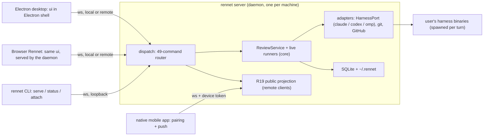

The build plan for Rennet's app server wave: move the core out of Electron
main into a local daemon, make the desktop app and a browser client full-fat
peers of one protocol, and open the road to first-class remote and native
mobile control. Evidence lives in the
[app server research digest](/developing/reference/app-server-research/);
decisions here trace to findings there. Rai approved this plan 2026-08-17.

## Thesis

One runtime, one protocol, N transports — and one UI in two shells.

The same `packages/ui` bundle runs inside Electron and served from the daemon
as a browser app. Both are full-featured peers; both carry a server picker
that attaches to the local daemon or a remote one (`rennet serve` on any box).
The desktop app spawns and supervises the local daemon so single-machine UX is
unchanged. Local clients speak the private Zod contract; remote connections
carry the R19 projection. Electron-native concerns (menu, window identity,
auto-update, daemon supervision) are shell affordances, not product features.

## Invariants

- **Capability parity.** The daemon supports everything the desktop app does
  today: all 49 commands, all `HarnessPort` adapters (Claude via the Agent
  SDK, Codex via codex app-server, omp), all stores. The refactor moves
  capability; it never drops any. The desktop app and the browser client are
  both full-fat; anything machine-bound (open-in-editor) keys on *server
  locus*, not client type.
- **Rule Zero holds everywhere.** Pairing and device tokens are connection
  bootstrap. Publishing stays "Rai clicks post" from any client. No consent
  ceremony appears on the client-daemon path.
- **Docs move with each phase.** Every phase updates the pages it invalidates
  in the same change (see the surface map below).

## Decision log

- **Transport:** WebSocket, JSON text frames, request/response correlated by
  `requestId` plus event topics. No binary framing, no PTY streaming, no
  stdio, no gRPC. Loopback by default; tailnet/LAN by opt-in bind.
- **Protocol authority:** `packages/protocol` stays the single source of
  truth. Private contract Zod-first; public remote surface JSON-Schema-first
  per R19. One protocol version integer with a min-compat window, feature
  flags on `serverInfo.features`, append-only wire schemas, dated `COMPAT()`
  tags (Orca + Paseo discipline).
- **Persistence:** keep SQLite (`node:sqlite`) and the `~/.rennet` file
  stores. No new database. The daemon resolves its own data dir, defaulting to
  the current userData path so existing data carries over byte-for-byte.
- **Harness:** existing adapters move unchanged behind the existing
  `HarnessPort` seam. Resume stays anchored to harness session ids. We do
  **not** build a new Paseo-style cross-provider normalization layer; if
  harness breadth ever becomes a goal, ACP is the seam to adopt.
- **Remote:** direct/Tailscale primary — zero Rennet infrastructure, zero open
  ports, WireGuard encryption, and the "no hosted backend" copy stays
  literally true. No relay in this wave; a relay is architecturally just one
  more way a daemon meets a client (daemon dials out), so it can be added
  later without protocol changes — and if ever built, it is E2E
  ciphertext-only and self-hostable (Happy's design).
- **Human moments:** server-initiated request pattern (codex shape) with a
  `resolved` cleanup notification carries the product's human actions — Rai
  clicking post, and Agent SDK `canUseTool` passthrough — from any client,
  with no stale dialogs.
- **Licensing:** copy freely from T3 Code, Orca, opencode, Happy (MIT,
  notices retained); shapes only from codex (Apache-2.0); **architecture only
  from Paseo (AGPL — never code, never schema files).**

## The phases

Each phase is independently shippable and keeps `pnpm check` green. One
OpenSpec change per phase (the wave convention), dual-reviewed, closing its
issue in the same motion.

### Phase 0 — Protocol groundwork (1-2 days)

Add to `packages/protocol`: a `hello { clientId, clientType, protocolVersion }`
to `serverInfo { version, features }` handshake, and a transport-neutral
envelope — requests correlated by `requestId`, event topics for
progress-by-`commandId` and ask-stream-by-`reviewId` (the `RennetBridge`
methods, serialized). Adopt the versioning discipline in writing: append-only
wire schemas, tolerant decoders, features gated once on `serverInfo.features`,
one protocol version integer with a min-compat window. Ships protocol
additions plus a protocol-compatibility docs page; no behavior change. The
discipline this phase establishes is written up in full at
[protocol compatibility](/developing/reference/protocol-compatibility/).

### Phase 1 — Extract the server package (2-4 days)

New `packages/server` (imports: core, adapters, instructions, protocol,
types, Node — the edge declared in the architecture gate). Move `dispatch.ts`,
`orchestrator.ts`, `live-review-backend.ts`, `review-intelligence-session.ts`,
the `*-live.ts` runners, `LiveTurnRegistry`, and the composition root into
`createRennetServer({ dataDir, … })`. Their Electron-free unit tests move
unchanged and are the safety net. Break the one persistence coupling: the
server resolves its own data dir (defaulting to the current userData path).
Electron main becomes: create the server in-process, forward `rennet:invoke`
to it. Ships an identical app with a relocated brain; e2e passes untouched.

### Phase 2 — WebSocket transport + network bridge (2-3 days)

WS listener on loopback (JSON text frames only), following the
`canvas-ops-external.ts` listener precedent. `WsRennetBridge`: a browser-safe
client implementing `RennetBridge` over the Phase 0 envelope with reconnect
and resubscribe. Switch the renderer to the WS bridge; delete the
`ipcMain.handle`/preload invoke pair and the `webContents.send` fan-out. IPC
remains only for menu and platform natives. Ships the desktop app as client
number one over the real wire; the hand-rolled IPC plumbing is deleted.

### Phase 3 — Detached daemon (2-4 days)

The server gets a bin entry; the desktop spawns it detached and supervises it
via pidfile plus health probe (probe, connect, else spawn — one launcher, so
no Orca-style socket-handover protocol). Lifecycle moves off Electron:
`LiveTurnRegistry` abort-on-quit becomes daemon shutdown handling; running
turns survive app restart and any client reattaches mid-turn. A `rennet` CLI
ships `serve` (headless), `status`, `stop` — the CLI-as-client property is the
cheapest proof the protocol is real. Forge packaging bundles the server
entrypoint; e2e launches the bundled daemon. Ships reviews that survive
quitting the app.

### Phase 4 — Remote surface: the R19 work (3-5 days)

Build the contractually required public projection: JSON-Schema-first,
recipient-specific, host paths scrubbed, raw event envelopes never crossing
the boundary. This is the one genuinely new subsystem in the wave. Pairing:
one-time code or QR from the desktop app mints a long-lived device token;
token-bearing connections get the projection, loopback clients keep the
private contract. Opt-in bind beyond loopback (LAN/tailnet address); Tailscale
is the documented remote path — no relay, nothing listening on the open
internet. This unlocks remote attach for every client: desktop and browser
both ride this plumbing to reach a daemon on another machine. R19 note:
"full-fat" means capability parity — the projection shapes *representation*
(repo-relative display paths), it never removes capability.

### Phase 5 — Browser Rennet: one UI, two shells (3-5 days)

The daemon serves the existing `packages/ui` bundle over HTTP alongside the
WS endpoint (`rennet serve` gains the UI by default). A loopback browser tab
is a trusted client on the full private contract — full-fat Rennet with no
Electron installed. The UI is already browser-only and bridge-shaped, so this
is build/serve plumbing, not a rewrite. Both shells gain the shared server
picker (connections: localhost default, saved remote daemons as host plus
device token); the desktop app can attach to a remote daemon instead of
spawning its own. Ships Rennet in a browser tab, peer of the desktop app,
against any daemon local or remote.

### Phase 6 — Native mobile app (2-4 weeks, gated on the mobile design pass)

A native app (Expo/React Native, mobile only — no RN-on-desktop) as the
first-class mobile client, riding Phase 4's pairing, device tokens, and R19
projection. First step: extract the shared client-runtime package (connection
supervisor, reconnect and resubscribe, auth/token handling, replica cache)
out of the browser/desktop client — justified now that a second UI codebase
exists. Push notifications ("review finished", "turn needs you") land here.
The browser client's responsive behavior is a bonus, not the mobile story.

**This phase does not start until the
[mobile design pass](#the-phase-6-gate-the-mobile-design-pass) is done and
Rai has signed off on its outputs.**

## The phase 6 gate: the mobile design pass

Phase 6 is the only phase that builds a new product surface rather than
re-homing an existing one, so it is gated on a design pass with three
deliverables. This is Rai gating his own design quality — a definition-of-done
for planning, not a consent ceremony (Rule Zero is untouched: nothing here
sits on the acting path of the product).

1. **Ideation.** A short document that answers: what *is* mobile Rennet?
   Walk the 49 protocol commands and classify each as mobile-primary,
   mobile-secondary, or absent-by-locus. Name the jobs the phone actually
   does — triage a finished review, answer a turn's ask, steer or interrupt a
   running review, read canvases, publish (the product's human action,
   now available from the sofa), kick off a review from a PR link — and the
   jobs it explicitly does not do (writing code on a phone). Define the
   notification taxonomy: which daemon events become pushes, what each push
   deep-links to. Output: `docs/src/content/docs/developing/reference/mobile-ideation.md`.
2. **Wireframe pass.** Low-fi wireframes for the core screens in the
   repo's existing `wireframes/` convention: connections and pairing, review
   list, review detail and canvas digest, ask/turn interaction, the publish
   flow, and notification-to-deep-link landings. Each wireframe names the
   protocol commands and event topics it consumes — a screen that cannot name
   its commands is not designed yet.
3. **Impeccable planning pass.** Run the impeccable planning discipline over
   the ideation doc plus wireframes (the same treatment `apps/marketing`
   carries via its `.impeccable` setup) to produce the build plan: screens to
   components, components to client-runtime API needs, milestones with real
   sizes, and the acceptance list for the first shippable cut. Output feeds
   the Phase 6 OpenSpec change directly.

Exit criterion: Rai signs off on all three outputs; the sign-off comment on
the gate issue unblocks Phase 6.

## Docs and marketing surface

| Page | Change | Phase |
| --- | --- | --- |
| `developing/concepts/architecture-overview.md` | Heaviest rewrite: renderer-to-main-over-IPC becomes daemon plus clients; both mermaid diagrams redrawn; storage no longer "Electron Application Support" | 1-3 |
| `developing/reference/contracts-and-rulings.md`, `architecture-contracts.md` | Close the "still open" remote-transport question; update the remote/mobile row from deferred to the R19 projection as built | 4 |
| `developing/reference/delivery-order.md` | The app server wave entry and its issues | 0 |
| New: `developing/reference/protocol-compatibility.md` | Versioning discipline, feature flags, COMPAT tag convention | 0 |
| New: `using/guide/remote-access.md` | Pairing, Tailscale setup, what a remote client sees (projection, scrubbed paths) | 4-5 |
| New: `using/guide/browser-rennet.md` | Running `rennet serve`, opening the browser client, the server picker | 5 |
| `developing/reference/reactive-streams.md`, `harness-adapters.md`, `codex-app-server.md`, `developing/guide/settings-and-setup.md`, `repository-bootstrap.md` | IPC/Electron mentions updated; "no daemon mode" statements corrected | 1-3 |
| "No Rennet backend" copy: `using/concepts/product-and-vision.md`, `common-questions.md`, `using/guide/getting-started.md`, `reviewing-a-github-pr.md`, `collation-and-publishing.md`, `dependency-standard.md` | Stays true and gets sharper: no *hosted* backend — the daemon is yours, runs on your machine, and the only egress is the harness/provider egress already disclosed | 3-4 |
| `apps/marketing` (Astro site) | Browser client, remote, and mobile stories added when each ships, not before | 5-6 |
