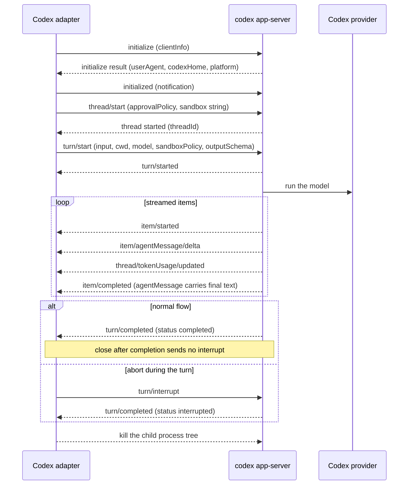

Rennet's Codex seat drives the user's installed codex through its `app-server`
protocol: a newline-delimited JSON-RPC 2.0 session over stdio. This page is the
developer reference for that integration — the exact methods Rennet speaks, how
their notifications become normalized [harness events](/developing/concepts/harness-adapters/),
how a codex binary is discovered (including the one bundled inside ChatGPT
desktop on macOS), and where the protocol schema comes from.

For where this sits in the wider adapter boundary, read
[harness adapters](/developing/concepts/harness-adapters/) first; this page is
the Codex-specific detail beneath it.

## Why app-server, not `codex exec`

The earlier Codex adapter shelled out to `codex exec --json` per turn — a batch
CLI surface OpenAI treats as secondary to the app-server protocol its own
products (ChatGPT desktop, the IDE extension) are built on. Driving
`codex app-server` gives Rennet structured thread/turn/item semantics, richer
streaming (agent-message deltas, command-execution items, in-protocol token
counts), a first-class interrupt, and — the practical win — makes a Mac with
**ChatGPT desktop installed a working Codex harness with no extra install**,
because ChatGPT.app bundles the same codex binary and shares `~/.codex` auth.

The transport still sits behind the same injected seam as before
(`createCodexTurnTransport`, the peer of the Claude adapter's injected query
function), so the adapter stays pure and process-free; only the native-frame
source changed.

## The turn lifecycle

Rennet keeps the shipped session model: one `HarnessSession` runs exactly one
turn against a turn-scoped child. The child is spawned as `codex app-server`,
handshaken, driven through a single turn, and terminated. No daemon mode, no
thread reuse, no pooling.

### Sequence of a codex turn



A pre-turn abort (before `turn/start` even lands) skips the interrupt and kills
the child directly; a `close()` after the turn already completed sends no
interrupt at all.

The wire is newline-delimited JSON-RPC 2.0 — one JSON object per line, **the
`jsonrpc` member omitted on the wire** — not LSP `Content-Length` framing. The
line protocol is a readline over stdout, `JSON.parse` per line, and an
id-correlation map for responses; there is **no new dependency**.

Two details matter for correctness. The **final agent message is primarily
captured from the `item/completed` notification** that carries the `agentMessage`
ThreadItem (its text streamed incrementally via `item/agentMessage/delta`); the
runner uses the `agentMessage` item in `turn/completed`'s `turn.items` only as a
backstop when the streamed capture is empty. And `turn/completed` is the terminal
event carrying the turn status; an interrupt is acknowledged by `turn/completed`
with status `interrupted`, never by an RPC response to `turn/interrupt`.

## The method surface Rennet uses

Rennet uses the app-server v2 surface. The methods and notifications it depends
on:

| Direction | Method / notification | Rennet's use |
| --- | --- | --- |
| request | `initialize` | Handshake; the result reports `userAgent`, `codexHome`, and platform. |
| notification | `initialized` | Required post-handshake notification before any thread work. |
| request | `thread/start` | Open a thread carrying the approval and sandbox policies. |
| request | `turn/start` | Run one turn: `input`, `cwd`, `model`, `sandboxPolicy`, `approvalPolicy`, and `outputSchema` when the session spec carries one. `effort` is sent only by the utility one-shot executor, not the agentic `HarnessSession` path (whose turn spec carries no `effort` field). |
| request | `turn/interrupt` | Cancel an in-flight turn (`threadId`, `turnId`). |
| notification | `turn/started`, `item/started`, `item/completed` | Turn and item lifecycle. |
| notification | `item/agentMessage/delta` | Streamed assistant text. |
| notification | `item/commandExecution/outputDelta`, `item/reasoning/*` | Command output and reasoning, normalized or passed through. |
| notification | `thread/tokenUsage/updated` | In-protocol token usage (`ThreadTokenUsage`). |
| notification | `turn/completed` | Terminal outcome. The expected `status` values are `completed`, `interrupted`, and `failed` (`TurnStatus` also defines `inProgress`); the runner treats any non-`failed`, non-`interrupted` status as completed, with `TurnError { message, codexErrorInfo }` on failure. |
| server → client request | approval requests | Answered per-method with a schema-valid affirmative shape (see capability posture). |

`turn/start` carries `outputSchema` as a **first-class structured-output
parameter** — it replaces the `codex exec` era's `--output-schema` flag plus
last-message scratch-file capture. There are **no scratch files on the turn path
at all**; structured output round-trips in-protocol.

## Frame mapping

Each app-server notification maps into the adapter's normalized event stream.
Nothing is silently dropped — an unmodelled frame becomes a visible passthrough
event.

| app-server (v2) | Rennet event |
| --- | --- |
| `turn/started` | `session.started` (the `thread/start` response is consumed internally by the transport) |
| `item/agentMessage/delta` | streamed assistant text |
| `item/commandExecution/*`, `item/reasoning/*`, `item/started` / `item/completed` | normalized item events or passthrough (never dropped) |
| `thread/tokenUsage/updated` | usage (in-protocol; no session-log file read on this path) |
| `item/completed` carrying the `agentMessage` item | final message text (structured output when `outputSchema` was set) |
| `turn/completed` status `completed` | `session.ended`, completed, with the accumulated final message and usage |
| `turn/completed` status `failed` | `failed` outcome; `TurnError.message` verbatim (auth expiry must reach the outcome) |
| `turn/completed` status `interrupted` | `cancelled` outcome (the interrupt ack) |
| JSON-RPC error response / process exit before a terminal notification | `HarnessError` (origin transport or harness per class) |

## Capability posture

`thread/start` and `turn/start` compose the **full-access sandbox policy**
(`dangerFullAccess`) and the **never-ask approval policy** — the app-server
peers of the old `--dangerously-bypass-approvals-and-sandbox`. This is the
capable-by-default acting posture; the adapter carries no approval plumbing, no
consent surface, and no read-only mode.

The composed policies make server-initiated approval requests unreachable. If
one arrives anyway it is answered per-method with a schema-valid affirmative
shape and surfaced as evidence — never queued for a human, never allowed to
block a turn.

## Config isolation

`codex app-server` **rejects `--ignore-user-config`** (verified against the real
binary: "unexpected argument"), so the exec transport's determinism flag cannot
carry over. Instead the spawn pins the one load-bearing key with a full-table
override:

```
codex app-server
  -c mcp_servers=<inline TOML>   # full-table replace: ONLY Rennet's canvasOps MCP
```

A `-c mcp_servers=...` override **replaces** the entire `mcp_servers` table
(it never merges), so the child sees only Rennet's canvasOps MCP server (or none,
`mcp_servers={}`) regardless of what the user's `~/.codex` config declares. Every
other user config key loads as it does for any rich app-server client — only the
MCP surface is load-bearing for a Rennet turn, and only it is pinned.

## Discovery

Codex discovery enumerates candidates, probes each for executability and version,
then probes the chosen one for app-server capability. A user-installed codex CLI
always outranks a bundled binary.

### macOS candidates, in preference order

1. A codex CLI on `PATH` or in a known install directory (the existing probes).
2. `/Applications/ChatGPT.app/Contents/Resources/codex` — the binary bundled
   inside ChatGPT desktop.
3. The same relative layout under a user-local `~/Applications/ChatGPT.app`.

The ChatGPT-desktop bundle reports `codexHome: ~/.codex`, so **its auth is shared
with the codex CLI** — same `auth.json` home, same login, and threads a Rennet
turn opens are visible to the desktop app's rollout store. A Mac with ChatGPT
desktop therefore needs **no separate codex install** to run the Codex seat.

### The Windows Store ACL ceiling

On Windows, ChatGPT desktop is the `OpenAI.Codex` Store package. Its bundled
`codex.exe` sits next to `ChatGPT.exe`, but the WindowsApps ACLs **deny
out-of-package execution** ("Access is denied") and the AppxManifest exposes no
`ExecutionAlias` — it is not spawnable by another process (verified). So Windows
adds **no Store-bundle candidate**. Windows rides an installed codex CLI, which
ships the same `app-server` subcommand; the health detail for an absent Windows
codex names installing the codex CLI as the remedy, not the un-spawnable Store
binary.

### The app-server capability probe

The chosen candidate is probed for app-server capability: spawn `app-server`,
send `initialize`, require a response line within a bounded timeout, then kill.
A binary whose handshake fails is recorded `unavailable` with the probe detail
and the version found — Rennet **never silently falls back to an exec-mode
invocation**.

WSL loci work through the same `locusCommand` seam. The distro's own codex is
spawned as `app-server` and `turn/start` receives a distro-native `cwd`; JSON-RPC
over stdio crosses the locus boundary unchanged (stdio is locus-transparent), so
no scratch-file translation is needed on the turn path. The asdf paired-node
launcher's argv gains `app-server` support.

### Attaching to a running server was rejected

Attaching to ChatGPT desktop's already-running app-server was investigated with
live probes and rejected. The desktop app's app-server is a private stdio child —
another process's stdio is not attachable — and the separate
`~/.codex/app-server-control` socket belongs to codex's SSH remote-control
bootstrap, refused raw JSONL, reports remote control disabled, and is upstream-
flagged experimental. The reuse that matters already holds by construction: a
spawned child shares `CODEX_HOME`, giving the same login, the same account, and
threads visible to the desktop app. The full evidence is in the change's
`design.md` Rejected section.

## Protocol schema provenance

The version-pinned truth for the app-server surface is the schema dumped from the
installed binary, not memory:

```
codex app-server generate-json-schema --out <dir>
```

When method shapes or field names are in doubt, **regenerate the schema from the
codex you are targeting** rather than trusting a copy in this repo. The upstream
reference is the [codex app-server README](https://github.com/openai/codex/blob/main/codex-rs/app-server/README.md).

## Verification status

The app-server transport and discovery changes ship covered by the wave-1
hermetic gate — fake stdio pairs exercise the happy turn, streamed items,
structured output, strictly-increasing `seq`, and each failure shape at zero
token spend. The empirical facts on this page (the ChatGPT-bundled handshake, the
`--ignore-user-config` rejection, the Windows Store ACL denial, the shared
`codexHome`) were verified by direct probes against the real binaries during the
change's research.

The full live matrix is now green:

- A real app-server turn ran through the ChatGPT-bundled binary
  (`/Applications/ChatGPT.app/Contents/Resources/codex`) on macOS — discovery
  listed the bundle candidate, structured output round-tripped, and in-protocol
  usage was recorded (gated `codex-appserver-live.real.test.ts`).
- A real WSL-locus codex turn ran on lancelot over the app-server transport
  (gated `codex-wsl-live.real.test.ts`).
- The full throttled native win32 gate passed (all targets, all projects), and
  the macOS full gate is green.
