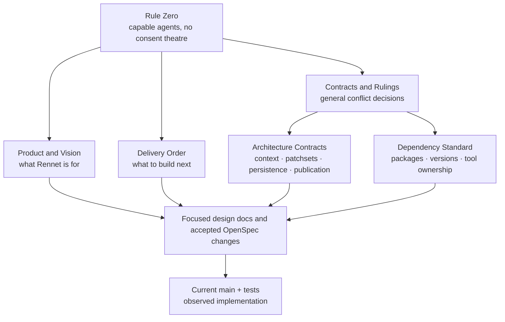
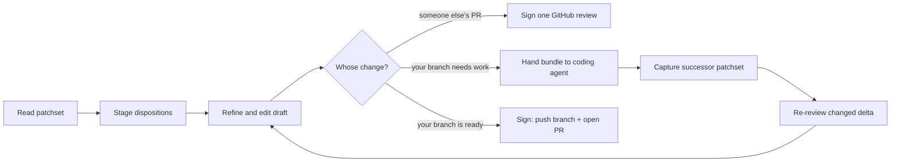
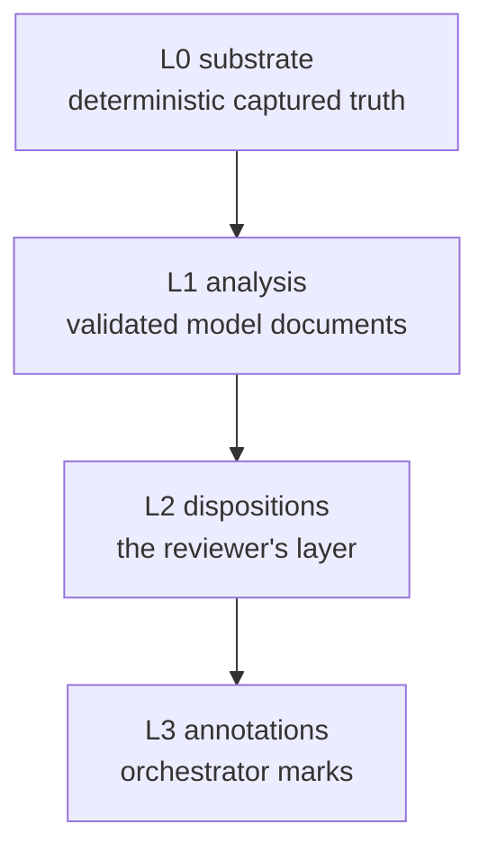

Use this page when two Rennet documents disagree. It explains which source wins,
then preserves the stable `R1`–`R55` references in a readable current-decision
index rather than carrying every superseded argument into the docsite.

## Authority map

Rule Zero sits above every plan and contract. Below it, authority is scoped rather
than one long ladder: product intent, current delivery sequence, engineering
contracts, and dependency choices each have their own owner.



Apply the sources this way:

1. If a proposal adds a consent step, denies a useful capability, or hardens the
   product at the cost of doing its job, Rule Zero rejects it.
2. For “what is Rennet trying to achieve?”, Product and Vision wins.
3. For “what should land next?”, Delivery Order wins, but verify its “true right
   now” section against current `main` because shipped work moves quickly.
4. For project context, immutable patchsets, event history, harness access, and
   publication, Architecture Contracts wins.
5. For package choice, exact versions, licences, and overlapping tools, Dependency
   Standard wins.
6. Current code tells you what is live, not what the contract meant. A mismatch is
   either unfinished work or a doc bug; name it instead of quietly choosing one.

## The current product decisions

These are the load-bearing calls behind the ruling index:

- Rennet is an MIT-licensed Electron review harness with no Rennet backend.
- Both someone-else's-PR and own-branch review are first-class paths.
- The product makes large changes digestible through roll-up, zoom, and lenses.
  Grouping is opinionated and hard-baked; decisions are never capped.
- Reading order is logical and agent-produced over a deterministic dependency
  floor. Blast radius is paint, not an ordering signal.
- The reviewer owns dispositions. The same model stages a GitHub review on someone
  else's PR or a coding-agent task bundle on the user's branch.
- Agents remain capable. Analysis can inspect and reproduce; the handoff agent can
  write and run tests. Pushing is part of the own-branch product path.
- The paper freezes exactly what leaves the machine. Model execution itself does
  not wait for a permission ceremony.
- Five canvases ship — Spec, Sequence, Decisions, Flagged, and Noise — with blast
  radius as an overlay. Claims-to-requirement mapping is infrastructure, not a
  separate canvas.
- Repo Maps are local-first derived context. Current `main` stores one path-keyed
  entry per checkout, with deliberate opt-in promotion into `.rennet/`.
- The renderer is a client of typed IPC. Durable truth and host authority stay in
  the desktop main process.

## Ruling index

The IDs stay stable so old issues and commits remain searchable. “Retired” means
the old conflict no longer controls current work; the row records the replacement.

### Foundation and product shape

| ID | Current ruling |
|---|---|
| **R1** | The product and package namespace are Rennet and `@rennet/*`. |
| **R2** | The Claude adapter uses `@anthropic-ai/claude-agent-sdk`, passes the user's installed `claude` executable, uses the user's existing auth, and strips the SDK's bundled executables at packaging time. |
| **R3** | Every Rennet package is MIT. `types` and `protocol` remain separate for architectural portability, not licence separation. |
| **R4** | Base instructions are Rennet's evolving product voice, not part of the public RSP contract. `instructions` never becomes a dependency of `types` or `protocol`. |
| **R5** | Retired: the former licence-family variant no longer exists under MIT. |
| **R6** | The disagreement data shape is part of the product; useful emission requires more than one real opinion. Repetition is an evidence trigger, not a default model-call count. |
| **R7** | Working-tree review and GitHub PR review are both first-class product modes. |
| **R11** | The user-facing canvases are Spec, Sequence, Decisions, Flagged, and Noise; blast radius is an overlay. Over-engineering and redundancy are findings/noise categories, not a separate lens. |
| **R14** | Apple signing and account decisions belong to the public-release phase, not local dogfood. |
| **R15** | Retired: route-handoff as a separate product artifact. The own-branch review loop itself is the useful feature. |
| **R23** | `omp` means `@oh-my-pi/pi-coding-agent`; the abandoned namesake package is not a target. |
| **R26** | Glass is chrome, code is opaque, and paper is the frozen outbound object. Tokens and chrome are product structure; decorative polish can follow. |

### Review engine and data

| ID | Current ruling |
|---|---|
| **R8** | Occurrence IDs plus an explicit lineage graph replace content hash as identity. Similarity is evidence only; ambiguous, split, merged, or changed content reopens. |
| **R9** | Decomposition is hybrid: deterministic code guarantees total coverage and an offline floor; a harness proposes the human-friendly graph; deterministic validation rejects omissions, duplicates, invalid anchors, and oversize units. |
| **R10** | Use local code for non-semantic work and batched model jobs for semantic work. Under 15 seconds to first useful structure and fewer than five initial decomposition invocations are performance targets, never a reason to deny all analysis or pretend the deterministic floor was a model review. |
| **R12** | `append` is the fourth settings merge strategy and is limited to guidance prose, with layer-labelled concatenation. |
| **R13** | Adapter capabilities include per-call model selection and advertised models. Capabilities begin false and are demonstrated by conformance. |
| **R17** | Commands produce durable receipts and events; projections rebuild from them. Publication has explicit `outcome-unknown` and query-before-retry recovery. Private events cannot change outbound bytes. |
| **R18** | Diff ingestion stays byte-safe. Binaries, submodules, mode-only changes, oversize splits, and incomplete ingestion are first-class. Truncated, binary, or submodule capture leaves an explicit decomposition blocking state, so a done or publish gate cannot report completeness. |
| **R19** | Public protocol is transport-neutral and JSON-Schema-first; private commands and events are Zod-first. Remote clients receive recipient-specific projections, never raw host paths or event envelopes. |
| **R20** | `@rennet/ui` imports only `types`, `protocol`, and browser-safe dependencies; it never imports `core`. |
| **R21** | The live package spine is `types`, `protocol`, `instructions`, `core`, `adapters`, and `ui`, composed by `apps/desktop`; boundary arrows are checked in CI. |
| **R24** | Forge behaviour sits behind capability-based `ForgePort`, not GitHub checks scattered through core. |
| **R27** | Amended by R55: `.rennet/` is no longer the mandatory home of every derived Repo Map. It holds human config and an optional promoted mirror. |
| **R28** | Every review edition is an immutable patchset. Local or remote movement creates a successor; it never edits the active patchset. |
| **R29** | Exact unaffected analysis stays current; direct changes become `invalid`; dependency, context, and ambiguity changes become `potentially-invalid`. Old analysis remains visibly available until a replacement validates. |
| **R30** | Project context is fingerprinted by source, config, generator, schema, toolchain, and shards. Non-current context is rebuilt or omitted with explicit degradation, never silently reused. |
| **R31** | Harnesses receive assembled current context and capable execution. The run ledger names provider egress, model source, authority, and non-enumerable ambient inputs. Copy says “no Rennet backend,” never “nothing leaves the machine.” |
| **R32** | Append-only history lasts only while a review is retained. Delete physically removes Rennet-controlled copies. Unknown events remain byte-identical and make the affected projection explicitly incomplete without disabling the rest of the product. |
| **R33** | Someone else's PR publishes one signed, idempotent review. On the user's branch, the paper previews the PR submission; signing pushes the named branch and opens that exact PR. |
| **R35** | No RxJS dataflow layer. Harnesses use `AsyncIterable`; durable truth is the event store; one post-commit feed carries ordered invalidations; small injected-clock batchers own coalescing. |

### Tooling and dependencies

| ID | Current ruling |
|---|---|
| **R16** | Pierre `CodeView` owns the diff surface. Generic virtualization stays on rails and queues, not around the diff. |
| **R22** | Before outside code contributions are accepted, the repository carries the chosen contributor policy and explicit grant; there are never AI co-author or attribution trailers. |
| **R25** | The diff-rendering direction is measured, not hypothetical. A replacement version must rerun DOM, frame, annotation-recycling, and accessibility checks. |
| **R34** | pnpm owns packages, Nx owns the project graph and local cache, Vite owns renderer builds, and Electron Forge owns package/make/release. Exact pins follow the dependency standard. |

### Dispositions, paper, and conversation

| ID | Current ruling |
|---|---|
| **R36** | Making a disposition stages it immediately; there is no extra staging gesture. |
| **R37** | Withdraw means unstage. Editing a staged item is one continuous edit on the draft. |
| **R38** | A signing act freezes every item currently staged. To sign a subset, withdraw the rest first. |
| **R40** | The editable forming destination is the collation draft canvas, not the paper. The paper is the frozen signed result and supports sign or back, not editing. |
| **R46** | Comment, request-change, question, and discussion work at the relevant anchor rather than in a detached chat silo. |
| **R52** | Conversation is verbs × anchors: line, range, chunk, fragment, plus structured spec rows. Threads and symbol inspection use the margin/right rail so the diff column never reflows. Peek floats; pin docks. |
| **R53** | OpenSpec renders as structured review material. Requirements, scenarios, tasks, and rationale are disposition anchors with coverage chips and an honest `unimplemented` state. |

### Routing and interaction

| ID | Current ruling |
|---|---|
| **R39** | The Model Council may route light jobs to a different installed harness. Every run names the harness and model; the user may pin a job or tier. |
| **R41** | Rennet chrome is terse and functional. Model analysis, narration, and conversation are content and may use the voice the work needs. |
| **R42** | Prefer an icon where it removes chrome noise without removing meaning; every glyph remains discoverable through a legend or equivalent accessible label. |
| **R43** | Superseded by the current product shell: first run is the empty Projects state with automatic discovery, not a separate tutorial wizard. |
| **R44** | Screens may scroll vertically. Do not cram or truncate a stage to fit one viewport. |
| **R45** | Diff views expose implementation↔test navigation and open-in-editor, including the honest “no tests reference this” state. |
| **R47** | A patchset freezes review intent: PR title and body or local branch intent, plus relevant spec snapshots/digests. |
| **R48** | Decisions come from spec + PR/body intent + diff. Each decision has a plain title, anchor, evidence, marked reconstructed why, and alternatives where visible. They are grouped, uncapped, and not pre-judged by a user-facing taxonomy. |
| **R49** | Flagged is an index of anchored model findings and disagreements, with severity and agreement state. Validator rejections are malformed documents, never findings. |
| **R50** | Noise is a visible totality floor. Mechanical rules handle unambiguous churn; model judgement handles the remainder; nothing is silently dropped and “not noise” restores an item. The precise Flagged/Noise overlap remains an open product call. |
| **R51** | `review.ask` defaults to one orchestrator answer. “Ask both” adds a separately labelled second opinion; Rennet never invents a synthesized third answer. |

R45 is only partly live. The current code view shows **View test** or **View
implementation** when the counterpart is another changed file in this review,
and the symbol inspector can open a definition in the editor. When no changed
counterpart resolves, the button is simply absent; the explicit “no tests
reference this” state from the ruling has not landed yet.

### Repo Map

| ID | Current ruling |
|---|---|
| **R54** | “Repo Map” means deterministic ProjectSnapshot + evidence-backed knowledge + a small retrieval primer. Maps compose by reference, update incrementally, and novelty claims cite the baseline they compare against. |
| **R55** | Current implementation decision: derived maps are local-first under `~/.rennet/projects/<escaped-absolute-path>/`, one entry per checkout/worktree. Local wins; a deliberate promotion mirrors a validated map into `.rennet/` for collaborators. This replaces both mandatory in-repo storage and the earlier shared `git-common-dir` key. |

## The review-driven coding loop

The disposition is one model with two destinations:

```ts
interface Disposition {
  anchor: LineAnchor | RangeAnchor | ChunkAnchor | FragmentAnchor | SpecAnchor
  type: "approve" | "request-change" | "comment" | "question"
  body: string
  refined?: string
  published?: string
  thread?: InlineThread
}
```



Read state is action-defined: approve, request-change, or ask a question. Scroll
position and dwell time do not count. Exact unchanged occurrences may carry their
settled state to a successor; ambiguity reopens.

## The canvas and orchestrator contract

An angle is a way of looking at a review. A canvas is one stateful instance of an
angle for `(reviewId, patchsetId)`.



The engine owns capture, invalidation, carry, and order. Fleet jobs emit RSP
documents. The orchestrator describes, retrieves, focuses, annotates, proposes,
and recomputes through `canvasOps@2`. The user disposes and signs.

The orchestrator receives a small primer that maps the available context, then
zooms on demand through canvas, diff, context, and provenance tools. Tool replies
carry evidence, freshness, totals/cursors, and explicit truncation. “Nothing
found” is different from “search failed.”

## Frozen, adjustable, and open

### Frozen

- Rennet, MIT throughout, and no AI attribution trailers.
- No client repositories, time, screenshots, or infrastructure without written
  authorization.
- Roll-up, zoom, lenses, logical agent-owned order, uncapped decisions, and
  action-defined read state.
- Immutable patchsets, complete provenance, honest freshness, and exact outbound
  preview.
- Capable harness sessions and Rule Zero.
- The package dependency arrows and renderer/main authority boundary.

### Adjustable with evidence

- Exact thresholds, retry counts, debounce windows, and cache sizes.
- Model assignments and effort levels in the Model Council.
- Cohort sizing and the presentation of dense reviews.
- Dependency versions that satisfy the exact-pin and owning-test policy.

### Still open

- The crisp boundary and possible overlap between Flagged and Noise.
- Which harnesses can ever truthfully report an exhaustive context manifest.
- The product shape and transport work for a future remote/mobile client.

Track current work in GitHub issues and the
[delivery order](/developing/reference/delivery-order/). Do not resurrect an old
open question from the archived docs without checking whether code or a later
accepted change already answered it.

## Working agreement

Keep `main` releasable. Run the full `pnpm check` before pushing, with positive
controls capable of failing. Use the issue queue for newly discovered scope rather
than stretching an unrelated change. Spikes finish with a written verdict; their
throwaway code does not quietly become production code.

## Related

- [Architecture overview](/developing/concepts/architecture-overview/)
- [Architecture contracts](/developing/concepts/architecture-contracts/)
- [Dependency standard](/developing/reference/dependency-standard/)
- [Delivery order](/developing/reference/delivery-order/)
