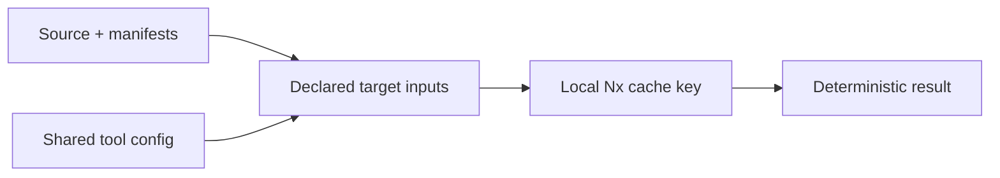
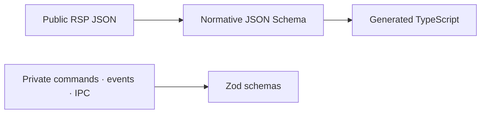

Rennet uses mature plumbing and keeps product behaviour in Rennet. This page is
the authority for dependency choice, exact-version policy, tool ownership, and
overlap; product and data behaviour lives in the
[architecture contracts](/developing/concepts/architecture-contracts/).

## The decision test

A dependency earns a place when it removes a subsystem Rennet would otherwise
maintain, has a healthy primary source, has a compatible licence, and fits the
product's deterministic and local-first architecture. Saving ten lines is not
enough. Neither is being fashionable.

| Verdict | Meaning |
|---|---|
| **MUST** | The chosen default for this capability. Changing it needs an evidence-backed architecture decision. |
| **SHOULD** | Add when the named capability or measurement arrives. |
| **DEFER** | Plausible, but not mature, measured, or needed yet. |
| **AVOID** | Overlaps an owner or fights an architecture boundary. |
| **OWN** | Small, load-bearing product logic that a generic library cannot define for Rennet. |

These words are engineering decisions, not user-facing permission gates.

## Version and licence policy

All Rennet packages use the MIT licence. Runtime and development dependencies
may use compatible permissive licences; any attribution and NOTICE obligations
travel with distributed artifacts. Tools and binaries discovered in a reviewed
repository are external processes, not linked parts of Rennet.

Self-hosted brand fonts (DM Sans, Fraunces, Source Serif 4, adopted in the
2026-08-19 design overhaul) ship under the SIL Open Font License (`OFL-1.1`,
or `MIT AND OFL-1.1` for the expo-google-fonts wrappers). The OFL is
permissive for bundling and redistribution inside software of any licence; its
conditions bind the font files only and never affect Rennet's MIT code, so the
licence gate allows those two expressions.

Dependency versions are exact pins with a committed `pnpm-lock.yaml`. A new
release normally waits seven days before adoption (`minimumReleaseAge: 10080`),
then passes its owning tests. An exact-version exception is acceptable when the
reason is written down and the relevant build, audit, and package paths pass.

The current supply-chain rules are:

- pnpm owns dependency resolution and the lockfile;
- Electron Forge requires `nodeLinker: hoisted`, but hoisting never excuses an
  undeclared import;
- Nx and ESLint enforce in-repo package arrows;
- licence and vulnerability checks cover the full lockfile and include a seeded
  positive control;
- pnpm currently reports the adopted proprietary Agent SDK packages as
  `Unknown`; the licence check allows those package names only, while every
  other unknown licence still fails the gate;
- scanners and build caches never receive credentials, user repositories, or
  ambient home-directory state as declared inputs;
- overrides leave once the upstream graph resolves to an equal or newer compatible
  version and the owning checks remain green.

## Tool ownership at a glance

One tool owns each job. This is the quickest way to avoid installing a second
stack that quietly disagrees with the first.

```mermaid
flowchart TB
  packages[Package installation] --> pnpm[pnpm]
  graph[Projects · tasks · cache] --> nx[Nx]
  format[Format + broad lint] --> biome[Biome]
  boundaries[Architecture rules] --> eslint[ESLint + Nx rule]
  renderer[Renderer build] --> vite[Vite]
  tests[Unit + integration] --> vitest[Vitest]
  e2e[Electron journeys] --> playwright[Playwright]
  desktop[Package + make + release] --> forge[Electron Forge]
  runtime[Desktop runtime] --> electron[Electron]
```

That makes several choices straightforward:

- no Turbo or Vite+ task graph alongside Nx;
- no Prettier or parallel general linter alongside Biome;
- no electron-builder, electron-updater, electron-vite, or unofficial Nx Electron
  abstraction alongside Forge and explicit Nx targets;
- no direct Rolldown install alongside Vite;
- no second diff editor or terminal stack: Rennet is a review surface, not an IDE.

## What current `main` actually pins

This table is read from the workspace manifests, not copied from an old research
snapshot.

| Capability | Current owner | Exact version | Status |
|---|---|---:|---|
| Node host | Node.js | `24.18.0` | Live baseline |
| Package manager | pnpm | `10.32.1` | Live baseline |
| Task graph | `nx` and official `@nx/*` plugins | `23.1.0` | Live; all Nx packages move together |
| Native compiler | `@typescript/native` alias | `typescript@7.0.2` | Live |
| Tool API compiler | `typescript` alias | `@typescript/typescript6@6.0.2` | Live compatibility bridge |
| Renderer build | `vite` | `8.1.5` | Live |
| React transform | `@vitejs/plugin-react` | `6.0.4` | Live |
| Format and broad lint | `@biomejs/biome` | `2.5.6` | Live |
| Architecture lint | `eslint` / `typescript-eslint` | `10.8.0` / `8.65.0` | Live, narrow remit |
| Unit and integration tests | `vitest` | `4.1.10` | Live |
| Electron journeys | `@playwright/test` | `1.62.0` | Live |
| Desktop runtime | `electron` | `43.2.0` | Live |
| Package and make | Electron Forge | `7.11.2` | Live |
| Electron fuses | `@electron/fuses` | `2.1.3` | Live |
| Claude integration | `@anthropic-ai/claude-agent-sdk` | `0.3.223` | Live; invokes the user's installed `claude` |
| GitHub client | `@octokit/core` | `7.0.7` | Live; plugin-free, adapters own retry semantics |
| Runtime schemas | `zod` | `4.4.3` | Live in protocol and adapters |
| Child processes | `execa` | `10.0.0` | Live in adapters |
| Change hints | `chokidar` | `5.0.0` | Live; Git remains truth |
| Durable IDs | `uuid` | `14.0.1` | Live; UUIDv7 behind Rennet's port |
| UI runtime | `react` / `react-dom` | `19.2.8` | Live |
| Renderer error boundary | `react-error-boundary` | `6.1.2` | Live |
| Ephemeral renderer state | `zustand` | `5.0.14` | Live; never durable review truth |

When this table and `package.json` disagree, the manifest is observed state and
this page needs an update in the same change.

## Nx and cache contract

Run repository work through Nx, prefixed by pnpm. The full local gate is:

```sh
pnpm check
```

That is `nx run-many -t format,architecture,licenses,lint,typecheck,test,build`.
Use `pnpm nx affected -t lint,typecheck,test,build` for iteration, not as proof of
the whole repository.



A cacheable target declares every file and environment value that can change its
verdict, plus every generated output directory. Never hash credentials,
timestamps, absolute machine paths, harness state, user codebases, or undeclared
ambient state.

Cache deterministic `format`, `architecture`, `licenses`, `lint`, `typecheck`,
`test`, and `build` targets. Long-running `serve`/watch tasks and interactive
Electron work are not cacheable. E2E stays uncached until its hermeticity is
proved. Local `.nx/cache` is the default; there is no Nx Cloud dependency.

Trust a matching local cache result. `--skip-nx-cache` and `nx reset` are diagnosis
tools, not rituals. The known exception is an Nx task-history SQLite failure such
as `FOREIGN KEY constraint failed` after the target itself succeeded; stop
concurrent Nx processes in the same worktree, reset once, and rerun.

## Desktop runtime and packaging

Electron is an explicit Nx project. Vite builds the renderer; ordinary Node-target
builds produce main and preload; Forge owns package, make, signing, notarization,
and publishing when those release stages are enabled.

Use Electron built-ins for `utilityProcess`, `MessageChannelMain`, `safeStorage`,
`nativeTheme`, shortcuts, notifications, deep links, external links, and local
crash dumps. Production keeps context isolation and the renderer sandbox; those
are ordinary application boundaries, not restrictions on the coding agent Rennet
drives.

The Forge Vite plugin remains out because Rennet already has explicit Vite build
ownership. `vite-plugin-electron` may earn a bounded dev-loop comparison, but it
cannot replace Forge. Public updater, signing, notarization, and release publisher
packages arrive with the public-release work rather than ahead of it.

## Data, persistence, and process plumbing

The public RSP wire format (the Rennet Surfacing Protocol — see [surfacing and
routing](/developing/concepts/surfacing-and-routing/)) and the private
application protocol have different owners:



Never define the same public wire shape independently in JSON Schema and Zod.

The dependency decisions for the next capability that needs them remain:

| Capability | Decision | Boundary |
|---|---|---|
| Public JSON Schema validation | `ajv` + `ajv-formats` | Strict normative RSP validation |
| Public type generation | `json-schema-to-typescript` | Dev-only, one-way generation |
| Canonical JSON | RFC 8785-compatible canonicalization | Digest input, one implementation |
| JSONC project config | `jsonc-parser` | Preserve human comments |
| Atomic non-SQLite writes | `write-file-atomic` | Only where rename-based writers do not already own the path |
| Bounded async work | `p-queue` | Harness, LSP, Forge, and I/O queues |
| CPU pools | `piscina` | Add only after a measured hot path |
| Durable review store | Electron/Node `node:sqlite` | One writer, WAL, transactions, defensive limits |
| Retry | `p-retry` | Idempotent reads only; never blind mutation retry |

Rennet owns event decisions, upcasts, projections, command receipts, physical
purge, and publication reconciliation. A generic event-sourcing framework,
SQLite ORM, Redis queue, XState machine, or Immer layer would obscure those
contracts rather than remove them.

## Streams and live state

Do not add RxJS or another reactive-streams framework. The existing primitives
already have clear owners:

- `AsyncIterable` streams harness events with pull-based backpressure;
- the event store is the replayable state truth;
- a future post-commit feed will fan out targeted invalidations in sequence order;
- TanStack-style async read models or the current typed bridge handle renderer
  query lifecycle;
- Zustand holds ephemeral view state only;
- small batchers under injected clocks handle time-based coalescing.

That feed is not composed in the live SQLite/UI path yet. Every push seam still
states its lifecycle and coalescing policy. “No RxJS” does not mean “listener
soup.”

## Git, code intelligence, and diffs

The user-installed `git` process is canonical Git truth. Invoke an exact executable
with an argv array through Execa; never shell strings. Rennet owns byte-safe,
NUL-delimited parsing and immutable capture because generic Git wrappers tend to
erase details the review model needs.

The adopted direction for code intelligence is:

| Capability | Choice | Boundary |
|---|---|---|
| Tier-0 syntax | `web-tree-sitter` WASM | Parse once and dispose; grammar provenance is per asset |
| LSP transport | `vscode-jsonrpc` + `vscode-languageserver-protocol` | Own lifecycle and degradation, not wire framing |
| TypeScript 7 LSP | Reviewed repo's own TS7 executable | Never substitute another compiler major |
| Older TS fallback | `typescript-language-server` using the repo's TypeScript | Managed fallback only |
| Similarity and mini-diffs | `diff` | Never canonical patch ingestion |
| Derived graph algorithms | `@dagrejs/graphlib` | Persist Rennet data, not library objects |
| One-to-one assignment | `munkres`, deferred | May solve assignment only, never scoring or ambiguity policy |

System `rg` may be an accelerator. Rennet does not bundle a second platform
binary merely to guarantee it. Monaco, CodeMirror, and xterm remain out: code is
read here, not edited in an embedded IDE or terminal.

## GitHub and harness integrations

For GitHub, the plugin-free `@octokit/core` client carries REST and GraphQL
calls, while Rennet owns authentication precedence, anchoring, degradation,
idempotency, read-back markers, and `outcome-unknown` reconciliation. The
aggregate `octokit` bundle and its global retry/throttle plugins are deliberately
NOT used — the publish path owns its rate-limit semantics (`ForgeRateLimited`,
backoff on GitHub's schedule, never a hidden retry storm). Webhook machinery and
GitHub Apps remain out of the product shape.

GitHub authentication is Rennet's own OAuth device flow, implemented directly
against github.com's two login endpoints (Rennet's public OAuth App client id —
no client secret, no Rennet backend, no flow library: the octokit device-flow
strategy drops the refresh half of an expiring-token response, so Rennet owns
the exchange). The minted credential — access token plus the rotating refresh
token an expiring-token app configuration returns — or a pasted personal access
token is kept in an owner-only file under the daemon's data directory, and
expiring credentials renew transparently before expiry. Rennet does not parse
any other tool's auth files.

The Claude adapter uses the official Agent SDK but passes
`pathToClaudeCodeExecutable` for the user's installed binary. Packaging strips the
SDK's bundled platform executables. Rennet never bundles a harness binary and
never reads a harness credential.

## Renderer stack

React owns rendering. The UI package imports only `@rennet/types`,
`@rennet/protocol`, and browser-safe dependencies. Durable review truth stays in
the main process; Zustand stores only selection, panel, and transient interaction
state.

The old research ledger selected React Aria Components, TanStack Router, TanStack
Query, Tinykeys, TanStack Virtual for non-diff lists, Pierre for the diff surface,
and a sanitised React Markdown pipeline. **None of these are installed on current
`main`.** Treat them as the first candidates when their capability lands, recheck
current versions and peer ranges, and update this page and manifests together.

Avoid parallel dialog/menu/toast primitive families. Avoid wrapping the diff
surface in generic virtualization: the measured direction is Pierre `CodeView`;
list virtualization belongs to rails and queues, not the diff itself.

## Mobile stack (Expo / React Native)

The native app (`apps/mobile`, phase 6 M1) is an **Expo + expo-router** application.
It uses **explicit Nx targets** (plain commands over the workspace's own tools), not
the `@nx/expo` inference — so `@nx/expo` itself is **not a dependency**: it was
installed during scaffolding, went unused (the generator's inferred targets conflict
with the biome/eslint/vitest gate), and was removed (no unused deps). Re-add it —
pinned to the workspace Nx version — only if and when an Expo generator is actually
wanted. Expo SDK **55** and its module set are pinned from the SDK's
bundled-native-modules matrix (`expo-router`, `expo-secure-store`, `expo-camera`,
`expo-notifications`, `expo-task-manager`, `expo-linking`,
`@react-native-async-storage/async-storage`, `react-native`, `react`/`react-dom` at
the workspace's React 19.2). SDK 55 matches the workspace React, which is why it is
chosen over the newer default.

- **MUST** — Expo SDK modules over hand-rolled native code (camera, secure-store,
  notifications, linking, task-manager); `expo-secure-store` for the device-token keychain
  and `@react-native-async-storage/async-storage` for the replica cache, the persisted
  daemon list, and the notification preferences; `expo-task-manager` (`~55.0.18`,
  SDK-matched) for the module-scope background task that answers an ask from a notification
  action while the app is backgrounded/terminated — Android only, the one platform
  expo-notifications runs a task on an action tap (M2 finding 4). Elsewhere the action opens
  the app pre-filled (the honest fallback), never a dropped answer.
- **`expo-share-intent`** (`6.1.1`, community, **MIT**) — reads a shared PR link
  (Android `Intent.EXTRA_TEXT`) into the kickoff route (M2 finding 9). Vetted per this
  standard: MIT is allowlisted; the version is exact-pinned and >7 days old (published
  2026-05-25); it is the SDK-55 line (`expo: ^55` — the 7.x/8.x releases target SDK 56/57).
  The config plugin is admitted **Android-only** (`disableIOS: true`, `androidIntentFilters:
  ["text/*"]`): the iOS share extension is a native extension target (Apple team id + app
  group) disproportionate to this pass, so iOS keeps the paste + `rennet://kickoff` link
  paths and the extension is the recorded follow-up (design decision 5) — not a lying
  manifest that claims an iOS share sheet Rennet has not wired.
- **AVOID** — a component library in M1 (the kit look is plain RN styles over a token
  transpose); a second navigation stack beside expo-router; `packages/ui` in RN (it is
  DOM-bound). The app imports `@rennet/client`/`protocol`/`types` only.
- **Nx targets** — the app is admitted with **explicit** `lint`/`typecheck`/`test`
  targets (plain commands, the workspace's own eslint + biome + tsc + vitest), *not* the
  generator's inferred Expo targets, so the app rides the same gate as every package. There
  is **no `build` target**: an Expo export / EAS build is native distribution (M3), outside
  the JS gate, and `nx run-many -t build` simply skips a project without the target.
- **Licence exceptions** — the Expo/RN tree pulls several additional permissive
  licences (dual-`OR` expressions, `MPL-2.0`, `CC-BY-4.0`, `Python-2.0`), now allowlisted in
  `scripts/check-licenses.mjs` with the rationale inline — the "documented exception, owning
  checks green" path this policy sanctions. There is **no TypeScript peer override**: the
  only package that peer-wanted TS `^5` was `@expo/require-utils`, pulled in transitively by
  the unused `@nx/expo`; removing `@nx/expo` removed the demand, so `pnpm install` is clean
  with no `peerDependencyRules.allowedVersions` typescript entry.

## Testing and diagnostics

Vitest owns unit and integration tests. Playwright owns Electron journeys.
Real-browser component tests, axe checks, property tests, coverage, structured
local logs, and vulnerability scanning should be added where the product path
needs them, not as decorative percentages or dashboards.

Rennet owns log field policy, path and content redaction, bounded local retention,
diagnostic export, and purge. Hosted telemetry and crash upload are not part of
the default architecture, and neither is a hosted backend of any kind: there is no
Rennet server. The daemon runs on the user's own machine, and a remote client
reaches it directly over the user's private network (Tailscale) — no relay, no
Rennet-operated infrastructure. Egress is to the harness's model provider and to
GitHub only, and it is disclosed rather than denied.

## Product code Rennet intentionally owns

These are not missing dependencies:

1. Typed IPC dispatch, streaming, and recipient-specific projections.
2. Exact Git commands, byte parsers, immutable capture, and ingestion limits.
3. Patchset occurrence lineage, scoring, ambiguity, split/merge, and read carry.
4. Event schema, upcasts, projections, receipts, purge, and publication recovery.
5. Repo Map identity, freshness, incremental rebuild, overlays, and knowledge.
6. Harness conformance, prompt assembly, routing, budgets, cancellation, and run ledger.
7. LSP lifecycle, materialisation, readiness probes, degradation, and tier labels.
8. GitHub anchor mapping, batch publication, idempotency markers, and reconciliation.
9. Dependency-boundary checks and their positive controls.

## Revisit triggers

- A stable Pierre release replaces the proven candidate only after the existing
  DOM, frame, annotation-recycling, and accessibility measurements pass.
- Every packaged tree-sitter grammar carries its own source, version, licence,
  query, and NOTICE provenance.
- pnpm 11, Vite+, Oxfmt, and remote caching are reconsidered when their maturity
  or integration removes an owner instead of adding a parallel one.
- Signing, notarization, updaters, and publishers land with the public-release
  phase.

## Related

- [Architecture overview](/developing/concepts/architecture-overview/)
- [Architecture contracts](/developing/concepts/architecture-contracts/)
- [Contracts and rulings](/developing/reference/contracts-and-rulings/)
