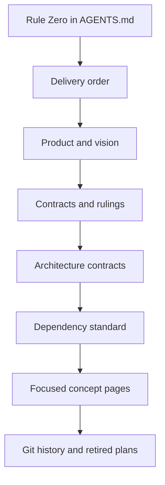

Rennet has product intent, architecture contracts, dependency decisions, and a
live delivery queue. This page shows which source owns each kind of truth so a
dated plan cannot quietly overrule the product.

## Authority order

The arrows mean “wins over.” Two focused registers also own their exact scope:

- [Architecture contracts](/developing/concepts/architecture-contracts/) win on
  project context, immutable patchsets, invalidation, persistence, and
  publication mechanics.
- [Dependency standard](/developing/reference/dependency-standard/) wins on
  package choice, versions, licences, toolchain ownership, and dependency
  overlap.

If either disagrees with the product's intent, that is a documentation bug to
reconcile rather than a reason to pick whichever sentence is convenient.

## What each page is for

| Need | Source |
|---|---|
| What Rennet is trying to become | [Product and vision](/using/concepts/product-and-vision/) |
| What to build or land next | [Delivery order](/developing/reference/delivery-order/) and the live GitHub issue queue |
| Stable product and architecture decisions | [Contracts and rulings](/developing/reference/contracts-and-rulings/) |
| Runtime and persistence invariants | [Architecture contracts](/developing/concepts/architecture-contracts/) |
| Allowed packages and tool ownership | [Dependency standard](/developing/reference/dependency-standard/) |
| The review interaction model | [Canvas model](/developing/concepts/canvas-model/) |
| How model jobs are assigned | [Model council](/developing/concepts/model-council/) |
| How context reaches models | [Context assembly](/developing/concepts/context-assembly/) |
| How a review becomes an outbound artifact | [Collation and signing](/developing/concepts/collation-and-signing/) |

## Live state beats prose

A documentation page can age. Before relying on a claim about what is shipped,
check the current code, the relevant GitHub issue, and the resolved Nx project
configuration. Keep three statements separate:

1. **Observed:** the code path and tests that exist now.
2. **Configured:** the contract or target the repository declares.
3. **Intended:** the destination described by product docs or an open issue.

The site uses callouts such as “live today” and “still being built” to keep those
categories visible.

## What happened to the old planning files?

The previous root `docs/` folder mixed current authority with spikes, review
notes, dated backlogs, and Wingman-era plans. The useful content was rewritten
into this site; the old files were removed from the working tree and remain
recoverable from Git history.

Do not restore a retired plan merely to preserve a citation. Move any still-live
fact into the owning page and link that page instead.

## Maintaining the map

When a code change alters behaviour or a boundary, update the page that owns the
fact in the same change. When a new page introduces a competing source of truth,
either give it a narrow scope here or fold it into an existing owner.

See the [docs style guide](/developing/contributing/docs-style-guide/) and the
[good docs standard](/developing/contributing/good-docs-standard/) before adding
a new section.
