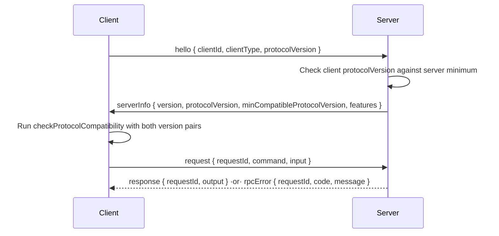

Once the daemon and a client can be built from different commits, the protocol
stops being a compile-time contract and becomes a wire contract. This page is the
law for evolving that wire without a flag day: how frames may change, how a client
and daemon negotiate versions, and how a new capability ships without breaking an
old peer. It governs everything in the [`protocol-session`](#the-frame-vocabulary)
layer (`packages/protocol/src/session.ts`) and every wire schema added after it.

## The one rule

**Wire schemas evolve append-only.** A field may be *added* if it is optional. A
field may never be removed, never narrowed (no new `min`, no tighter enum, no
`string` → literal), and never promoted from optional to required. If a peer
built last month must still parse a frame this peer sends today, and vice versa,
the schema is correct. If it must not, the change is breaking and needs a new
protocol version instead.

This holds for the command payloads too. The envelope carries `command` inputs
and outputs from [`commandDefinitions`](/developing/reference/contracts-and-rulings/)
by reference — those schemas are the single authority for payload validation, and
they obey the same append-only rule.
Frame payloads (`request.input`, `response.output`, and `rpcError.details`) must
be JSON-representable, and the command schemas in `commandDefinitions` remain the
single validation authority for command inputs and outputs.

## One protocol version, with a window

There is one integer, `PROTOCOL_VERSION`, exported from `@rennet/protocol`. It
starts at `1`. Bump it only for a change the append-only rule cannot express — a
removed field, a changed meaning, a new required shape.

Alongside it, `MIN_COMPATIBLE_PROTOCOL_VERSION` names the oldest version this
build can still talk to. Two peers are compatible when each side's version is at
or above the other side's minimum. Mixed versions are the normal state, not an
error to design out — a phone on an old build and a freshly-updated daemon must
coexist.

The handshake divides that check according to the information each side has.
The server checks the `hello.protocolVersion` against its own
`MIN_COMPATIBLE_PROTOCOL_VERSION`; `hello` does not carry the client's minimum,
so that is all the server can and needs to check. After `serverInfo` supplies
both server version values, the client runs the full symmetric
`checkProtocolCompatibility` helper.

```ts
import { checkProtocolCompatibility, PROTOCOL_VERSION, MIN_COMPATIBLE_PROTOCOL_VERSION } from "@rennet/protocol";

const result = checkProtocolCompatibility(
  { version: PROTOCOL_VERSION, minCompatible: MIN_COMPATIBLE_PROTOCOL_VERSION },
  { version: serverInfo.protocolVersion, minCompatible: serverInfo.minCompatibleProtocolVersion },
);
if (!result.compatible) {
  // result.reason names which side is too old — surface it, don't guess.
}
```

The helper returns `{ compatible: true }` or `{ compatible: false, reason }`, not
a bare boolean, so the peer that refuses a connection can tell the user *why* and
which side needs to update.



## New capabilities are gated on features, once

Anything beyond what the version window already guarantees ships behind a flag in
`serverInfo.features` — an open `Record<string, boolean>`, not an enum (an enum
would make adding a feature a breaking schema change, which is the whole thing we
are avoiding). A client checks `features.x` **once** at handshake and takes one
path. There is no fallback path, no degraded mode, no re-probing mid-session. A
feature the peer does not advertise is simply off. Document each key here as it is
added.

| Feature key | Advertised when | Meaning |
|---|---|---|
| `serverRequests` | always, on current daemons | The daemon can send `serverRequest` frames and understands `serverResponse` (see the [frame vocabulary](#the-frame-vocabulary)). A client that reads this flag as true may register an `onServerRequest` handler; one that does not never sees a server-initiated request. No product flow raises one yet — the flag reserves the capability so a future client negotiates it once, at handshake. |
| `attention` | when the daemon wires the attention system (issue #383 M1) | The daemon consumes client `presence` frames, delivers attention events presence-aware, and accepts `device.registerPush` / `attention.acknowledge`. A client that reads this flag as true transmits its `presence` frame (and re-sends it on every reconnect), registers a push token, and receives `attentionEvent` frames; one that does not (an M0-era daemon never advertises it) sends no presence, registers no token, and its presence seam stays a wire-silent no-op. Checked once at handshake, one path — the standard feature-gate. |

## Inbound decoders are tolerant

Every session frame schema is a default (non-strict) Zod object: it **strips
unknown fields** instead of rejecting them. That is what lets a newer peer add an
optional field without breaking an older decoder — the older decoder never sees
the field, and the frame still parses. This deliberately diverges from the
`.strict()` habit used for intra-process shapes elsewhere in `packages/protocol`;
`.strict()` stays right *there*, tolerance is the rule *on the wire*. A test in
`session.test.ts` pins this by proving a `.strict()` clone of each frame would
reject an unknown field the real schema accepts.

## COMPAT shims carry a removal date

When the window eventually moves and a shim is needed to keep an old peer working
— translating an old field, defaulting a new one — tag it in code with a
`COMPAT(name)` comment and a removal date:

```ts
// COMPAT(hello-no-clientType): clients before v2 omit clientType; default it.
// Remove after 2026-12-01, once MIN_COMPATIBLE_PROTOCOL_VERSION >= 2.
```

The tag makes shims greppable and the date makes them expire on purpose instead
of accreting forever.

## The frame vocabulary

The transport serializes these frames and nothing else. Each is one arm of
the `sessionFrame` discriminated union, keyed on `type`.

| Frame | Direction | Carries |
|---|---|---|
| `hello` | client → server | `clientId`, `clientType`, `protocolVersion`, optional `deviceToken` |
| `serverInfo` | server → client | `version`, `protocolVersion`, `minCompatibleProtocolVersion`, `features` |
| `request` | client → server | `requestId`, `command` (validated against the registry), `input` |
| `response` | server → client | `requestId`, `output` |
| `rpcError` | server → client | `requestId`, `code`, `message`, optional `details` |
| `progressEvent` | server → client | `commandId`, `event` (the existing `ProjectProcessEvent`) |
| `askStreamEvent` | server → client | `reviewId`, `event` (the existing `ReviewAskStreamEvent`) |
| `serverRequest` | server → client | `serverRequestId`, `kind`, `payload` |
| `serverResponse` | client → server | `serverRequestId`, `payload` |
| `serverRequestResolved` | server → client | `serverRequestId` |
| `presence` | client → server | `focused`, `visible`, `deviceClass`, optional `focusedReviewId` |
| `attentionEvent` | server → client | `event` (`raised`/`cleared`), optional `item`, optional `clearedIds` |

The last two frames are the attention layer (issue #383 M1), gated on the `attention`
feature above. `presence` is the client's focus/visibility beacon the delivery planner reads
to decide in-app-vs-push per client; a client sends it only to a daemon that advertised
`attention`, so an M0-era daemon never receives it. `attentionEvent` broadcasts an attention
raise (a `review-finished`, an `ask-pending`, …) or a clear to every authorized socket, so a
focused client gets the live in-app event (its push is suppressed) and, on acknowledgment,
every client's needs-you badge clears together. Both are additive arms of the `sessionFrame`
union — an older peer that never sends or handles them is unaffected. The two commands that
travel with the layer, `device.registerPush` (a paired device registers/replaces/clears its
push token) and `attention.acknowledge` (clear on view, propagated to all clients), are
ordinary additive `commandDefinitions` entries reachable only on a token-bearing connection
while `attention` is advertised.

The taxonomy is a closed six-family set, but not every family is raised from a
real source in M1. **Live in M1:** `review-finished` (wired to the capture / openPr
/ regenerate pipeline outcomes), `ask-pending` and `turn-failed` (both wired to the
streaming `review.ask` turn lifecycle — an in-flight ask raises `ask-pending`,
clears on settle, and raises `turn-failed` on error or interrupt). **Now live (M2):**
`handoff-completed` raises from `review.handoff.run`'s outcome (delta summary as
substance) and `publish-ready` from a composed own-branch draft (`review.draftPrBody`),
clearing on post or on viewing the preview — so all six families now raise from real
lifecycles. `processing-finished` is silent by taxonomy: it updates the in-app badge
but never pushes.

`attentionItemSchema` gained an additive optional `actions` array (issue #382 M2) —
answer chips (`{ id, label }`) an ask-pending item carries, so the app can register them
as notification actions and answer the ask from the shade (the reply composes chip label +
free-text direction into one `review.ask`). It rides the `attentionEvent` frame and the
Expo push payload (alongside a `categoryId`); it is absent on every other family and on any
daemon that predates it, stripped harmlessly by the tolerant decoder. Two additive
`commandDefinitions` entries landed with M2, ordinary token-bearing commands under the same
rules: `review.interrupt` (the client Stop — aborts a review's in-flight turn, emits
`ask-interrupted`) and `publish.compose` (the daemon composes the own-branch outbound
submission + byte-exact payload for a projected client that cannot import the `ui`
composition layer). The `device.registerPush`
input also carries an additive optional `disabledFamilies` — families a device
muted in its notification settings, which the daemon suppresses pushes for; a
high-priority family (ask-pending / review-finished / turn-failed) always reaches
every client regardless, so muting affects only the normal families.

The projected review carries an additive optional `attention` summary —
`{ needsYou, running }` — alongside the attention frames (issue #383 M1). It is
sourced from the daemon's attention system, not the review pipeline: `needsYou`
is true when an active high-priority attention (pending ask / review finished /
turn failed) targets the review, and `running` is true while a review-scoped
turn is in flight on it (the daemon's in-flight-review registry — **not**
`pendingPatchsetId`, which means the working tree moved, i.e. staleness). The
daemon attaches it only when it advertises `attention`; a pre-attention daemon
omits it, and the field is non-required in the `projected-review` public-schema
fixture, so an older client ignores it and a newer client falls back to deriving
needs-you from its flagged queue plus live events (with `running` honestly false —
a pre-attention daemon exposes no live-turn signal). It exists so a cold-open
review list is truthful about needs-you before any push arrives — the sanctioned
"grow the projection" path, never a side channel.

**The additive guarantee has one sharp edge, worth stating plainly.** "Additive"
means an older *runtime* peer that ignores unknown fields is unaffected — the
tolerant frame decoders strip what they do not know. It does **not** mean a
consumer that validates against the *old* checked-in `projected-review` fixture
stays green: that fixture is `additionalProperties: false`, so a strict validator
built against it will *reject* a review carrying the new `attention` key. The
contract is the checked-in fixture, and growing the projection means regenerating
it (`UPDATE_PUBLIC_SCHEMA=1 pnpm nx test rennet-protocol`) in the same change — a
consumer pins to a fixture *version*, and picks up the new optional field when it
adopts the regenerated one. This is the expected refresh, not a break; it is why
every projected-shape addition ships with its fixture diff.

`hello.deviceToken` is the append-only field a remote client presents to prove it
was paired; a loopback client omits it. It carries the raw device token, which the
daemon checks against its hashed device store. See
[remote access](/using/guide/remote-access/) for pairing.

The last three frames are the server-initiated request pair plus its cleanup
frame. Until now every exchange was client-driven; these let the server ask a
specific connection a question and await an answer:

- `serverRequest` opens the ask — `kind` names what is being asked, `payload`
  carries its data, and `serverRequestId` correlates the reply.
- `serverResponse` is the client's answer, echoing `serverRequestId`.
- `serverRequestResolved` tells the client the ask is settled (answered, timed
  out, or the turn ended) so it never leaves a stale prompt on screen.

They are additive: `serverRequest`/`serverResponse`/`serverRequestResolved` are
three new arms of the `sessionFrame` union, so an older peer that never sends or
handles them is unaffected. **There is no product consumer yet.** The wire
contract and the listener/bridge plumbing (an `askConnection` helper on the
server, an `onServerRequest` seam on the client) exist and are pinned by tests, so
the first client that needs a turn-time question — a mobile client, per the app
server plan — builds against a fixed contract instead of inventing one. A peer
that does not advertise the feature flag below never receives these frames.

`rpcError.code` is a small known set (`invalid_input`, `command_failed`,
`incompatible_protocol`, `unknown_command`) unioned with `string`, so the field
stays append-only: new codes are added by documenting them, never by breaking the
schema. The two push frames reuse their payload types by reference — they are
never forked or copied.

## Where this fits

Phase 0 of the [app server plan](/developing/reference/app-server-plan/) wrote
this discipline down before any transport existed, so every later phase inherited
it instead of retrofitting it. The WebSocket transport now serializes these
frames; every frame added since — including the server-request trio above — obeys
the append-only rule, so a daemon and a client built from different commits still
interoperate.
