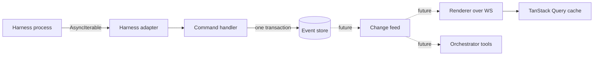

Rennet has plenty of live data, but it does not use RxJS. Durable events remain
the source of truth and harness output uses `AsyncIterable`. A small post-commit
invalidation feed is the chosen future shape, not live wiring today.

## The short version

An observable graph would create a second, in-memory account of what happened.
That is a poor fit for a review system whose important state must survive a
restart, replay deterministically, and cross Electron or protocol boundaries.

When implemented, the change feed is only an invalidation hint. The event store
remains truth, and a consumer that misses a notification re-reads current state.

## Which primitive goes where

| Situation | Primitive | Why |
|---|---|---|
| Harness output | `AsyncIterable<HarnessEvent>` | Pull-based backpressure, one consumer, and a direct match for the harness SDKs. |
| Cancellation | `AbortSignal` | One cancellation path from the command down to the subprocess. |
| Durable review changes | Commands and append-only events | Replayable, transactional, and inspectable after a crash. |
| Future live UI refresh | A typed post-commit change feed | Small notifications cross IPC cleanly; consumers re-query truth. |
| Short bursts such as token deltas | A tiny coalescer under an injected clock | Keeps timing local and testable without introducing another dataflow runtime. |
| Bounded concurrent jobs | `p-queue` | Concurrency stays explicit and close to the work being scheduled. |

## The discipline Rennet does keep

The decision is not “streams are bad.” Every push seam still needs four things:

1. One owner and an explicit disposal point.
2. A named backpressure or coalescing policy.
3. Source-assigned ordering rather than arrival-time guesses.
4. One fan-out point per process instead of listener soup.

That gives Rennet the useful parts of reactive design without hiding durable
review state inside operator closures.

## The progress-narration seam

The progress push — now a WS `progressEvent` frame (the server to every subscribed
client, keyed by `commandId`, carrying a `ProjectProcessEvent`) — is one such live
seam. It obeys the four-point discipline above: dispatch owns the terminal event so
the stream and the command's resolved value always agree, and the renderer folds the
stream into UI state that a re-read of durable truth can always reconstruct.

The processing slot renders through the shared narration organ (`ProgressFeed`
plus the processing-specific `deriveProgressView` fold in `packages/ui`). The
renderer keeps one command UUID per project for the session, and the server
deduplicates a live `project.process` run by that UUID while retaining a bounded
replay suffix (keyed by the connecting socket's identity), so remounting the
processing consumer — or reloading the renderer onto a fresh WS connection —
reattaches instead of starting a second concurrent snapshot build. A successful repo line carries the processed project
artifact through the real consumer and opens that project; the fold also derives
that anchor from a successful resolved summary when the push channel degrades.

The rest of issue #71 is not live yet. The capture/review pipeline does not emit
progress events and its busy surface does not consume `ProgressFeed`; protocol
variants for that path should arrive with real emitters and a renderer. The
proactive-rehydration broadcast also has no renderer listener or project-card
indicator. A run epoch, completed-summary return path, and an integration proof
that runs every narrated slot with the model utility port stubbed are still
unchecked OpenSpec tasks. The pure processing fold needs no model input, but that
fact alone is not the cross-pipeline zero-model proof.

## When to revisit it

Reopen the decision if Rennet needs several non-trivial time or combination
operators on the same side of a process boundary, or if a future offline client
must merge and replay multiple live streams locally. A debounce or a second
subscriber is not enough by itself.

## Where to go next

- [Architecture overview](/developing/concepts/architecture-overview/) shows the whole runtime.
- [Architecture contracts](/developing/concepts/architecture-contracts/) defines durable state and process boundaries.
- [Harness adapters](/developing/concepts/harness-adapters/) explains the `AsyncIterable` seam.
