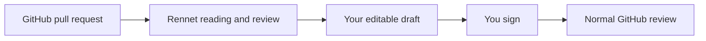

Rennet changes where you read and shape a review. It does not ask your team to
adopt a new forge, replace your coding harness, or accept a model's verdict.

## Does Rennet take review out of GitHub?

No. When you review somebody else's pull request, Rennet publishes one normal
GitHub review with the comments and verdict you signed. Your teammates keep
working in GitHub; Rennet is the place where you make sense of the change before
you post.

## Is this AI reviewing AI?

The models are instruments, not reviewers. They help group the change, suggest
an order, find evidence, and show disagreement. You decide what is correct,
which comments survive, and which verdict gets signed.

When two models disagree, Rennet keeps both answers visible. It does not invent
a confident synthesis to make the disagreement disappear. It can add a **third
opinion** beside them: an adjudication turn reads the real code around the
contested spot and says whether it **supports the flag**, **contradicts** it, or
**could not adjudicate**. That chip is a tiebreak hint, not a ruling—both original
answers stay, the row never disappears because of it, and you still decide what is
correct. The disputed row appears as soon as the review has verified it; adjudication
runs afterward and adds the chip when it finishes. A slow or stuck adjudicator never
holds the row off screen.

## Why not just prompt a model?

A prompt can produce a useful wall of text. It does not keep the review state:
what you read, what remains, which decision you accepted, what moved after the
author pushed again, or the exact batch you are about to publish.

Rennet's product is that durable review loop around the inference.

## Does code leave my machine?

There is no Rennet backend and no Rennet telemetry service. Context sent through
Claude Code, Codex, or another selected harness may go to that harness's model
provider. Rennet records what it assembled for each run so the boundary stays
visible.

## Does Rennet need separate API keys?

The goal is to use the coding harnesses already installed and authenticated on
your machine. For example, the Claude adapter launches your installed `claude`
binary through Anthropic's agent SDK rather than asking Rennet to store a Claude
credential.

For Codex the same holds, with one convenience on macOS: if you already have
**ChatGPT desktop installed, no separate Codex install is needed** — the app
bundles a codex binary and shares its `~/.codex` login, so Rennet drives it as-is
(a codex CLI you install yourself is preferred when both are present). On Windows
the Store-packaged desktop binary is locked against outside execution, so Codex
there needs the codex CLI (`npm i -g @openai/codex`).

## What happens on my own branch?

Today, the live renderer lets you shape and sign the pull-request title and body,
then Rennet pushes the named branch and opens that pull request.

The next loop turns your requested changes into a coding-agent bundle, lets the
agent edit and test, captures a successor patchset, and shows the delta. Handing
off is live: an own-branch review composes, previews, and runs the bundle from the
renderer, and the acting command executes that exact model-composed bundle,
threaded and bound by its digest. Seeing the successor patchset as a delta
re-review is live too: the successor is captured with the ask trace and rendered
as a deterministic hunk-grain delta account on the successor review.

When you sign the finished paper, Rennet pushes the named branch and opens the
previewed pull request. The richer fuzzy sub-file lineage work is separate: the
current carry path only reuses state when unchanged identity is proven.

## Where to go next

- [Getting started](/using/guide/getting-started/) gives the shortest tour.
- [Reviewing a GitHub PR](/using/guide/reviewing-a-github-pr/) follows the live PR path.
- [Product and vision](/using/concepts/product-and-vision/) explains what Rennet is trying to become.
