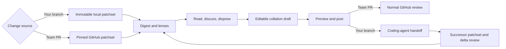

Rennet is a local-first desktop review harness. It helps you understand and take
responsibility for changes written by coding agents without turning the review
into another autonomous rubber stamp.

> You stopped writing the code. You still have to answer for it.

## The problem

Coding agents can produce a changeset faster than a person can build a mental
model of it. A flat list of changed files makes that gap worse: it tells you
where bytes moved, not how the change hangs together.

The first user is the engineer reviewing work produced on their own branch before
asking a teammate to absorb it. Rennet removes the mechanical overhead around
that self-review. It does not outsource the judgment or turn a model's finding
into a human verdict.

Rennet does the structural work around the review. It groups related changes,
orders them for comprehension, surfaces decisions and disagreements, remembers
what you acted on, and turns your dispositions into one editable outbound
artifact.

The models assist. The human reviews and posts.

## The whole loop

The two entry doors share one review engine. The destination changes with the
mode: a teammate's PR gets a GitHub review; your own branch gets a handoff to a
coding agent and eventually a PR submission.

## Four product principles

### Roll up aggressively

Related files and hunks should read as one logical cohort. Grouping is a product
opinion, not a per-project tuning exercise.

### Let the reviewer choose the altitude

You can act on a whole cohort or one anchored item. Decisions are collapsed for
calm, never capped or silently discarded.

### Make zoom reversible

Move from the whole change to a decision, hunk, line, test, or definition and
back without losing your place.

### Keep the user effort for judgment

Rennet can clean up wording, assemble context, run models, and maintain the
bookkeeping. It should not add ceremony that merely makes the machinery feel
important.

## Ordering is the product

The baseline order comes from deterministic dependency information. An agent
may improve it into the clearest story: high-level intent first, then the
foundations needed to understand the implementation.

Risk is an overlay, not the table of contents. A high-blast-radius change can be
painted amber without forcing every review to begin at the scariest line.

## The review lenses

| Lens | The question it answers |
|---|---|
| Spec | What was this change supposed to do, and which requirements have evidence? |
| Sequence | In what order should I read the implementation? |
| Decisions | Which calls did the implementer make that I need to understand? |
| Flagged | Where did automated review find a problem or disagreement? |
| Noise | What remains, and why does it probably not need close attention? |

Blast radius paints the other lenses instead of owning a separate surface. The
same patchset and anchors sit underneath every view, so rotating a lens does not
move the code under you.

Models surface findings, reconstruct possible reasoning, and propose useful
grouping. The reviewer reads, judges, and posts. Product copy should preserve
that distinction: Rennet can say a model **flagged** something, not that the
machine **reviewed**, **approved**, or **found a bug** on the reviewer's behalf.

## Local-first, honestly stated

Rennet has no *hosted* Rennet backend and no Rennet telemetry service. There is a
server, but it runs as a local daemon on your own machine — the desktop app spawns and
talks to it over loopback, and it outlives the window so a review keeps running when you
quit. Nothing about it is remote. Review state and project context live locally.
Material sent through a selected harness may go to that harness's model provider. Rennet feeds its deterministic assembled context
as a labelled layer. Rennet records the exact text it handed to each model, and
only labels context **sent** when that record matches what it assembled — it never
claims a model saw nothing extra. Ambient harness reads remain separately
disclosed.

The intended zero-config path uses harnesses already installed and authenticated
on your computer. Rennet does not need to become a credential vault to drive
Claude Code or Codex.

## What is live and what is still closing

- **Live** — the team-PR loop, end to end on `main`: ingest, decomposition, the
  review lenses, dual-model analysis, refinement, and a real GitHub post.
- **Live** — the own-branch submission path: Rennet drafts the pull request, you
  publish, and it pushes the named branch and opens the previewed pull request.
- **Live** — the coding-agent handoff with delta re-review: you compose the
  handoff, preview it, run it, and get a focused re-review of exactly what the
  agent changed, including anything it changed beyond what you asked for. The
  mechanics are on [agent handoff](/developing/concepts/agent-handoff/).
- **Pending** — in-place lineage: when the agent reworks existing code in place,
  Rennet cannot yet always recognise it as the same code moved or edited, so it
  re-reviews it fresh rather than carrying over your earlier decisions.

Project-processing narration and parts of the code-intelligence experience are
still intended destinations rather than finished surfaces.

These docs mark those seams explicitly. A designed flow is useful context, but
it is not reported as shipped merely because a schema or mockup exists.

## The human act

The collation draft is private working material. The preview shows the exact
outbound review or submission. Publishing is the moment it becomes the user's
artifact.

That is not a generic consent gate. It is the authorship model: the review goes
out in the reviewer's name, voice, and verdict.

## Where to go next

- [User journey](/using/guide/user-journey/) follows the intended experience from project to posted review.
- [Reviewing a GitHub PR](/using/guide/reviewing-a-github-pr/) covers the live team-review path.
- [Common questions](/using/concepts/common-questions/) answers the usual objections.
- [Architecture overview](/developing/concepts/architecture-overview/) explains how the system supports the loop.
