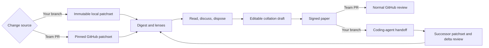

Rennet is a local-first desktop review harness. It helps you understand and take
responsibility for changes written by coding agents without turning the review
into another autonomous rubber stamp.

> You stopped writing the code. You still have to answer for it.

## The problem

Coding agents can produce a changeset faster than a person can build a mental
model of it. A flat list of changed files makes that gap worse: it tells you
where bytes moved, not how the change hangs together.

Rennet does the structural work around the review. It groups related changes,
orders them for comprehension, surfaces decisions and disagreements, remembers
what you acted on, and turns your dispositions into one editable outbound
artifact.

The models assist. The human reviews and signs.

## The whole loop

The two entry doors share one review engine. The destination changes with the
mode: a teammate's PR gets a GitHub review; your own branch gets a handoff to a
coding agent and eventually a PR submission.

## Four product principles

### Roll up aggressively

Related files and hunks should read as one logical cohort. Grouping is a product
opinion, not a per-project tuning exercise.

### Let the reviewer choose the altitude

You can act on a whole cohort or one anchored item. Decisions are collapsed for
calm, never capped or silently discarded.

### Make zoom reversible

Move from the whole change to a decision, hunk, line, test, or definition and
back without losing your place.

### Keep the user effort for judgment

Rennet can clean up wording, assemble context, run models, and maintain the
bookkeeping. It should not add ceremony that merely makes the machinery feel
important.

## Ordering is the product

The baseline order comes from deterministic dependency information. An agent
may improve it into the clearest story: high-level intent first, then the
foundations needed to understand the implementation.

Risk is an overlay, not the table of contents. A high-blast-radius change can be
painted amber without forcing every review to begin at the scariest line.

## The review lenses

| Lens | The question it answers |
|---|---|
| Spec | What was this change supposed to do, and which requirements have evidence? |
| Sequence | In what order should I read the implementation? |
| Decisions | Which calls did the implementer make that I need to understand? |
| Flagged | Where did automated review find a problem or disagreement? |
| Noise | What remains, and why does it probably not need close attention? |

Blast radius paints the other lenses instead of owning a separate surface. The
same patchset and anchors sit underneath every view, so rotating a lens does not
move the code under you.

## Local-first, honestly stated

Rennet has no Rennet backend and no Rennet telemetry service. Review state and
project context live locally. Material sent through a selected harness may go to
that harness's model provider, so Rennet records the assembled context for each
run rather than claiming that nothing ever leaves the machine.

The intended zero-config path uses harnesses already installed and authenticated
on your computer. Rennet does not need to become a credential vault to drive
Claude Code or Codex.

## What is live and what is still closing

The team-PR loop works end to end on `main`: ingest, decomposition, the review
lenses, dual-model analysis, refinement, signing, and a real GitHub post.

The own-branch loop is live too: Rennet composes the handoff, runs the coding
agent with write access, captures the successor patchset, carries only proven
unchanged state, and can push the named branch and open the previewed pull
request. Richer sub-file lineage, project-processing narration, and parts of the
code-intelligence experience are still intended destinations rather than
finished surfaces.

These docs mark those seams explicitly. A designed flow is useful context, but
it is not reported as shipped merely because a schema or mockup exists.

## The human sign

The collation draft is private working material. The paper previews the exact
outbound review or submission. Signing is the moment it becomes the user's
artifact.

That is not a generic consent gate. It is the authorship model: the review goes
out in the reviewer's name, voice, and verdict.

## Where to go next

- [User journey](/using/guide/user-journey/) follows the intended experience from project to signed paper.
- [Reviewing a GitHub PR](/using/guide/reviewing-a-github-pr/) covers the live team-review path.
- [Common questions](/using/concepts/common-questions/) answers the usual objections.
- [Architecture overview](/developing/concepts/architecture-overview/) explains how the system supports the loop.
