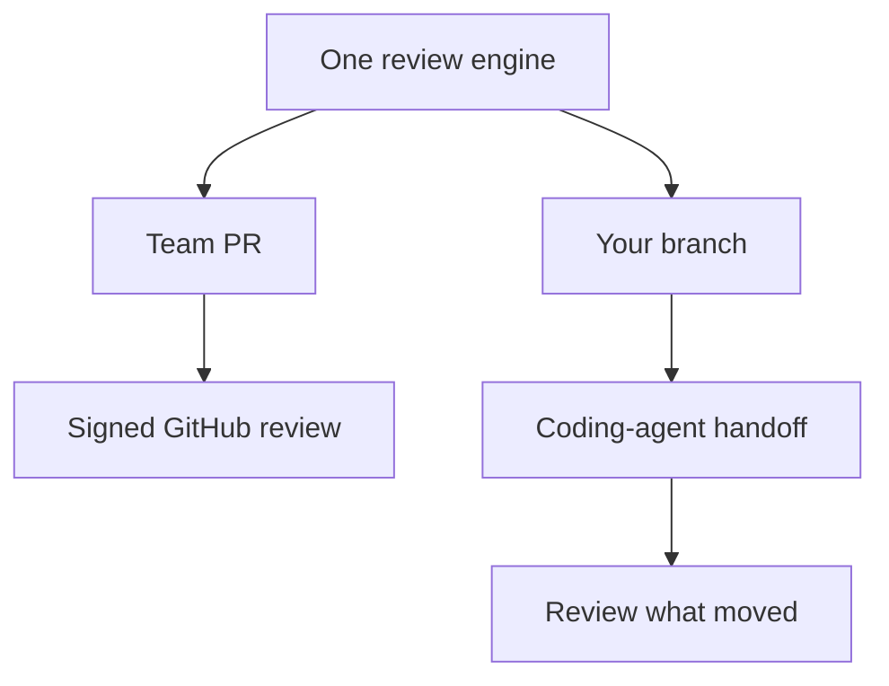

Rennet turns a local branch or GitHub pull request into an ordered review you
can read, discuss, and sign. This page gives the shortest route through the
product through the two current outbound routes.

## The loop

1. **Choose a project.** Point Rennet at one repository or a workspace with
   several repositories and worktrees.
2. **Choose a change.** Use the project's unified list: a local row for your
   working branch, or a pull-request row for GitHub work. The Local, PRs, Mine,
   and Needs you filters narrow the same list.
3. **Read through the lenses.** Start with the sequence, then use Spec,
   Decisions, Flagged, and Noise without losing your position in the diff.
4. **Act where the thought belongs.** Comment, request a change, ask a question,
   discuss, or approve at the line, chunk, requirement, or cohort.
5. **Shape the draft.** Reword, reorder, merge, split, or withdraw the collected
   dispositions.
6. **Preview and sign.** The paper shows the exact outbound artifact before it
   becomes a GitHub review or an own-branch pull request.

## Two modes, one engine

A team PR can become a signed GitHub review. Your branch can be pushed and
opened as the previewed pull request when you sign. The write-enabled agent
handoff and successor-delta loop is the intended extra pass; its backend command
path exists, but it is not called by the current renderer.

## Move quickly with the keyboard

Press `⌘K` on macOS or `Ctrl+K` elsewhere to open the context-aware command
palette. It includes only actions that can do something on the current screen:
recent places, navigation, review retry/regeneration, lens changes, zoom, blast
radius, appearance, settings, and the draft or paper when those destinations
exist.

`⌘[` and `⌘]` move backward and forward through Rennet's surface history without
stealing those keys from a text field. On a loaded canvas, `l` zooms in and `h`
zooms out. Commands at a zoom limit and the already-active lens are omitted
instead of appearing as dead entries.

### Remap any shortcut

Open **Settings → Keyboard** to change a command's chord. Each row shows its
current shortcut with **Set**, **Unbind**, and **Reset**: Set records the next
chord you press, Unbind removes the shortcut entirely, and Reset returns the
command to its default. A remap takes effect immediately and everywhere — the new
chord actually runs the command, the old one stops, and the palette and menu both
show the new shortcut. Overrides are stored on this machine only, in
`~/.rennet/config.json`, and survive a restart.

If two commands end up on the same chord, Rennet **shows** the collision on both
rows (and on both palette entries) rather than blocking it: the shortcut is marked
and names the other command, the write still lands, and you resolve it — or leave
it — with more plain edits. When a chord is shared, the first registry match wins.

The v1 recorder accepts bare keys or the platform-primary modifier with one key
(`⌘` on macOS, `Ctrl` on Windows/Linux). Shift and Alt combinations are left
unchanged with an inline note instead of being recorded inaccurately. If a config
file contains an invalid chord, the row shows the raw value as invalid and Rennet
uses that command's default until you replace, unbind, or reset it.

### The menu bar mirrors the palette

Rennet's application menu is built from the same command registry as the palette,
so every menu item carries the same label and the same (remappable) shortcut. A
command that can't act on the current screen appears **disabled**, not missing,
and choosing a menu item runs exactly what the palette would.

## Reopen old reviews, and pick up where you left off

Every review Rennet captures is persisted locally, so you can reopen an older one
at any time — not just the most recent — and read it exactly as it was captured:
its files, diff, read states, dispositions, delta account, and conversation
threads. Reopening is a plain read; nothing re-runs and nothing is asked of you.

If the working tree that review came from is no longer on disk, Rennet still opens
the review and simply says so — “The original worktree is gone — showing the review
as captured.” The captured content stays fully readable; only the live AI review,
which needs the original repository to run, reports that it is unavailable.

Rennet also remembers where you were. When you quit and reopen, it restores your
back/forward navigation stack and lands you on the surface you left, reloading its
content as you arrive. If something along that trail can no longer load, Rennet
drops just that entry with a plain note and falls back to the nearest place that
still opens — the Projects home always does.

## Settings explain themselves

The settings surface has two scopes. **Global** holds your personal appearance
scheme (dark, light, or follow the system); **Repo** holds each project's map
visibility and its [execution locus](/using/guide/windows-and-wsl/#the-execution-locus).

Every value shows **where it came from** (Explain): the built-in default, an
auto-`detected` environment value, your global preference, or an explicit
per-repo setting — the resolver's own answer, not a guess. Two controls sit on
each repo row. **Reset** appears when a value is set explicitly for the repo: it
clears that entry and the value falls back to whatever the rest of the ladder
resolves (resetting map visibility also re-applies the git-ignore switch so the
files match). **Pin** appears when a value is inherited or detected: it writes the
current effective value as an explicit per-repo setting, so a later change
elsewhere no longer moves it. The appearance scheme has the same reset back to the
system default.

All of it is plain config writes with no confirmation step. If a project's config
file cannot be parsed, that row shows the built-in defaults and disables editing so
the unreadable file is never overwritten.

## Local-first does not mean offline-only

There is no Rennet backend and no Rennet telemetry service. A selected harness
may send assembled context to its model provider. Rennet records what it sent so
you can inspect the boundary instead of relying on a vague “nothing leaves your
machine” promise.

## Next steps

- [Windows and WSL](/using/guide/windows-and-wsl/) covers running on Windows, natively or driving a WSL distro.
- [User journey](/using/guide/user-journey/) gives the full intended experience.
- [Reviewing a GitHub PR](/using/guide/reviewing-a-github-pr/) follows the live team path.
- [Common questions](/using/concepts/common-questions/) covers GitHub, models, credentials, and local-first behavior.
