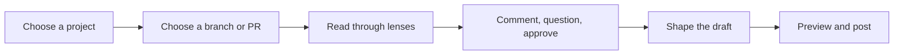

Rennet turns a local branch or GitHub pull request into an ordered review you
can read, discuss, and post. This page gives the shortest route through the
product through the two current outbound routes.

## The loop

1. **Choose a project.** Point Rennet at one repository or a workspace with
   several repositories and worktrees.
2. **Choose a change.** Use the project's unified list: a local row for your
   working branch, or a pull-request row for GitHub work. The Local, PRs, Mine,
   and Needs you filters narrow the same list.
3. **Read through the lenses.** Start with the sequence, then use Spec,
   Decisions, Flagged, and Noise without losing your position in the diff.
4. **Act where the thought belongs.** Comment, request a change, ask a question,
   discuss, or approve at the line, chunk, requirement, or cohort.
5. **Shape the draft.** Reword, reorder, merge, split, or withdraw the collected
   dispositions.
6. **Preview and post.** The preview shows the exact outbound artifact before it
   becomes a GitHub review or an own-branch pull request.

## Two modes, one engine

A team PR can become a posted GitHub review. Your branch can be pushed and
opened as the previewed pull request when you publish. The coding-agent route is
live end to end: you compose the handoff, preview it, run it, and get a focused
re-review of exactly what the agent changed — including anything it changed beyond
what you asked for.

The one unfinished piece: when the agent reworks existing code in place, Rennet
cannot yet always recognise it as the same code moved or edited, so it re-reviews
it fresh rather than carrying over your earlier decisions.

## Move quickly with the keyboard

Press `⌘K` on macOS or `Ctrl+K` elsewhere to open the context-aware command
palette. It includes only actions that can do something on the current screen:
recent places, navigation, review retry/regeneration, lens changes, zoom, blast
radius, appearance, settings, and the draft or preview when those destinations
exist.

`⌘[` and `⌘]` move backward and forward through Rennet's surface history without
stealing those keys from a text field. On a loaded canvas, `l` zooms in and `h`
zooms out. Commands at a zoom limit and the already-active lens are omitted
instead of appearing as dead entries.

### Remap any shortcut

Open **Settings → Keyboard** to change a command's chord. Each row shows its
current shortcut with **Set**, **Unbind**, and **Reset**: Set records the next
chord you press, Unbind removes the shortcut entirely, and Reset returns the
command to its default. A remap takes effect immediately and everywhere — the new
chord actually runs the command, the old one stops, and both the palette and the
Keyboard settings show the new shortcut. Overrides are stored on this machine only, in
`~/.rennet/config.json`, and survive a restart.

**Edge cases:**

- **Collisions** — if two commands end up on the same chord, Rennet **shows** the
  collision on both rows (and on both palette entries) rather than blocking it: the
  shortcut is marked and names the other command, the write still lands, and you
  resolve it — or leave it — with more plain edits. When a chord is shared, the
  first registry match wins.
- **Recorder limits** — the v1 recorder accepts bare keys or the platform-primary
  modifier with one key (`⌘` on macOS, `Ctrl` on Windows/Linux). Shift and Alt
  combinations are left unchanged with an inline note instead of being recorded
  inaccurately.
- **Invalid chord recovery** — if a config file contains an invalid chord, the row
  shows the raw value as invalid and Rennet uses that command's default until you
  replace, unbind, or reset it.

### The Rennet logo is the app menu

The Rennet mark in the top-left of the window is a button: click it for a small
panel of app destinations — **Settings**, **Back to projects**, and
**Documentation** (which opens the docsite in your browser) — with the current
version at its foot. When an update is staged it also grows a highlighted
**Restart to update** row and a badge on the mark. Settings also has a default
shortcut, `⌘,` on macOS (`Ctrl+,` elsewhere).

### The palette is the command surface

Every command lives in the palette — press `⌘K` (or `Ctrl+K`) to open it and run
one. **Settings → Keyboard** lists the stable commands and lets you remap their
chords; dynamic entries like recent surfaces and lens jumps are palette-only.
The one always-present menu on the window is the logo panel above.

On macOS, Rennet installs the standard platform menu — the app menu, **Edit**, and
**Window** — because the system expects one there. It handles native niceties like
copy, paste, and window controls, and carries no Rennet commands of its own.
Windows and Linux show no menu strip at all. Nothing is lost either way: every
command is a `⌘K` away.

## Reopen old reviews, and pick up where you left off

Every review Rennet captures is persisted locally, so you can reopen an older one
at any time — not just the most recent — and read it exactly as it was captured:
its files, diff, read states, dispositions, delta account, and conversation
threads. Reopening is a plain read; nothing re-runs and nothing is asked of you.

If the working tree that review came from is no longer on disk, Rennet still opens
the review and simply says so — “The original worktree is gone — showing the review
as captured.” The captured content stays fully readable; only the live AI review,
which needs the original repository to run, reports that it is unavailable.

Rennet also remembers where you were. When you quit and reopen, it restores your
back/forward navigation stack and lands you on the surface you left, reloading its
content as you arrive. If something along that trail can no longer load, Rennet
drops just that entry with a plain note and falls back to the nearest place that
still opens — the Projects home always does.

## Settings explain themselves

The settings surface has two scopes. **Global** holds your personal appearance
scheme (dark, light, or follow the system); **Repo** holds each project's map
visibility and its [execution locus](/using/guide/windows-and-wsl/#the-execution-locus).

Every value shows **where it came from** (Explain): the built-in default, an
auto-`detected` environment value, your global preference, or an explicit
per-repo setting — the resolver's own answer, not a guess. Two controls sit on
each repo row:

| Control | Appears when | What it does |
|---|---|---|
| **Reset** | a value is set for this repo | clears it and falls back to the inherited value (resetting map visibility also re-applies the git-ignore switch so the files match) |
| **Pin** | a value is inherited or auto-detected | freezes the current value as an explicit repo setting, so a later change elsewhere no longer moves it |

The appearance scheme has the same reset back to the system default.

All of it is plain config writes with no confirmation step. If a project's config
file cannot be parsed, that row shows the built-in defaults and disables editing so
the unreadable file is never overwritten.

## Local-first does not mean offline-only

There is no hosted Rennet backend and no Rennet telemetry service — no server of
ours sits between you and your work. A selected harness may send assembled
context to its model provider. Rennet records what it sent so you can inspect the
boundary instead of relying on a vague “nothing leaves your machine” promise.

Reviewing from another device does not change that. When you
[pair a phone or laptop](/using/guide/remote-access/), it reaches the daemon on
your machine directly over your own private network (Tailscale) — still no Rennet
server in the middle.

## Updates arrive as a badge, not a dialog

Rennet checks for a new release every five minutes while it runs. On Windows
the check asks the project's public GitHub Releases directly; on macOS it goes
through update.electronjs.org, which resolves the same GitHub Releases — either
way there is no Rennet backend. When a newer version has downloaded, the
Rennet mark in the window chrome grows a small dot on its corner. Click it to
restart into the new version, or dismiss the prompt and keep working; the badge
stays until you choose to apply, and nothing ever restarts on its own. The tray
icon carries the same dot while a window is closed, and its menu gains a
**Restart Rennet to update** line — the same restart, from either surface.

## Rennet lives in the tray

Rennet keeps a presence in the tray (the macOS menu bar, the Windows system
tray) so it is reachable even with no window open. **Closing the window does not
quit Rennet** — the review daemon and any streaming review keep running in the
background, exactly as they do when the window is open. On macOS the Dock icon
steps aside while no window is open and returns when you reopen one. On Windows,
where closing usually quits an app, Rennet instead stays in the tray; the tray
icon is always there so it is easy to find again.

The tray menu is deliberately small:

- **Open Rennet** — brings the window back (or focuses it if it is already
  open); a closed-then-reopened window reattaches to the running daemon and
  repaints the live state, so a review that was streaming is still there.
- **Restart Rennet to update** — appears only when an update is staged.
- the version, and
- **Quit** — the only complete exit. Its label tells you what it will do: **Quit
  Rennet and stop daemon** when Rennet is running its own local daemon, or **Quit
  Rennet** when it is not. Quitting stops that owned daemon gracefully — an
  in-progress review is saved as interrupted and resumes on next start — with no
  confirmation dialog. A daemon on another machine you have paired with is never
  touched.

## Next steps

- [Windows and WSL](/using/guide/windows-and-wsl/) covers running on Windows, natively or driving a WSL distro.
- [User journey](/using/guide/user-journey/) gives the full intended experience.
- [Reviewing a GitHub PR](/using/guide/reviewing-a-github-pr/) follows the live team path.
- [Common questions](/using/concepts/common-questions/) covers GitHub, models, credentials, and local-first behavior.
