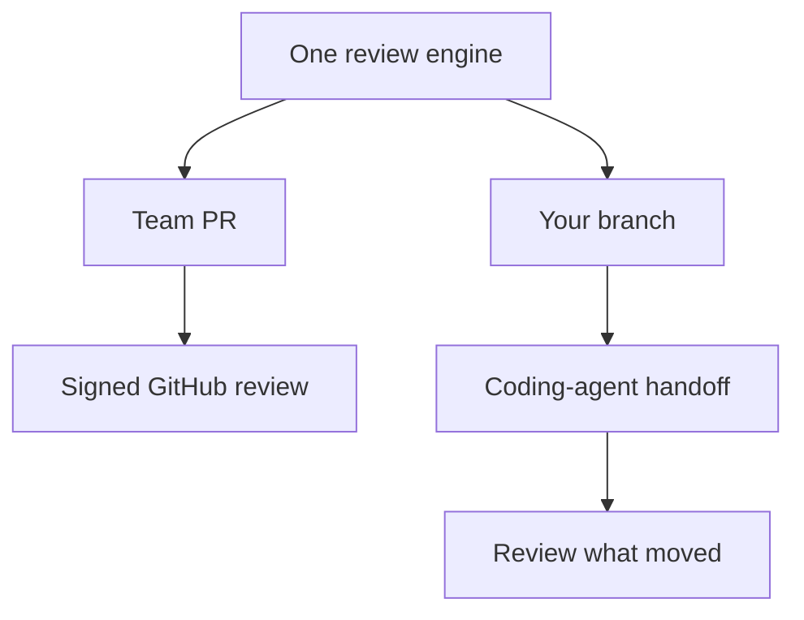

Rennet turns a local branch or GitHub pull request into an ordered review you
can read, discuss, and sign. This page gives the shortest route through the
product through the two live review routes.

## The loop

1. **Choose a project.** Point Rennet at one repository or a workspace with
   several repositories and worktrees.
2. **Choose a change.** Pick something under Yours for local work, or Team for a
   GitHub pull request.
3. **Read through the lenses.** Start with the sequence, then use Spec,
   Decisions, Flagged, and Noise without losing your position in the diff.
4. **Act where the thought belongs.** Comment, request a change, ask a question,
   discuss, or approve at the line, chunk, requirement, or cohort.
5. **Shape the draft.** Reword, reorder, merge, split, or withdraw the collected
   dispositions.
6. **Preview and sign.** The paper shows the exact outbound artifact before it
   becomes a GitHub review or an own-branch handoff.

## Two modes, one engine

Both routes work end to end today. A team PR becomes a signed GitHub review.
Your branch becomes a write-enabled agent handoff, a successor delta review,
and, when you sign, a pushed branch with the previewed pull request.

## Local-first does not mean offline-only

There is no Rennet backend and no Rennet telemetry service. A selected harness
may send assembled context to its model provider. Rennet records what it sent so
you can inspect the boundary instead of relying on a vague “nothing leaves your
machine” promise.

## Next steps

- [User journey](/using/guide/user-journey/) gives the full intended experience.
- [Reviewing a GitHub PR](/using/guide/reviewing-a-github-pr/) follows the live team path.
- [Common questions](/using/concepts/common-questions/) covers GitHub, models, credentials, and local-first behavior.
