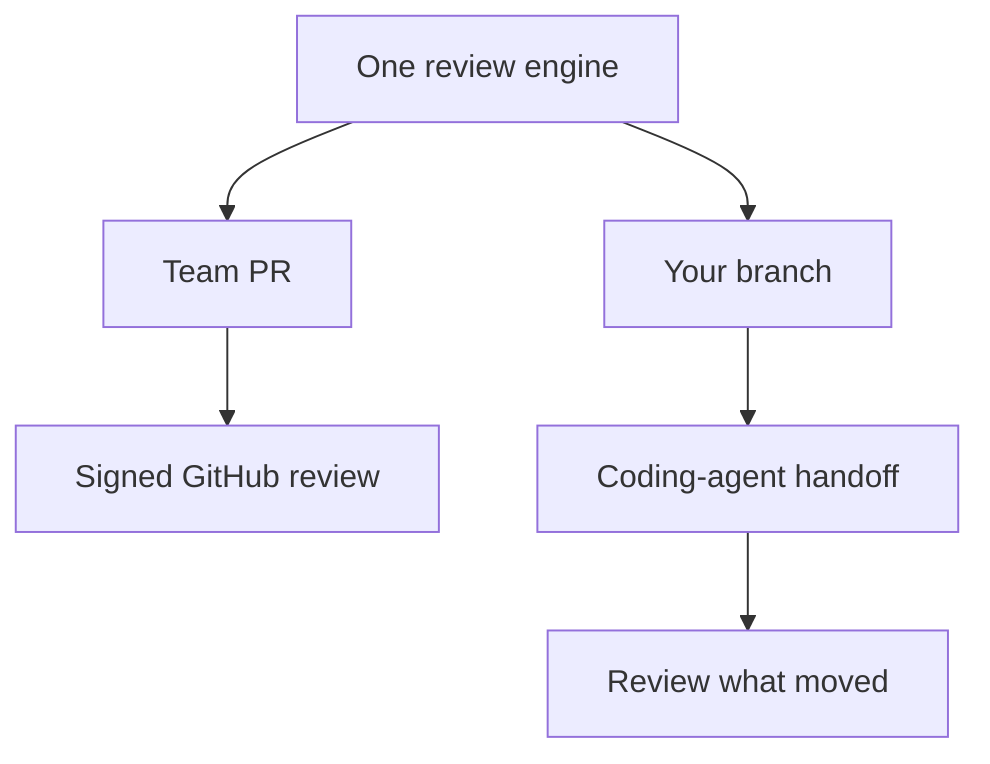

Rennet turns a local branch or GitHub pull request into an ordered review you
can read, discuss, and sign. This page gives the shortest route through the
product through the two current outbound routes.

## The loop

1. **Choose a project.** Point Rennet at one repository or a workspace with
   several repositories and worktrees.
2. **Choose a change.** Use the project's unified list: a local row for your
   working branch, or a pull-request row for GitHub work. The Local, PRs, Mine,
   and Needs you filters narrow the same list.
3. **Read through the lenses.** Start with the sequence, then use Spec,
   Decisions, Flagged, and Noise without losing your position in the diff.
4. **Act where the thought belongs.** Comment, request a change, ask a question,
   discuss, or approve at the line, chunk, requirement, or cohort.
5. **Shape the draft.** Reword, reorder, merge, split, or withdraw the collected
   dispositions.
6. **Preview and sign.** The paper shows the exact outbound artifact before it
   becomes a GitHub review or an own-branch pull request.

## Two modes, one engine

A team PR can become a signed GitHub review. Your branch can be pushed and
opened as the previewed pull request when you sign. The write-enabled agent
handoff and successor-delta loop is the intended extra pass; its backend command
path exists, but it is not called by the current renderer.

## Move quickly with the keyboard

Press `⌘K` on macOS or `Ctrl+K` elsewhere to open the context-aware command
palette. It includes only actions that can do something on the current screen:
recent places, navigation, review retry/regeneration, lens changes, zoom, blast
radius, appearance, settings, and the draft or paper when those destinations
exist.

`⌘[` and `⌘]` move backward and forward through Rennet's surface history without
stealing those keys from a text field. On a loaded canvas, `l` zooms in and `h`
zooms out. Commands at a zoom limit and the already-active lens are omitted
instead of appearing as dead entries. Key remapping and native menu parity are
not live yet.

## Local-first does not mean offline-only

There is no Rennet backend and no Rennet telemetry service. A selected harness
may send assembled context to its model provider. Rennet records what it sent so
you can inspect the boundary instead of relying on a vague “nothing leaves your
machine” promise.

## Next steps

- [Windows and WSL](/using/guide/windows-and-wsl/) covers running on Windows, natively or driving a WSL distro.
- [User journey](/using/guide/user-journey/) gives the full intended experience.
- [Reviewing a GitHub PR](/using/guide/reviewing-a-github-pr/) follows the live team path.
- [Common questions](/using/concepts/common-questions/) covers GitHub, models, credentials, and local-first behavior.
