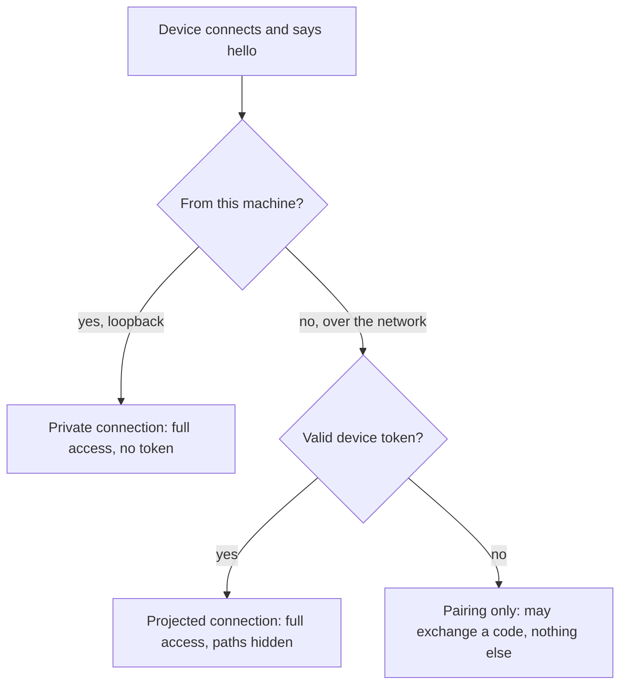

Rennet runs on the machine that holds your repositories, but you can review from
another device — a phone on the couch, a laptop in another room — by pairing it to
the daemon over your own private network. There is no Rennet server in the middle:
the remote device talks straight to your machine.

## How a connection is classified

The daemon decides what a connection is allowed to do exactly once, when the
device says hello, and never changes its mind for that connection:



- A **private** connection comes from the same machine (loopback). It needs no
  token and sees the product exactly as it always has.
- A **projected** connection comes from elsewhere on your network and presents a
  valid device token. It can do everything a private connection can — capture
  reviews, drive canvases, sign — but host paths on your machine never cross to
  it (see [what a remote client sees](#what-a-remote-client-sees)).
- A connection from the network **without** a valid token can do exactly one
  thing: exchange a pairing code for a token. Every other request is refused.

## Open the daemon beyond loopback

By default the daemon binds to `127.0.0.1`, so only the local machine can reach
it. To let another device connect, set `daemon.listen` in `~/.rennet/config.json`
to the address you want to bind:

```json
{
  "version": 1,
  "daemon": {
    "listen": { "host": "100.101.102.103" }
  }
}
```

Use your machine's Tailscale address (below) as the host. An optional `port`
pins the listen port; omit it to keep the default. `rennet status` and the
daemon's discovery file both show the bound host and port once it restarts.

When the daemon is bound beyond loopback it also refuses any HTTP request whose
`Host` header does not match the configured host, its address literals, or
`localhost`. That refusal happens before the connection is upgraded, and it is
there to stop a hostile web page from tricking your browser into reaching the
daemon by name (a DNS-rebinding attack).

## Reach the machine with Tailscale

Tailscale is the documented remote path, and the only one you need. It builds a
private, WireGuard-encrypted network (a *tailnet*) between your own devices, so:

- there is **no Rennet infrastructure** and **no relay** — traffic goes device to
  device;
- there are **no open public ports** — nothing on the internet can reach the
  daemon;
- the connection is **encrypted end to end** by WireGuard.

To set it up:

1. Install [Tailscale](https://tailscale.com/) on the machine running Rennet and
   on the device you want to review from. Sign both into the same tailnet.
2. On the Rennet machine, find its tailnet address with `tailscale ip -4` (it
   looks like `100.x.y.z`).
3. Put that address in `daemon.listen.host` as shown above and restart the
   daemon.
4. On the remote device, point the client at `http://100.x.y.z:<port>` — the host
   and port `rennet status` reports.

That is the whole network story. No port forwarding, no tunnel service, no
account beyond your own Tailscale login.

## Pair a device

Pairing is a one-time bootstrap. You mint a short-lived code on the machine, type
it into the new device once, and the device gets a long-lived token it reuses
from then on.

### From the desktop app

Open **Settings → Pairing**. Press **Mint code** to generate an 8-character code.
The panel shows the code and its expiry; it is valid for five minutes and works
once. Enter it on the new device to finish pairing. The same panel lists the
devices you have already paired and lets you revoke any of them.

### From the terminal

```sh
rennet pair
```

`rennet pair` prints a fresh code and its expiry — the same single-use, 5-minute
code the desktop panel mints. On the remote device, supply the code together with
a name for the device; the daemon returns a device token. The **raw token is
shown once** — store it on the device that will use it. The daemon keeps only a
SHA-256 hash of it in `~/.rennet/devices.json`, so it can never show the token
again; if a device loses its token, pair it again.

A device token lasts 30 days and renews every time it is used, so a device you
review from regularly never needs re-pairing. One that sits unused for 30 days
expires and simply pairs again.

## What a remote client sees

A projected connection gets the full review — the same commands, the same
capabilities — but nothing that would reveal the layout of files on your machine.
Rennet rewrites the boundary in both directions:

- **Outbound**, every structural path — a repository's root, a review's
  repository root, a project or discovered-repo path — is replaced by a repo
  reference (a stable key plus a display name) instead of an absolute host path.
- **Outbound narration** — progress notes and detail text — has your known
  repository roots and your home directory swapped for display tokens.
- **Inbound**, when the remote client names a repository it sends the reference,
  not a path, and the daemon resolves it back to the real location on your
  machine. An unknown reference is refused with a typed error, never guessed.

Loopback clients are untouched by all of this — they keep seeing real paths,
exactly as before.

:::caution[One honest limit]
The structural fields above are a contract: they are guaranteed not to carry host
paths. **Model-authored prose is not.** The text a model streams into a review —
the ask, the conversation — is the model's own writing, and Rennet does not
rewrite it. If a model quotes an absolute path in its narration, that text can
reach a remote client. Rennet promises to project the structural boundary and to
substitute known roots in its own narration; it does not promise to sanitize a
model's prose, and this page says so rather than implying a guarantee it does not
make.
:::

## Revoke a device

Revocation is immediate and needs no confirmation ceremony. Remove the device and
its token stops working at the very next handshake; pairing stays available for a
replacement.

```sh
rennet devices                 # list paired devices with their ids
rennet devices --revoke <id>   # revoke one by id
```

The desktop **Settings → Pairing** panel does the same thing from a list with a
revoke control on each row. A revoked or expired token is simply refused at the
handshake — the device can pair again with a new code whenever you want it back.

## Next steps

- [Getting started](/using/guide/getting-started/) walks the core review loop.
- [Common questions](/using/concepts/common-questions/) covers models,
  credentials, and local-first behavior.
