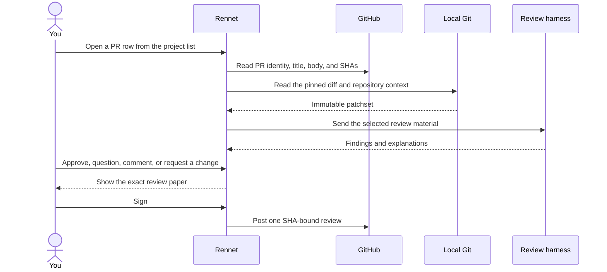
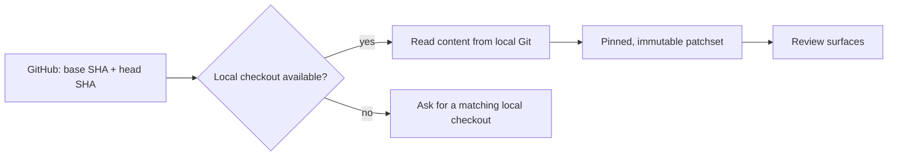
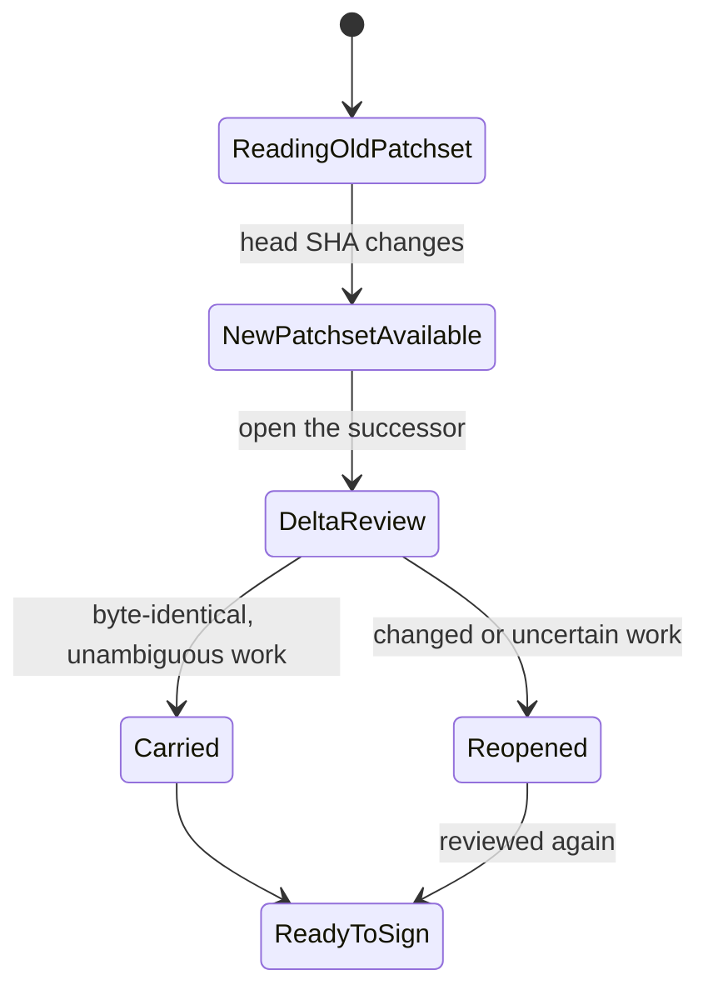

This is the shortest path from “there is a pull request” to a review that lands
on GitHub under your name. Rennet does the sorting and checking; you decide what
the review says.

## Before you start

Rennet uses the GitHub CLI login already on your machine. If you have not logged
in yet, do that once in a terminal:

```sh
gh auth login
```

Rennet asks `gh auth token` lazily when a GitHub operation needs it. It does not
read `hosts.yml`, and it does not copy the token into project files. The current
forge adapter targets github.com and uses the account token returned by `gh`;
GitHub Enterprise hosts are not wired yet.

You also need a supported coding harness installed. Claude Code is the primary
adapter, and Rennet discovers it automatically rather than asking you for an API
key. When Codex is also installed it runs as a co-equal second review seat, and
divergent findings can get a third-opinion adjudication — an additive pass that
never blocks a row.

## The review flow



1. Open the project, use **PRs** or **Needs you** to narrow the unified list, then
   choose the pull request.
2. Read the change through the available views. Rennet keeps the sequence,
   decisions, flags, and remaining noise connected to the same underlying diff.
3. Leave dispositions where you have a judgment: approve, question, comment, or
   request a change.
4. Open the draft and tidy the wording. The paper shows the actual outbound
   review, not a summary of it.
5. Sign the paper. Rennet posts the review to GitHub as one review event rather
   than a burst of unrelated comments.

The review path for someone else's PR is live end to end on the current main
branch: GitHub ingest, review, refinement, the paper, and the final post.

## Where the diff comes from

GitHub tells Rennet *which* base and head commits make up the pull request. When
the repository is available locally, Git supplies the actual diff and nearby
code. That gives Rennet the same repository context your local tools have,
without trying to rebuild a diff from GitHub's file list.



The live deep-review path requires a matching local checkout. If none is
available, Rennet reports that REST-only review is unavailable instead of
pretending it captured the repository from GitHub. After reviewing a pinned PR
head, Rennet also reads that exact commit's GitHub checks and shows an
informational CI panel in Flagged. Failures attributable to changed code become
high-severity findings when they have an offered-diff anchor; an attributable
failure without a real anchor stays visible in the panel. Only contextual
infrastructure signatures receive the infrastructure label, and model refinement
can only attribute a failure to the change or leave it unclassified. Missing,
truncated, timed-out, or otherwise unavailable CI never blocks review, signing,
or publishing and is never reported as passing.

## What reaches GitHub

GitHub understands line comments, file comments, replies, and one review body.
It does not understand Rennet's cohorts, lenses, multi-file threads, or private
read state. Rennet translates the review at the boundary:

- a normal contiguous code note becomes a GitHub review thread;
- a file-wide note becomes a file comment;
- a multi-file thought is split across useful anchors, with the full thought
  kept together locally;
- structure that has no GitHub equivalent goes into the review body;
- private chat, dismissed findings, reading progress, and model traces stay
  local.

The paper shows what will travel and what will remain in Rennet. The posted
review is pinned to the commit you reviewed.

## When the pull request changes

A push, rebase, or force-push creates a new patchset. Rennet does not rewrite the
review you were already reading.



Only byte-identical, unambiguous work carries automatically. Changed or uncertain
work reopens, so the next pass focuses on what actually moved. See
[delta re-review and lineage](/developing/concepts/delta-rereview-and-lineage/)
for the engineering model behind that behaviour.

## What stays on this Mac

Rennet has no backend. Review state, reading progress, local discussion, and the
full Rennet structure stay in local application storage. Material selected for a
model turn can leave the machine through the harness and provider you use, and
the context inspector lists the assembly and its per-seat send transcript. A
“sent” label means the digest extracted from at least one actual send matches the
recorded assembly; it does not claim that the harness made no additional ambient
reads.

GitHub naturally receives the review only when you sign it. If GitHub is
unavailable, local reading still works for material already on disk, but posting
waits until the connection is back.

## GitHub edge cases

An organization can require SAML SSO for the token returned by `gh`. GitHub may
then return `X-GitHub-SSO: partial-results`: a valid-looking but incomplete pull
request list. Rennet keeps that state distinct from a complete or empty list;
GitHub includes an authorization URL with the state, though the current project
screen only shows the generic incomplete-list banner. Authorize the `gh` token
for the named organization through GitHub, then refresh the project.

GitHub can also apply a secondary rate limit while the paper is posting. Rennet
keeps the artifact as one batched review and surfaces the backoff instead of
splitting it into independently retrying comments. Retry after GitHub's stated
window; the review marker and read-back reconciliation protect the one-review
shape when the network outcome was uncertain.

## Next

- [User journey](/using/guide/user-journey/) for the whole flow, including your
  own branch.
- [Product and vision](/using/concepts/product-and-vision/) for why Rennet uses
  roll-up, zoom, and several views of the same change.
