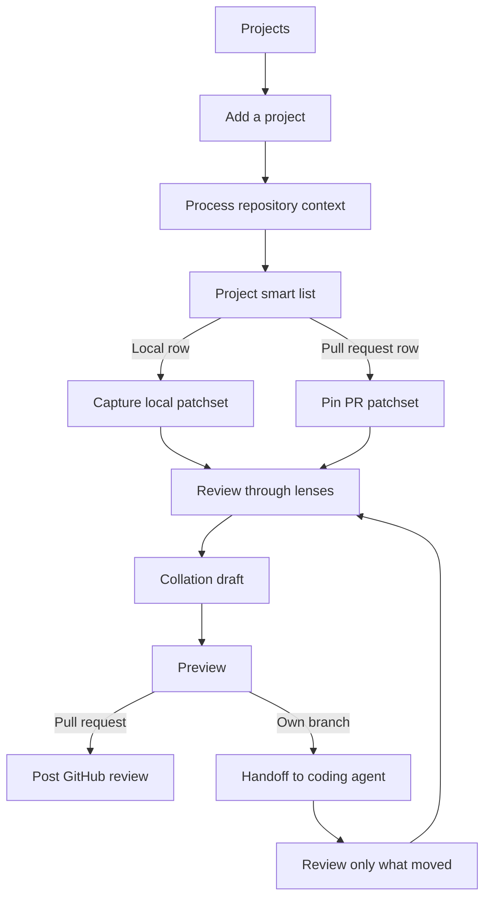

This is the road through Rennet: add a project, enter through your branch or a
team pull request, understand the change, shape the outbound artifact, and post
it. A team change can become a GitHub review, while your branch can be pushed and
opened as a pull request. The coding-agent loop is live end to end: you compose
the handoff, run it, and get a focused re-review of exactly what the agent
changed. The one unfinished piece is in-place lineage: when the agent reworks
existing code in place, Rennet cannot yet always recognise it as the same code, so
it re-reviews it fresh rather than carrying over your earlier decisions.

## The journey at a glance

## 1. Projects is home

First run is the empty Projects list, not a separate onboarding wizard. The main
action is **Add a project**. Harness discovery stays in the background and can
show a short status such as “Claude and Codex detected.”

## 2. Add a project

Choose a workspace or one repository, pick its path, then confirm the discovered
repositories and worktrees. Detection supplies editable defaults rather than a
questionnaire.

## 3. Process the repository

Rennet builds the Repo Map used by later reviews: deterministic structure plus
evidence-backed project knowledge. The intended experience narrates the work in
plain language and ends by becoming the project screen.

The live UI is simpler than that destination. The underlying project-context
lifecycle is real; the richer narrated animation remains polish work.

## 4. Choose from one smart list

The project screen mixes local work and pull requests in one list. Rows remain
visually distinct: local branch, your pull request, teammate pull request, or a
read-only closed/merged pull request. Use **Needs you**, **Mine**, **Local**, or
**PRs** to narrow it; the default Hot sort combines recent activity with work
that needs attention. The list shows open PRs by default; the **PRs** scope
control flips it to merged, closed, or all states — history is paged from
GitHub on demand, and opening a merged or closed row starts a read-only
retrospective review.

Your review request and a failing check on your own open pull request can float a
row into **Needs you**. A read-only row can offer **Clean up** when its worktree is
still checked out locally.

Once a local branch has a pull request, the pull-request row wins and the local
checkout becomes a **checked out locally** annotation. One thing should not
appear twice.

## 5. Capture one immutable patchset

For a local branch, Rennet captures committed changes, the index, unstaged
changes, and relevant untracked files without mutating the checkout. For a team
PR, it pins the forge-reported base and head commits.

Every review surface refers to that immutable patchset. A push, rebase, or new
local capture creates a successor instead of rewriting the thing under review.

## 6. Read the sequence

The tall sequence canvas is the review heart. It orders the whole change for
comprehension, keeps the diff column stable, and lets you open related tests,
definitions, or the source file in your editor without losing your place. The
current index and its deliberately honest confidence tiers are explained in
[code intelligence](/developing/concepts/code-intelligence/).

When both sides changed, the code header says **View test** or **View
implementation** instead of making you hunt through a file tree. That jump only
speaks for files in this review; no button is not a claim that no test exists.

## 7. Rotate the lenses

Use Spec, Sequence, Decisions, Flagged, and Noise over the same anchors. They do
different jobs:

- Spec turns known OpenSpec artifacts into addressable requirements and scenarios,
  with coverage chips only when a real mapping exists.
- Decisions groups implementer choices with evidence, reconstructed reasoning,
  and discernible alternatives.
- Flagged indexes automated findings by severity, agreement, verification, the
  cross-harness adjudication verdict on a contested row, and code anchor without
  pretending they are the reviewer's verdict.
  - When your changeset touches UI, a **verify-ui** pass renders it and reports
    what it saw as ordinary flags — see [the UI check](#the-ui-check).
- Noise groups low-signal churn, names whether a rule or model judged it, and lets
  you pull anything back with **not noise?**

### The UI check

When your changeset touches UI (a component, a stylesheet, a renderer file),
Rennet renders the change with whatever your project affords — its own tests,
storybook, a dev server, any browser automation — screenshots it, and runs an
accessibility check against the change's stated intent. Those observations arrive
as ordinary flags you disposition like any other, and a strip on Flagged shows the
screenshots inline. While that slow late pass runs, Flagged says the UI check is
still running rather than showing an unqualified clean result.

If it could not mount the change with anything your project affords, it says so
plainly: that is "could not check," never dressed up as an all-clear. A
backend-only changeset is skipped as not-applicable, and reopening a review checks
again. Rennet bundles no browser or accessibility tooling of its own, and
verify-ui never blocks publishing.

Blast radius paints those surfaces rather than changing their order. Read
coverage is equally literal: an action marks material read, scrolling can only
mark it skimmed, and collapsed or unseen work remains unread. The whole-change
mosaic keeps that residue visible. [Review lenses](/developing/concepts/review-lenses/)
has the deeper model.

## 8. Ask and annotate in place

Comments, change requests, questions, and discussion stay attached to a line,
range, chunk, requirement, or draft item. Threads open in the margin so the diff
does not reflow.

The orchestrator is the normal conversational model. A per-message “ask both”
option can show two labelled answers. Rennet does not auto-synthesize them into
a third supposedly authoritative answer.

## 9. Build the collation draft

Every disposition is staged when you make it. The private draft collects items
from every lens and lets you reword, reorder, merge, split, discuss, or withdraw
them. Background refinement can clean up rough notes, but the draft remains
editable and yours.

## 10. Preview and post

The preview is a read-only view of exactly what will leave Rennet. For a team
PR it contains the batched GitHub review and its verdict. For your own branch it
contains the handoff or PR submission.

If the preview is wrong, go back to the draft. Publishing sends the exact
preview, idempotently, in the reviewer's name.

## 11. Re-steer your own branch

On your own branch, you send requested changes to a coding agent, it edits and
tests, and Rennet captures what changed and focuses the next pass on exactly that.

The coding-agent route is live end to end: you compose the handoff, preview it,
run it, and get a focused re-review of exactly what the agent changed — including
anything it changed beyond what you asked for.

Publishing the finished own-branch preview pushes the named branch and opens the
previewed pull request. The one unfinished piece: when the agent reworks existing
code in place, Rennet cannot yet always recognise it as the same code moved or
edited, so it re-reviews it fresh rather than carrying over your earlier decisions.

## Where to go next

- [Getting started](/using/guide/getting-started/) is the shortest hands-on tour.
- [Reviewing a GitHub PR](/using/guide/reviewing-a-github-pr/) follows the live team path.
- [Agent handoff](/developing/concepts/agent-handoff/) explains the own-branch loop under the hood.
- [Canvas model](/developing/concepts/canvas-model/) explains how the review surfaces share state.
