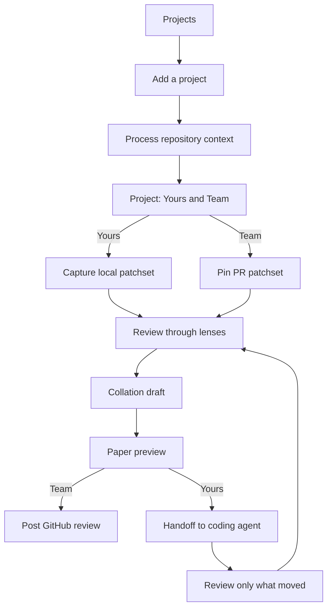

This is the road through Rennet: add a project, enter through your branch or a
team pull request, understand the change, shape the outbound artifact, and sign
it. Both destinations are live today: a team change becomes a GitHub review,
while your branch can loop through a coding agent and finish as a pull request.

## The journey at a glance

## 1. Projects is home

First run is the empty Projects list, not a separate onboarding wizard. The main
action is **Add a project**. Harness discovery stays in the background and can
show a short status such as “Claude and Codex detected.”

## 2. Add a project

Choose a workspace or one repository, pick its path, then confirm the discovered
repositories and worktrees. Detection supplies editable defaults rather than a
questionnaire.

## 3. Process the repository

Rennet builds the Repo Map used by later reviews: deterministic structure plus
evidence-backed project knowledge. The intended experience narrates the work in
plain language and ends by becoming the project screen.

The live UI is simpler than that destination. The underlying project-context
lifecycle is real; the richer narrated animation remains polish work.

## 4. Choose Yours or Team

The project screen has two zones on one page:

- **Yours** contains local worktrees and branches that are still private to the
  machine.
- **Team** contains pull requests that already exist on the forge, including
  your own open PRs.

Once a local branch has a PR, the PR is the primary row and the local checkout
becomes an annotation on it. One thing should not appear twice.

## 5. Capture one immutable patchset

For a local branch, Rennet captures committed changes, the index, unstaged
changes, and relevant untracked files without mutating the checkout. For a team
PR, it pins the forge-reported base and head commits.

Every review surface refers to that immutable patchset. A push, rebase, or new
local capture creates a successor instead of rewriting the thing under review.

## 6. Read the sequence

The tall sequence canvas is the review heart. It orders the whole change for
comprehension, keeps the diff column stable, and lets you open related tests,
definitions, or the source file in your editor without losing your place. The
current index and its deliberately honest confidence tiers are explained in
[code intelligence](/developing/concepts/code-intelligence/).

## 7. Rotate the lenses

Use Spec, Sequence, Decisions, Flagged, and Noise over the same anchors. Blast
radius paints those surfaces rather than changing their order.

Noise is not hidden content. It is the visible remainder of the change, grouped
and collapsed so you can confirm what received less attention.

## 8. Ask and annotate in place

Comments, change requests, questions, and discussion stay attached to a line,
range, chunk, requirement, or draft item. Threads open in the margin so the diff
does not reflow.

The orchestrator is the normal conversational model. A per-message “ask both”
option can show two labelled answers. Rennet does not auto-synthesize them into
a third supposedly authoritative answer.

## 9. Build the collation draft

Every disposition is staged when you make it. The private draft collects items
from every lens and lets you reword, reorder, merge, split, discuss, or withdraw
them. Background refinement can clean up rough notes, but the draft remains
editable and yours.

## 10. Preview and sign the paper

The paper is a read-only preview of exactly what will leave Rennet. For a team
PR it contains the batched GitHub review and its verdict. For your own branch it
will contain the handoff or PR submission.

If the preview is wrong, go back to the draft. Signing publishes the exact
paper, idempotently, in the reviewer's name.

## 11. Re-steer your own branch

On the own-branch path, signed requests go to a coding harness. The harness can
edit, test, commit, and push. Rennet then captures a successor patchset, carries
only exact unaffected review state, and focuses the next pass on what moved.

Signing the finished own-branch paper pushes the named branch and opens the
previewed pull request. The next precision work is narrower: richer sub-file
lineage without carrying old decisions onto merely similar code.

## Where to go next

- [Getting started](/using/guide/getting-started/) is the shortest hands-on tour.
- [Reviewing a GitHub PR](/using/guide/reviewing-a-github-pr/) follows the live team path.
- [Agent handoff](/developing/concepts/agent-handoff/) explains the own-branch loop under the hood.
- [Canvas model](/developing/concepts/canvas-model/) explains how the review surfaces share state.
