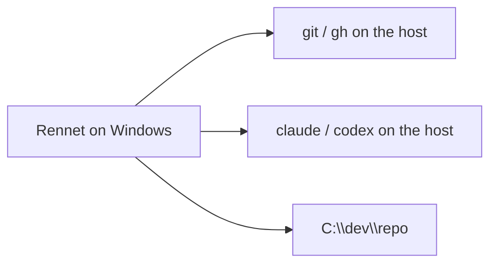

Rennet runs on Windows two ways, and it treats both as first-class. A project on
a Windows drive runs everything on the host. A project that lives inside a
[WSL](https://learn.microsoft.com/windows/wsl/) distro runs git, the harnesses,
and every repo-facing command **inside that distro** — the Windows app drives it
there. Which one a project uses is its **execution locus**, and Rennet picks it
automatically from the project's path.

## The execution locus

Every project carries an execution locus: the **host**, or a named **WSL distro**.

- Open a project at a Windows path like `C:\dev\repo` and its locus is the host.
- Open a project that resides in a distro — a `\\wsl.localhost\Ubuntu\home\you\repo`
  path — and its locus is that distro (`Ubuntu` here). git, `gh`, `claude`, and
  `codex` all run inside the distro, against the distro-native repo path.

The locus is a plain setting, not a prompt. You can see it and change it under a
project's settings (**Execution locus**): force the host, name a different WSL
distro, or reset to the auto-detected value. There is no confirmation step — the
setting simply takes effect.

Rennet never silently substitutes one locus for another. If a WSL locus is
unavailable — WSL not installed, the distro stopped, or a required binary missing
inside it — the harness status says so plainly and names the distro. It does not
fall back to a host binary for a WSL project.

## Native Windows



**Requirements**

- Windows 10/11 (x64).
- `git` on the host, and `gh` if you review or submit GitHub pull requests.
- A coding harness on the host — `claude` (and optionally `codex`) — installed any
  usual way. Rennet finds `.cmd`/`.exe` shims on your `PATH` and in the common
  per-user install locations (`%APPDATA%\npm`, `%LOCALAPPDATA%\Programs`, scoop,
  bun, volta), so it works even when the GUI-inherited `PATH` is missing an entry.
  No POSIX shell (zsh/bash) is required.
- An editor for line-targeted open — VS Code, Cursor, VSCodium, or Sublime — is
  found at its per-user or system install location as well as on `PATH`.

Keyboard shortcuts show Windows labels: the command palette is `Ctrl+K`, history
is `Ctrl+[` / `Ctrl+]`.

## WSL

```mermaid
flowchart LR
  app[Rennet on Windows] -->|wsl.exe| distro[Ubuntu distro]
  distro --> git[git / gh in the distro]
  distro --> claude[claude / codex in the distro]
  distro --> repo[/home/you/repo]
```

Keep your project, toolchain, and harness inside the distro exactly as you already
do. Rennet drives them there.

**Requirements**

- WSL 2 with your distro installed and running.
- Inside the distro: `git`, `gh` (for GitHub work), and your coding harness
  (`claude`, optionally `codex`), authenticated with your own subscription as
  usual. Rennet reads no credential — the distro's own `claude` login is used.
- Open the project by its distro path (`\\wsl.localhost\<distro>\home\you\repo`),
  or open it from inside the distro; the locus is detected from the path.

Everything a review or a handoff runs — capture, tests, the write-enabled agent
turn, the push that submits a pull request — executes inside the distro with the
same capability as native. Open-in-editor uses the editor's WSL remote so
`path:line` lands on the distro file. Rennet watches the repo by polling on WSL
(inotify events do not cross the WSL filesystem boundary reliably).

## What Rennet never does

- It never reads a credential, on either locus. The harness authenticates with
  your own subscription.
- It never publishes anything a person can see until you sign it. Pushing a review
  branch is not publishing — the coding-agent loop pushes freely, because
  submitting a pull request requires a push.
- On a WSL project it never runs a host binary against the distro repo.

## Next steps

- [Getting started](/using/guide/getting-started/) — the shortest tour of a review.
- Packaging (for developers) is documented in `apps/desktop/PACKAGING.md`.
