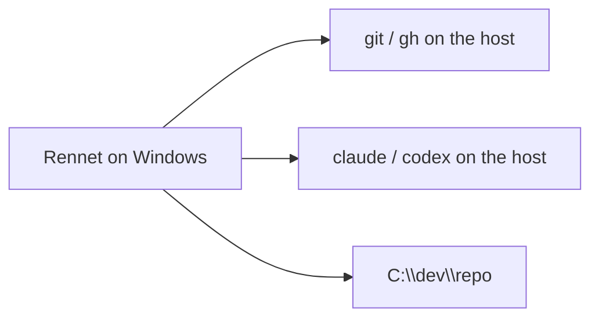

Rennet runs on Windows two ways. A project on a Windows drive uses the host. A
project that lives inside a [WSL](https://learn.microsoft.com/windows/wsl/)
distro can route the supported git, review, and harness operations into that
distro while the Windows app keeps its filesystem view through UNC. Which one a
project uses is its **execution locus**, and Rennet picks it automatically from
the project's path.

## The execution locus

Every project carries an execution locus: the **host**, or a named **WSL distro**.

- Open a project at a Windows path like `C:\dev\repo` and its locus is the host.
- Open a project that resides in a distro — a `\\wsl.localhost\Ubuntu\home\you\repo`
  path — and its locus is that distro (`Ubuntu` here). The operations listed in
  [What runs in the distro](#what-runs-in-the-distro) use its distro-native path.

The locus is a plain setting, not a prompt. You can see it and change it under a
project's settings (**Execution locus**): force the host, name a different WSL
distro, or reset to the auto-detected value. There is no confirmation step — the
setting simply takes effect.

The row also shows **where the value came from** (Explain): `detected` when it is
auto-detected from the path, `repo` when you have set an explicit override. When the
locus is auto-detected, a **Pin** control writes the currently detected distro as an
explicit override, so a later path or detection change no longer moves it — useful
for freezing a distro you have committed to. When it is overridden, a **Reset**
control clears the override and returns the row to auto-detection. Both are plain
config writes with no confirmation.

Rennet never silently substitutes one locus for another. If a WSL locus is
unavailable — WSL not installed, the distro stopped, or a required binary missing
inside it — the harness status says so plainly and names the distro. It does not
fall back to a host binary for a WSL project.

## Native Windows



**Requirements**

- Windows 10/11 (x64).
- `git` on the host, and `gh` if you review or submit GitHub pull requests.
- A coding harness on the host — `claude` (and optionally `codex`) — installed any
  usual way. Rennet finds `.cmd`/`.exe` shims on your `PATH` and in the common
  per-user install locations (`%APPDATA%\npm`, `%LOCALAPPDATA%\Programs`, scoop,
  bun, volta), so it works even when the GUI-inherited `PATH` is missing an entry.
  No POSIX shell (zsh/bash) is required. On Windows, Codex must be the codex CLI
  (`npm i -g @openai/codex`): the `codex.exe` bundled inside the ChatGPT desktop
  Store package is ACL-locked against out-of-package execution and cannot be
  driven, so having ChatGPT desktop is not enough here (unlike on macOS).
- An editor for line-targeted open — VS Code, Cursor, VSCodium, or Sublime — is
  found at its per-user or system install location as well as on `PATH`.

Keyboard shortcuts show Windows labels: the command palette is `Ctrl+K`, history
is `Ctrl+[` / `Ctrl+]`.

## WSL

```mermaid
flowchart LR
  app[Rennet on Windows] -->|wsl.exe| distro[Ubuntu distro]
  distro --> git[shipped git operations]
  distro --> claude[Claude handoff turn]
  distro --> repo[/home/you/repo]
```

Keep your project, toolchain, and harness inside the distro exactly as you already
do. Rennet drives them there.

**Requirements**

- WSL 2 with your distro installed and running.
- Inside the distro: `git` and `claude`, authenticated with your own subscription
  as usual. Rennet reads no credential — the distro's own `claude` login is used.
- Open the project by its distro path (`\\wsl.localhost\<distro>\home\you\repo`),
  or open it from inside the distro; the locus is detected from the path.

### What runs in the distro

Rennet routes these operations through the configured WSL distro:

- git capture, checkpoint, submodule probes, and submit-push;
- local PR-open git, project discovery/detail, and worktree cleanup;
- snapshot generation and settings/visibility git operations;
- the write-enabled Claude handoff turn, including tests or pushes the harness runs;
- **every review-pipeline model turn** — canvas lenses, the flagged and noise
  reviews, spec-delta mapping, knowledge enrichment (both proactive and the
  orchestrator's), symbol lookup, comment refinement, PR-body drafting, the delta
  digest, and handoff composition — so a WSL review has the same context as a
  host one, not a thinner one;
- **the Codex seat**, when the distro has its own `codex` installed. The distro's
  codex runs the real turn over its app-server JSON-RPC stream with a distro-native
  working directory — stdio crosses the WSL boundary unchanged, so there is no
  turn-path scratch translation — making a WSL review dual-harness (distro Claude
  + distro Codex) rather than degraded to a single Claude seat.

Open-in-editor uses the editor's WSL remote so `path:line` lands on the distro
file. Rennet watches the repo by polling on WSL because inotify events do not
cross the WSL filesystem boundary reliably. Windows-side untracked/spec reads,
snapshot identity, watching, and editor launch use the matching UNC path.

### Codex and the canvas surface

The agentic Codex turn talks to Rennet's live canvas over a loopback MCP server.
For a WSL review, Rennet finds an address the distro can actually reach: it first
checks whether the distro shares the host's `localhost` (mirrored networking), and
otherwise binds the surface to the WSL-facing host address the distro routes to.
The listener is never opened wider than that route. If no distro-to-host route can
be established, the Codex turn settles as an honest failed turn naming the
unreachable surface — Rennet never silently runs a host Codex against a WSL repo.

### Current ceiling

- A real WSL-locus Codex turn has run on real Windows hardware (lancelot) over the
  app-server transport, and the full native win32 gate is green. What remains
  pending is the packaged-app win32 boot and a full WSL dual-harness review with
  write/push from the distro account; this page is reconciled against that
  remaining live-run matrix once it runs.
- Token usage for a distro Codex turn arrives **in-protocol** over the app-server
  JSON-RPC stream (`thread/tokenUsage/updated`), which crosses the WSL boundary
  over stdio just like a host turn — so a distro Codex turn is measured like a
  host one, with no session-log file to correlate across the boundary. In-protocol
  usage is proven live on the macOS app-server leg; the live WSL run asserts turn
  completion and spawn composition, not usage.
- Networking varies per Windows configuration, so the mirrored-vs-gateway choice is
  made by an empirical probe per session rather than by sniffing config; a
  misconfigured host surfaces as a plain failed turn, not a wrong guess.

## What Rennet never does

- It never reads a credential, on either locus. The harness authenticates with
  your own subscription.
- It never publishes anything a person can see until you post it. Pushing a review
  branch is not publishing — the coding-agent loop pushes freely, because
  submitting a pull request requires a push.
- It never silently changes a WSL path to a differently configured distro. The
  status names both distros and stops the wrong-target operation.

## Next steps

- [Getting started](/using/guide/getting-started/) — the shortest tour of a review.
- Packaging (for developers) is documented in `apps/desktop/PACKAGING.md`.
