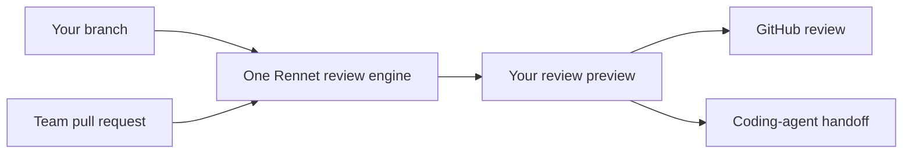

Rennet helps you turn a large local change or GitHub pull request into a review
you can understand and stand behind. Start with the short tour, then follow the
path that matches the change in front of you.

## Start here

- [Getting started](/using/guide/getting-started/) — the shortest useful tour.
- [Reviewing a GitHub PR](/using/guide/reviewing-a-github-pr/) — the live team-review path end to end.
- [User journey](/using/guide/user-journey/) — the full intended road from project to posted review.

## Understand the product

- [Product and vision](/using/concepts/product-and-vision/) — why Rennet exists and how the two review modes fit together.
- [Common questions](/using/concepts/common-questions/) — GitHub, model judgment, credentials, local-first behavior, and the own-branch loop.

Team work can become a posted GitHub review, and your own branch can become a
published push-plus-PR submission. The coding-agent route is live end to end: you
compose the handoff, preview it, run it, and get a focused re-review of exactly
what the agent changed — including anything it changed beyond what you asked for.
The one unfinished piece: when the agent reworks existing code in place, Rennet
cannot yet always recognise it as the same code moved or edited, so it re-reviews
it fresh rather than carrying over your earlier decisions.
