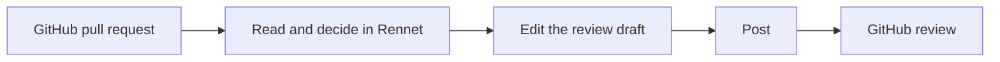

Rennet changes where you read and prepare a review. It does not require your
team to leave GitHub or replace its coding tools.

## Does Rennet take review out of GitHub?

No. For somebody else's pull request, Rennet posts one normal GitHub review
containing the comments and verdict you prepared. Your teammates continue to
work in GitHub.

## Is this AI reviewing AI?

Models help organize the change, find evidence, and explain disagreements. You
decide what is correct, which comments remain in the draft, and which verdict is
posted.

When two model seats disagree, Rennet keeps both answers visible. An optional
adjudication turn can inspect the contested code and report that the evidence
supports the flag, contradicts it, or is insufficient. The original answers
remain visible, and adjudication never delays the disputed row.

## Why not just prompt a model?

A prompt does not retain review state. Rennet records what you have read, the
decisions you made, the exact patchset under review, and the outbound artifact
you prepared. When the author pushes again, Rennet creates a successor patchset
instead of rewriting the review you already read.

## Does code leave my machine?

Rennet has no hosted backend and no Rennet telemetry service. Its daemon runs on
a machine you control. It listens on loopback by default and can accept paired
clients over a private network when you enable remote access.

Review state and project context stay with the daemon. Material selected for a
Claude Code, Codex, or other harness turn can go to that harness and its model
provider. Rennet records the context it assembled for each turn. See
[Remote access](../guides/remote-access.md) for the separate device connection
boundary.

## Does Rennet need separate model API keys?

Rennet uses coding harnesses already installed and authenticated on your
machine. The Claude adapter launches your installed `claude` binary through
Anthropic's agent SDK. It does not ask Rennet to store a Claude credential.

On macOS, Rennet can use the Codex binary bundled with ChatGPT desktop and its
existing `~/.codex` login. A separately installed Codex CLI takes precedence.
On Windows, install the Codex CLI because the Store-packaged ChatGPT binary
cannot be executed by another application.

## What happens on my own branch?

You can prepare a coding-agent handoff from your dispositions, run it, and review
the resulting changes. Rennet includes changes the agent made outside the
requested files in that next review.

When work is recaptured, a disposition carries only when its content is
byte-identical at the same path and the match is unambiguous. Changed or
ambiguous work is reviewed again. Once the branch is ready, Rennet can push the
named branch and open the pull request described by the outbound draft.

## Where to go next

- [Getting started](../guides/getting-started.md) gives the shortest tour.
- [Review a GitHub pull request](../guides/reviewing-a-github-pr.md) covers the team review path.
- [Product and vision](./product-and-vision.md) explains the product model.
