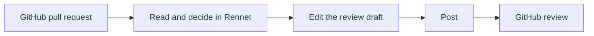

Rennet changes where you read and prepare a review. It does not require your
team to leave GitHub or replace its coding tools.

## Does Rennet take review out of GitHub?

No. For somebody else's pull request, Rennet posts one normal GitHub review
containing the comments and verdict you prepared. Your teammates continue to
work in GitHub.

## Is this AI reviewing AI?

Models help organize the change, find evidence, and explain disagreements. You
decide what is correct, which comments remain in the draft, and which verdict is
posted.

When two model seats disagree, Rennet keeps both answers visible. An optional
adjudication turn can inspect the contested code and report that the evidence
supports the flag, contradicts it, or is insufficient. The original answers
remain visible, and adjudication never delays the disputed row.

## Why not just prompt a model?

A prompt does not retain review state. Rennet records what you have read, the
decisions you made, the exact patchset under review, and the outbound artifact
you prepared. When the author pushes again, Rennet creates a successor patchset
instead of rewriting the review you already read.

## Does code leave my machine?

Rennet has no hosted backend and no Rennet telemetry service. Its daemon runs on
a machine you control. It listens on loopback by default and can accept paired
clients over a private network when you enable remote access.

Review state and project context stay with the daemon. Material selected for a
Claude Code, Codex, or other harness turn can go to that harness and its model
provider. Rennet records the context it assembled for each turn. See
[Remote access](../guides/remote-access.md) for the separate device connection
boundary.

## Does Rennet need separate model API keys?

Rennet uses coding harnesses already installed and authenticated on your
machine. The Claude adapter launches your installed `claude` binary through
Anthropic's agent SDK, so a turn runs on your existing subscription auth. Rennet
never stores a Claude credential and adds no per-token markup of its own. If a
session is authenticated by a metered API key instead of subscription auth,
Rennet says so, because that key spends money per token.

On macOS, Rennet can use the Codex binary bundled with ChatGPT desktop and its
existing `~/.codex` login. A separately installed Codex CLI takes precedence.
On Windows, install the Codex CLI because the Store-packaged ChatGPT binary
cannot be executed by another application.

## What happens on my own branch?

The asks you stage become a work order instead of a review. Dispatch a round and
a coding agent runs it; when the round returns, a report accounts for every ask
as addressed, partial, or untouched, each outcome verified against the round's
own diff. Work the agent did that you never asked for is surfaced as "beyond the
asks" rather than hidden.

The boards then regenerate over the successor patchset. Sections the round
touched open expanded and marked; sections it left alone carry forward folded,
and the previous generation stays readable. Repeat until nothing is left to ask,
at which point the same surface pushes the branch and opens the pull request
from the description it has been drafting all along.

## What licence is Rennet under?

Rennet is licensed under
[FSL-1.1-MIT](https://github.com/rbutera/rennet/blob/main/LICENSE), the
Functional Source License with an MIT future grant. The source is available:
you can read it, run it, modify it, and redistribute it for any purpose except
building a product that competes with Rennet. Two years after a release is
published, that release converts to the MIT licence.

This is source-available, not OSI-approved open source. Bundled third-party
dependencies keep their own permissive licences, listed in
[`THIRD-PARTY-LICENSES.md`](https://github.com/rbutera/rennet/blob/main/THIRD-PARTY-LICENSES.md).

## Where to go next

- [Getting started](../guides/getting-started.md) gives the shortest tour.
- [Review a GitHub pull request](../guides/reviewing-a-github-pr.md) covers the team review path.
- [Product and vision](./product-and-vision.md) explains the product model.
