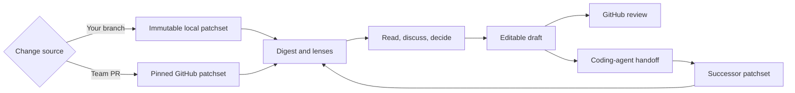

Rennet is a local-first desktop review tool for changes written with coding
agents. It helps you understand the change and prepare the review without
turning a model's output into your verdict.

> You stopped writing the code. You still have to answer for it.

## The problem

Coding agents can produce a changeset faster than a person can understand it. A
flat list of changed files shows where bytes moved, but not which files form one
decision or what should be read first.

Rennet groups related changes, orders them for reading, shows model findings and
disagreements, records the reviewer's decisions, and assembles those decisions
into an editable outbound artifact. Models assist. The reviewer decides and
posts.

## The review loop

Both modes use the same review state. A teammate's pull request produces a
GitHub review. Your own branch can produce a handoff to a coding agent, followed
by a focused review of what the agent changed. When the branch is ready, Rennet
can push it and open a pull request.

## Product principles

### Group related work

Files and hunks that implement one change should read as one cohort. The
reviewer can still inspect and act on each anchored item.

### Preserve every decision

A decision can apply to a cohort, requirement, chunk, range, or line. Collapsing
the display must not discard or cap those decisions.

### Keep navigation reversible

The reviewer can move from the whole change to a decision, hunk, line, test, or
definition and return without losing their place.

### Spend the reviewer's effort on judgment

Rennet can organize context, run models, improve draft wording, and maintain
review state. The reviewer should spend their time deciding what is correct and
what should be sent.

## Reading order and risk

The baseline reading order comes from deterministic dependency information. A
model can suggest an order that introduces intent before implementation detail.

Risk is metadata on the same material, not a separate reading order. A risky
change can be marked across the lenses without forcing every review to start at
the highest-risk line.

## Review lenses

| Lens | Question |
|---|---|
| Spec | What should the change do, and which requirements have evidence? |
| Sequence | In what order should I read the implementation? |
| Decisions | Which implementation choices need explanation? |
| Flagged | Where did automated analysis find a problem or disagreement? |
| Noise | What remains, and why may it need less attention? |

Blast-radius signals annotate these lenses. Every lens refers to the same
patchset and anchors, so changing lenses does not change the code under review.

Product copy keeps model output separate from the reviewer's judgment. Rennet
can say that a model flagged a problem. It must not say that the reviewer
approved or found a bug until the reviewer has made that decision.

## Local-first operation

Rennet has no hosted backend and no Rennet telemetry service. The desktop app
starts a daemon on the user's machine and connects to it over loopback. The
daemon can also serve paired clients over a private network. Closing the desktop
window does not stop the daemon.

Review state and project context stay with that daemon. Material selected for a
model turn can go to the chosen harness and provider. Rennet records the exact
context it assembled and labels it as sent only when the stored record matches.
Ambient files read independently by a harness are disclosed separately.

Rennet uses installed, authenticated coding harnesses instead of collecting
their credentials.

## Outbound artifacts

The collation draft is private working material. Before sending anything to
GitHub or a coding agent, Rennet shows the composed review, pull request, or
handoff. The outbound operation uses that composed artifact.

## Where to go next

- [Getting started](../guides/getting-started.md) covers the main review loop.
- [Review a GitHub pull request](../guides/reviewing-a-github-pr.md) covers a team pull request.
- [Common questions](./common-questions.md) covers models, credentials, and data.
- [Architecture overview](../../developing/concepts/architecture-overview.md) explains the system design.
