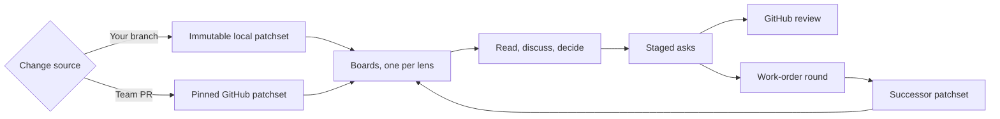

Rennet is a local-first desktop review tool for changes written with coding
agents. It helps you understand the change and prepare the review without
turning a model's output into your verdict.

> You stopped writing the code. You still have to answer for it.

## The problem

Coding agents can produce a changeset faster than a person can understand it. A
flat list of changed files shows where bytes moved, but not which files form one
decision or what should be read first.

Rennet drafts the change into boards — what it should do, what order to read it
in, which choices need explaining, what looks wrong, and what can be skimmed.
What the reviewer raises against those boards gathers as asks, and the asks
become the outbound review, work order, or pull request. Models assist. The
reviewer decides and posts.

## The review loop

Both modes use the same review state. A teammate's pull request produces one
GitHub review. On your own branch the asks become a work order instead: a
coding agent runs them, and the round comes back with a report and a new
generation of boards over what it changed. When nothing is left to ask, the
same surface pushes the branch and opens the GitHub pull request or GitLab.com
merge request named by the repository's effective push remote.

## Product principles

### Read the change, not the file list

Work that implements one change reads as one thing: a board section with a gist,
holding the findings, decisions, requirements, and cited code that belong
together. Folding a section never hides what it contains from the reviewer.

### Preserve everything the reviewer raises

A review addresses whatever the reviewer is looking at — a board section, a
single element such as a finding or a requirement, a quoted span of prose, or a
line of code. Each raises an ask that keeps its anchor and its provenance back
to the source, and no display state discards or caps them.

### Keep navigation reversible

The reviewer can move from the whole change to a decision, hunk, line, test, or
definition and return without losing their place.

### Spend the reviewer's effort on judgment

Rennet can organize context, run models, improve draft wording, and maintain
review state. The reviewer should spend their time deciding what is correct and
what should be sent.

## Reading order and risk

The baseline reading order comes from deterministic dependency information. A
model can suggest an order that puts intent before implementation detail.

Risk is metadata on the same material, not a separate reading order. A risky
change can be marked across the lenses without forcing every review to start at
the highest-risk line.

## Review lenses

| Lens | Question |
|---|---|
| Design | What should the change do, and which requirements have evidence? |
| Sequence | In what order should I read the implementation? |
| Decisions | Which implementation choices need explanation? |
| Flagged | Where did automated analysis find a problem or disagreement? |
| Noise | What remains, and why may it need less attention? |

Each lens is its own board, and a lens with nothing to show is absent rather
than empty. Every board cites the same patchset and the same anchors, so
changing boards changes the angle, never the code under review.

Product copy keeps model output separate from the reviewer's judgment. Rennet
can say that a model flagged a problem. It must not say that the reviewer
approved or found a bug until the reviewer has made that decision.

## Local-first operation

Rennet has no hosted backend and no Rennet telemetry service. The desktop app
starts a daemon on the user's machine and connects to it over loopback. The
daemon can also serve paired clients over a private network. Closing the desktop
window does not stop the daemon.

Review state and project context stay with that daemon. Material selected for a
model turn can go to the chosen harness and provider. Rennet records the exact
context it assembled and labels it as sent only when the stored record matches.
Ambient files read independently by a harness are disclosed separately.

Rennet uses installed, authenticated coding harnesses instead of collecting
their credentials.

## Outbound artifacts

Everything staged is private working material. The orchestrator keeps each
outbound document — the review text, the work order, the pull request
description — drafted and redrafted as the review progresses, and the reviewer
steers it by talking or by highlighting a span rather than typing into it.
Retired content is kept and restorable, never silently dropped.

The draft renders exactly as it will send, so the reviewer reads the real
artifact before the one action that sends it.

## Where to go next

- [Getting started](../guides/getting-started.md) covers the main review loop.
- [Review a GitHub pull request](../guides/reviewing-a-github-pr.md) covers a team pull request.
- [Common questions](./common-questions.md) covers models, credentials, and data.
- [Architecture overview](../../developing/concepts/architecture-overview.md) explains the system design.
